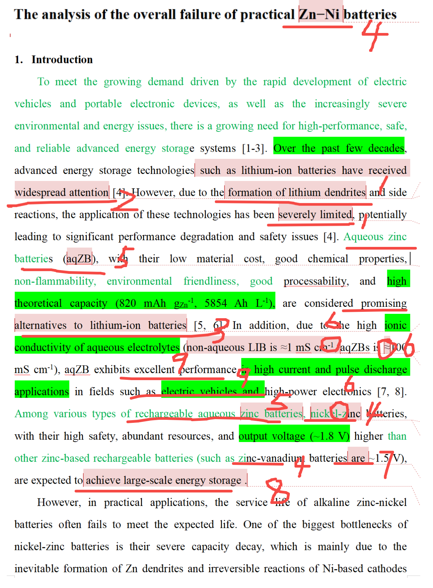

[来自： 科研论](https://wx.zsxq.com/group/15552141181242)

### 错误案例0.1.1、未关注Checklist

第1段中就出现了高达9处checklist中提到的问题。碰到这种第1段就大面积出错的情况，而且错误全是checklist中的，我就会认为这个学生没有看过checklist，所以我就不会看第2段了，我会要求这个学生提供看过checklist的 **视频证据** ，而且视频证据中需要包含学生根据checklist去仔细对比并且修改之后段落的操作。

所以他下次返回给我的文件，一方面是之前提到的视频证据，另一方面是保留修改痕迹的manuscript，两份格式过关后，我才会继续检查。

一定要去做这样一份视频证据，做的过程中，学生自然而然就能发现自己写作过程中存在的问题，这不是用来应付我的，而是切实帮助他提高论文表达水平。

扫码加入星球

查看更多优质内容

https://wx.zsxq.com/mweb/views/joingroup/join\_group.html?group\_id=15552141181242