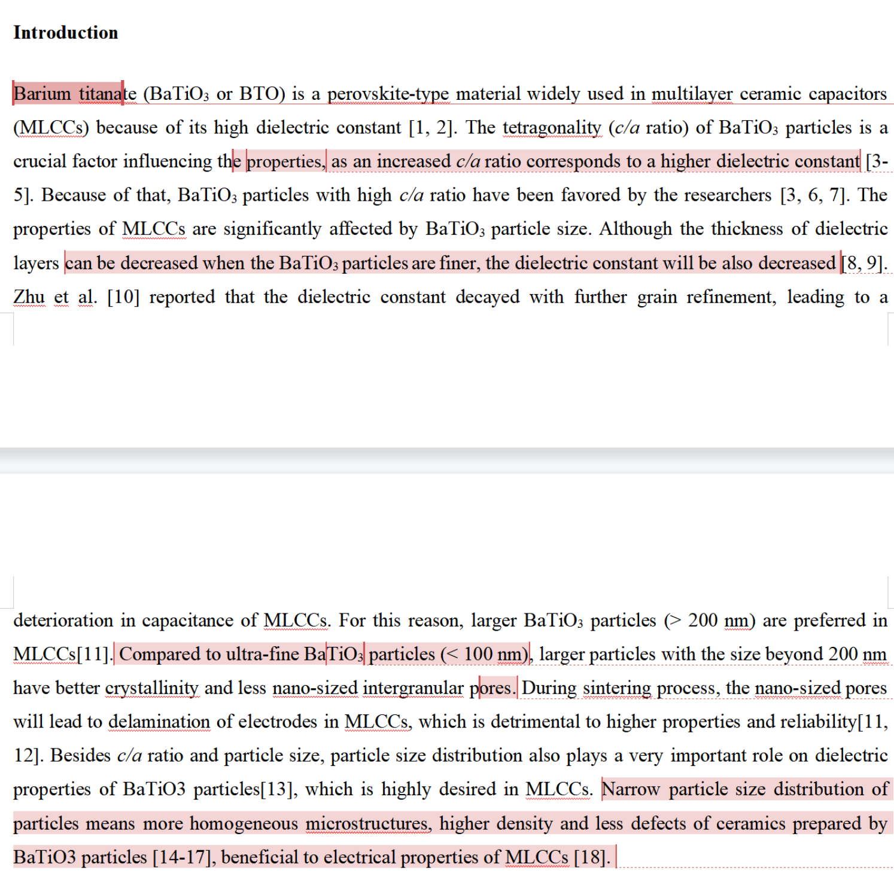
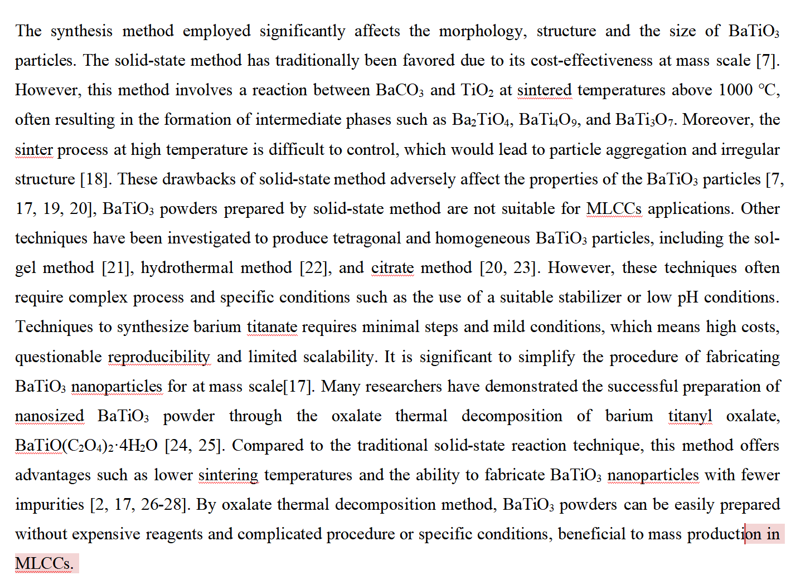
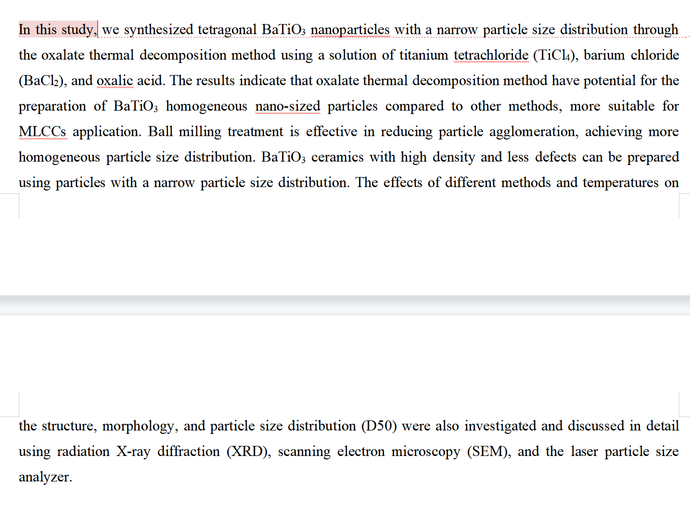
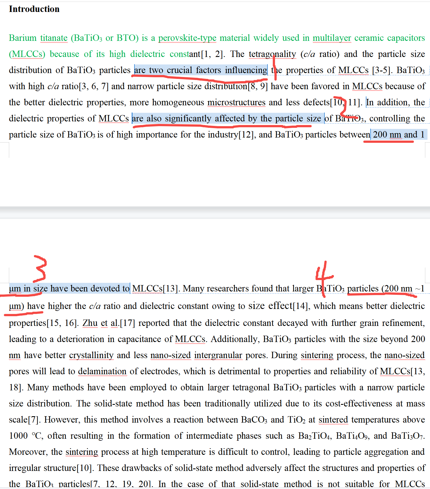
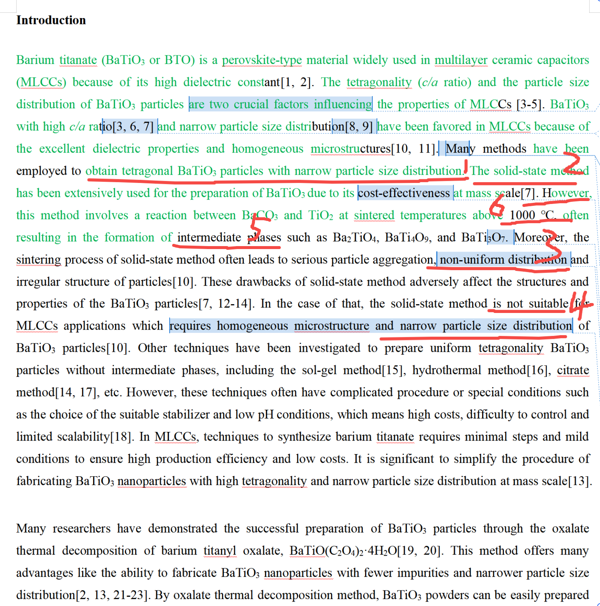
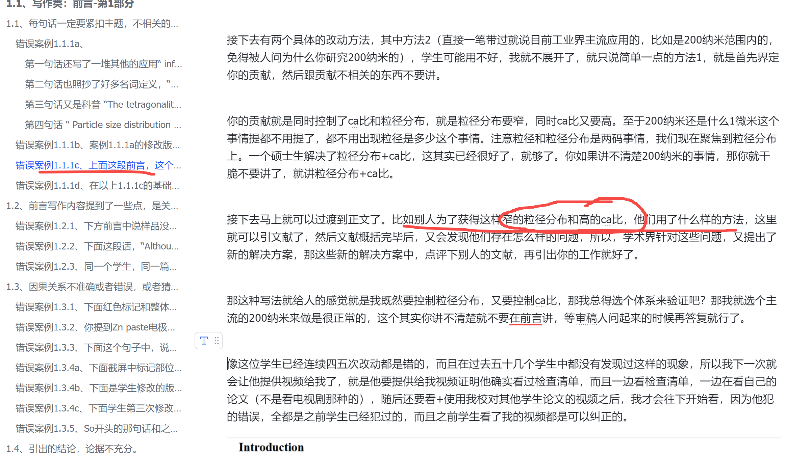
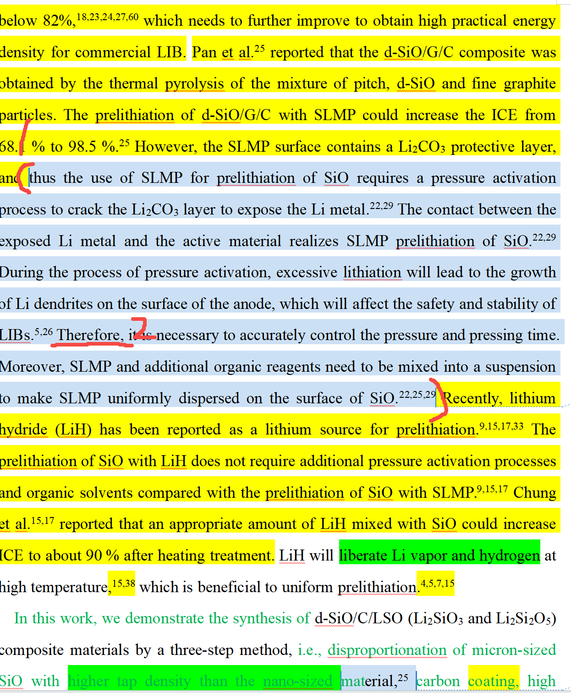
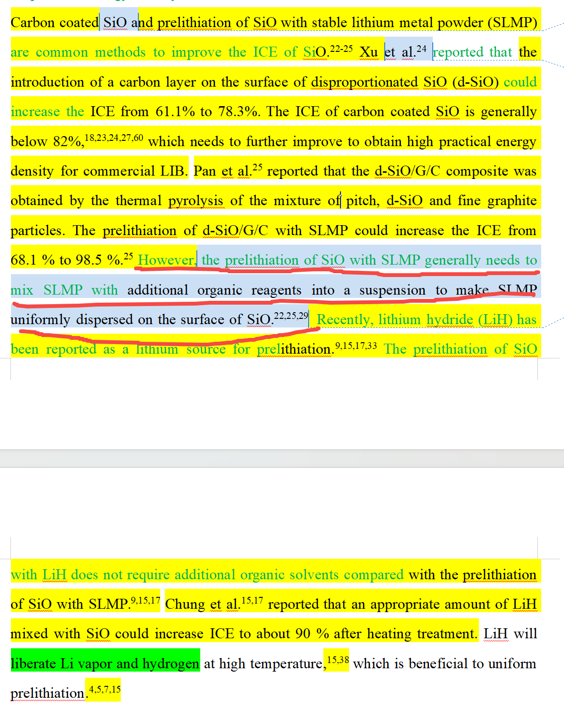

[来自： 科研论](https://wx.zsxq.com/group/15552141181242)

### 错误案例1.1.1a、每句话都没有指向性，没有指向中心思想，还讲了许多和自己论文无关的内容。\[pqc1\]

**Introduction**

Barium titanate (BaTiO3 or BTO) is a versatile perovskite-type material widely used in electroceramic applications, including multilayer capacitors (MLCCs), infrared detectors, thermistors, transducers, electro-optic devices, gas sensors, and catalyst carriers \[1\].

BTO undergoes phase transitions at different temperature ranges, exhibiting four distinct crystal phases: rhombohedral, orthorhombic, tetragonal, and cubic. The tetragonality (*c/a* ratio, *c* and *a* are lattice parameters) of BTO powders is a crucial factor influencing the performance, as an increased *c/a* ratio corresponds to a higher relative permittivity\[2-4\]. Particle size distribution also plays a particularly important role in determining various properties \[5\].

第1句话还写了一堆其他的应用“ infrared detectors, thermistors, transducers, electro-optic devices, gas sensors, and catalyst carriers \[1\].”，那读者自然疑问了，你还做了其他应用了么？比如你做了一个普适性的工作，这个工作对于其他领域也有帮助么？结果都不是的，你只是做了mlcc器件中应用的钛酸钡，而且你希望做到粒径均一（单分散，不要有大有小），ca比高（四方性能好），没杂质（都是钛酸钡相），那你中心思想只有这个的话，你就按照这个来写。每句话都要考虑和这个到底和中心思想什么关系，要么有直接，要么有间接的联系。

第2句话也照抄了好多名词定义，“BTO undergoes phase transitions at different temperature ranges, exhibiting four distinct crystal phases: rhombohedral, orthorhombic, tetragonal, and cubic.”，但没什么实质性内容，和进入主题，即告诉别人你背景到底是什么，你想解决什么问题，别人解决到什么程度了，存在什么问题，接着你如何解决等的脉络毫无关系。

第3句话又是科普 “The tetragonality (*c/a* ratio, *c* and *a* are lattice parameters) of BTO powders is a crucial factor influencing the performance, as an increased *c/a* ratio corresponds to a higher relative permittivity\[2-4\].”

第4句话 “ Particle size distribution also plays a particularly important role in determining various properties \[5\]. ”虽然讲了粒径分布，但很突兀，前面没任何过度，怎么就突然引出来要讨论这个，一旦采用我说的素材库方法，其实可以一篇篇去看别人脉络，别人一定是层层递进的进入自己要说明的问题的。

### 错误案例1.1.1b、案例1.1.1a的修改版本，还是不行，还是存在过度太慢，让读者迟迟不知道作者到底是干嘛的。

就像开车一样的，刚开始看你开了几段，似乎要去东方明珠，但是开了几段之后，发现你好像又要去迪士尼，那当以为你要去迪士尼的时候，又发现你好像去的是浦东机场。你要写电视剧，这样经常反转到还可以，但是你写文章一定不能这样，这样就很容易让读者去猜测了，一旦要让读者猜测，结果就都不会理想了。

比如下面很长的第一段话，全部是在介绍背景。几乎10句话过去了，审稿人还是不知道你要干嘛。这种给人体验很差。你去观察2.1号前言文字素材库（直接通过导航图的左栏，就可以迅速的看到每一篇文献的脉络），你可以去统计下，你读别人的文献，基本上第几句话就可以知道其他人到底要干嘛。

一个事物，肯定是背景很多的，但你不需要每个背景都配置上很多话去介绍，有的可以打包就有少数几句话就讲完的，让人尽快知道你到底要干嘛，之前背景介绍的目的只是让人了解你做的东西还是有必要的。让人知道你要干嘛后，就可以去点评文献，让读者知道别人目前这个领域做的如何了，然后第三段，最后一段就是你要干嘛。

### 错误案例1.1.1c、上面这段前言，这个学生又修改了一次，但还是很不理想，还是存在错误案例1.1.1b的问题。逻辑很割裂，然后很难判断出来他到底要干嘛这个问题，即中心思想很不明确。

其实中心思想的意思就是说你写一篇文章的时候，你要想清楚你这篇文献的贡献到底是什么，你想传达给别人的贡献到底是什么，其实也就一句话，或者一个短语。而每一句话都要针对这个中心思想来说。

比如看下面图片中的第一处，第1处已经是带概括性质的引导了。而且他说了ca比和粒径分布是两个重要影响因素（are two crucial factors），那为什么他说两个，而不是单独说一个呢？那给人感觉就是他这里是个引导句，然后把这篇文章中涉及的他认为的重要的所有因素都讨论进来了。不然他就会一个个讨论，比如先讨论一个影响因素是什么，说完后，再说另一个影响因素也很重要，但是他没有这样，他直接一句话说了2个重要因素，即把两个因素合并在一起了，那也就是会给人感觉，他全文讨论的就是这两个因素（ca比和粒径分布），可以进一步推测估计是既要控制粒径分布，又要ca比理想。

但等看到第2处就晕了，发现又来了一个因素，are also affected。当然这个因素确实是重要的，但为什么要单独去说它，而不是在概括性质的引导句把三个因素都说了呢？粒径、粒径分布、ca比都很重要（当然这种写法就会给人感觉，你的论文是三个因素都聚焦了）。

而且结合后面的3和4，他反复在强调200纳米这个事情，那大概就能猜到说他为什么要引出第2处，又要提下粒径了，是为了说明他的研究为什么选这个范围来做（读者能猜到，他的研究估计就是200nm以上的）。那这样马上就出来一系列新的问题了，或者说可以让人攻击的点了。你说200纳米好就一定是200纳米好吗？虽然他引了文献，但其实也没有说服力的，因为肯定还会有很多文献说是100纳米以下，比如50纳米的更好。其次，这样就容易让读者失去焦点，他不知道你要做的东西或者你的中心思想到底是什么？是要把东西做到200纳米以上呢？还是说要控制它的粒径分布呢？还是在控制粒径分布的同时还要控制ca比？

就读者已经读到了第4处，其实读者还是没这个概念，不知道作者的核心要说明的东西到底是什么。

然后继续往下读，似乎还涉及了一些什么工艺手段的对比，好像他的贡献还可能是某个工艺上的改进。这样读者就彻底晕了，就是根据他字里行间，审稿人脑补出来的想法，要么跟他后面要写的对不上，要么就出现问题了。

而且他在2、3、4处以及之后大篇幅都在讲200纳米这个事情，那就把读者的注意力全都集中到这方面去了，觉得你的中心思想是不是关于200纳米控制的，但在这个领域，200纳米并不是一个多稀奇的事情，就像芯片你反复强调一个20纳米，但学术界的人可能预期的是你1.5纳米的一个东西你这么强调下还过得去，20纳米不是很常见么？需要大篇幅反复强调么？此外，这样一强调，还给自己挖了很多坑，审稿人还能发现很多问题，比如200纳米，也不一定是学生说好就是好。而且其实这位学生的中心思想核心贡献并不是说要做一个200纳米的东西。

接下去有两个具体的改动方法，其中方法2（直接一笔带过就说目前工业界主流应用的，比如是200纳米范围内的，免得被人问为什么你研究200纳米的），学生可能用不好，我就不展开了，就只说简单一点的方法1，就是首先界定你的贡献，然后跟贡献不相关的东西不要讲。

你的贡献就是同时控制了ca比和粒径分布，就是粒径分布要窄，同时ca比又要高。至于200纳米还是什么1微米这个事情提都不用提了，都不用出现粒径是多少这个事情。注意粒径和粒径分布是两码事情，我们现在聚焦到粒径分布上。一个硕士生解决了粒径分布+ca比，这其实已经很好了，就够了。你如果讲不清楚200纳米的事情，那你就干脆不要讲了，就讲粒径分布+ca比。

接下去马上就可以过渡到正文了。比如别人为了获得这样窄的粒径分布和高的ca比，他们用了什么样的方法，这里就可以引文献了，然后文献概括完毕后，又会发现他们存在怎么样的问题，所以，学术界针对这些问题，又提出了新的解决方案，那这些新的解决方案中，点评下别人的文献，再引出你的工作就好了。

那这种写法就给人的感觉就是我既然要控制粒径分布，又要控制ca比，那我总得选个体系来验证吧？那我就选个主流的200纳米来做是很正常的，这个其实你讲不清楚就不要在前言讲，等审稿人问起来的时候再答复就行了。

像这位学生已经连续四五次改动都是错的，而且在过去五十几个学生中都没有发现过这样的现象，所以我下一次就会让他提供视频给我了，就是他要提供给我视频证明他确实看过检查清单，而且一边看检查清单，一边在看自己的论文（不是看电视剧那种的），随后还要看+使用我校对其他学生论文的视频之后，我才会往下开始看，因为他犯的错误，全都是之前学生已经犯过的，而且之前学生看了我的视频都是可以纠正的。

### 错误案例1.1.1d、在以上1.1.1c的基础上，这个学生又修改了一次，有一些改进，但还是存在偏离中心思想的问题。

图1

而且我为了确保学生这次有消化我说的内容，特地让他先说下他做了哪些改动，下面是他说的：

" 按照老师视频和清单的指导，修改如下：1.删除关于粒径范围的所有表述，避免说不清楚

2.删除了拉踩部分的表达，只说自己好，不说别人不好，减少被攻击

3.得出结论前分析他人研究进展，点评业内做到什么程度和仍存在哪些问题

4.自己研究中不重点涉及的少说或者不说，背景一定要跟研究高度相关，如果提到目前业内没做到的就想想自己是不是做到了，没有的话就不要写

5.逻辑混乱的问题，修改了之前弯弯绕绕的表达，上来就说四方性和粒径分布，不再提别的东西，避免说不清重点

6.目前逻辑结构为：点题两参数（四方性，粒径分布）+联系性能说明mlcc要求（favored）--为达成此目标用了很多方法（引出路径）--固相法等其他方法优缺点（成本，杂相/团聚，均匀）--引出草酸法--点评文献（其他研究者做的和没做的方面，难以同时控制均匀和四方性）--本工作（in this study）

"

从他说的内容来看，理解程度是有些提升的。比如头几句话可以看到我标记成绿色了，就是终于可以往下推进了可以，注意比对一下它前面已经修改了很多次，但一句绿色都没有办法标记。绿色的意思是这样的，就有时候我们不想已经确认过的东西反复再看，这样会耽误时间，所以确认过的地方都标绿色，这样下一次我们每次看黑色的部分就可以了。

见下图，1处已经收口或者引导到要获得具有四方性且具有窄的粒径分布的材料，那接着就是先要概括已有的工作在这方面做的贡献。然后他2处马上就跟着引出了一个制备手段A，那这样别人就会预期制备手段A应该是和他先前那句话提到的“要获得具有四方性且具有窄的粒径分布的材料”有关的。

结果读了几句之后发现又不是那么一回事情，比如3处，他说的是这个制备手段A获得的是不均匀分布的材料，然后4处也说了，说方法A不适合获得窄粒径分布的材料。那这样就是又完全偏离中心思想，偏离他前面引导的那句话了。

读者或者审稿人读到这里，想看的是“具有四方性且具有窄的粒径分布的材料”方面，别人做了什么样的工作，结果你大篇幅说做不到这样的要求。那这样又和你前面说的有矛盾了，你在第1处还特别说many methods都被应用了，意思是很多方法都可以做到，结果你举了一个做不到的方法，就给人感觉很莫名其妙。

**而且注意，这位学生没有响应到的点，其实就是我上次在1.1.1c中已经提过了的：**

图2

看上次我说的，我说的就是别人为了获得这样窄的粒径分布和高的ca比，他们用了什么样的方法？而不是让学生去给出一个无法获得窄粒径分布的方法，像现在他这样，拿着一个粒径分布很差的文献去点评，这个明显又偏离中心思想了，他前面已经限定了，说别人针对“具有四方性且具有窄的粒径分布的材料”方面做了什么工作，而且还说实现这种效果的工作很多，结果他讲一些没做到的工作，或者说给人感觉有意选一些最差的文献工作去讲，但是如果这个最差的文献工作和你要讲的前面的一句话相关也就算了，但结果和前面那句话还不相关而且还是相反的。

前面那句话还说很多方法都被用于控制粒径，结果他举了一个不能控制粒径的方法，这不是自己打自己脸吗？

其实改动方法也很简单的，他说的这种制备方法A，肯定也有控制住粒径分布的，选那些控制住粒径分布的工作来介绍，然后引出有别的问题，比如它有很高的温度烧结，或者它有杂质产生（见图1中的5、6处），也可能是ca比还不够高（意思是你本文中获得的ca值比他更高）。

那接着，肯定还有制备方法B比提出，为了解决制备方法A的问题，然后也是点评他们的贡献，如果有问题的话，继续补充下，直到引出你的工作。

最后给人的意思就是，你本文中提出的那个方法处理温度低、杂质和中间相少，也能顺便解决制备方法B的问题。所以注意！你讲的别人的问题（即图1中的5、6处），也是要你解决的。否则又出现我和这个学生说了很多遍的问题了，讲了别人（领域）存在的问题，结果自己也没提及，也没解决的。

### 错误案例1.1.2、和要讨论的主要内容不直接相关的点上配置了太多篇幅了。\[js1\]

下面在文献点评方面，整整8行都在说SLMP的缺点（见括号标记），一方面表达不够简练，凝练，太累赘了，另一方面这种大面积、大篇幅的攻击别人缺点的模式，我在其他地方就说过，也不能过度使用。因为如果是SLMP这个领域的人，他们不一定认可你说的东西。

而且第2点，这样会又把审稿人的思路带偏了，他会认为你既然这么多篇幅都在介绍SLMP，那你是不是做的也是SLMP领域的，你要解决的是不是SLMP领域中的问题？结果你做的完全是另一种方法。那这样的话，其实关于其他领域，比如SLMP，你点到为止就行了。

SLMP只是诸多你要介绍的文献中采用的方法中的一个，你其实至少介绍了两个，也有可能有三个方法，这三个方法介绍完之后，就点下存在的局限，然后就引出和你主题相关的方法了。然后这里还能发现你的第3个问题，即不对称问题，就我在错误案例1.3.4d中说的，同样存在这种不对称的问题，就是你会发现每一个人，他的错误结构是高度相似的（所谓的路径依赖），然后这样的错误结构会一直贯穿始终，就像你拍照或者取景一样，这种对称的结构会比较优美。

关于这个不对称，你前面至少介绍了两种文献方法，然后关于方法A你点到即止了，结果到方法B这里就整整八行都在说他的问题，那这样给人感觉也很不对称，怎么前面一个你就不怎么问题，后面一个你拼命踩他缺点？

你无非就想通过踩别人的缺点来说，你要换一种方法来实现你的目标。那就出来一个问题了，你把缺点概括一下，用一两句话概括或者出他的局限性，同样也能引出你的方法的。但你没这样做，你用8行去踩他缺点，那就会给人感觉，是不是你的意图还不只是要引出其他方法，比如你还要专门针对他的缺点去改进呢？但其实他的缺点你一条都不会碰的，你只不过要引出另一种方法，那其实就没必要大篇幅的去说一个和你不怎么相关的方法的缺点。

而且你这个8行中，还用了Therefore（标记2处），一般这种句子是要为你的工作进行引导的，比如你前面讲了一堆理由，然后therefore，因此我们要怎么怎么样，那接着你要这样做，结果也还并不是。你后面还是继续说了文献方法的另一个缺点。

所以你在看文字素材库的时候，你会有一个2.1号文件，这个文件是还没有重新剪切，没有打乱过逻辑顺序的，你在这个文件里要看一下别人的逻辑脉络是怎么样的，他们是花了多少篇幅在点评别人的工作，然后又怎么通过别人的工作引出自己的工作，是不是我说的这些问题他们就都避免了，那他们是怎么避免的，你可以怎么样避免。

如果这个问题还是不能解决的话，那么你就要让我看到你的引言文字素材库，然后我会指出你这个文字素材库做错在什么地方，为什么导致你的成文逻辑上有问题。

### 错误案例1.1.2-最终修改：概括为一句话了。

扫码加入星球

查看更多优质内容

https://wx.zsxq.com/mweb/views/joingroup/join\_group.html?group\_id=15552141181242