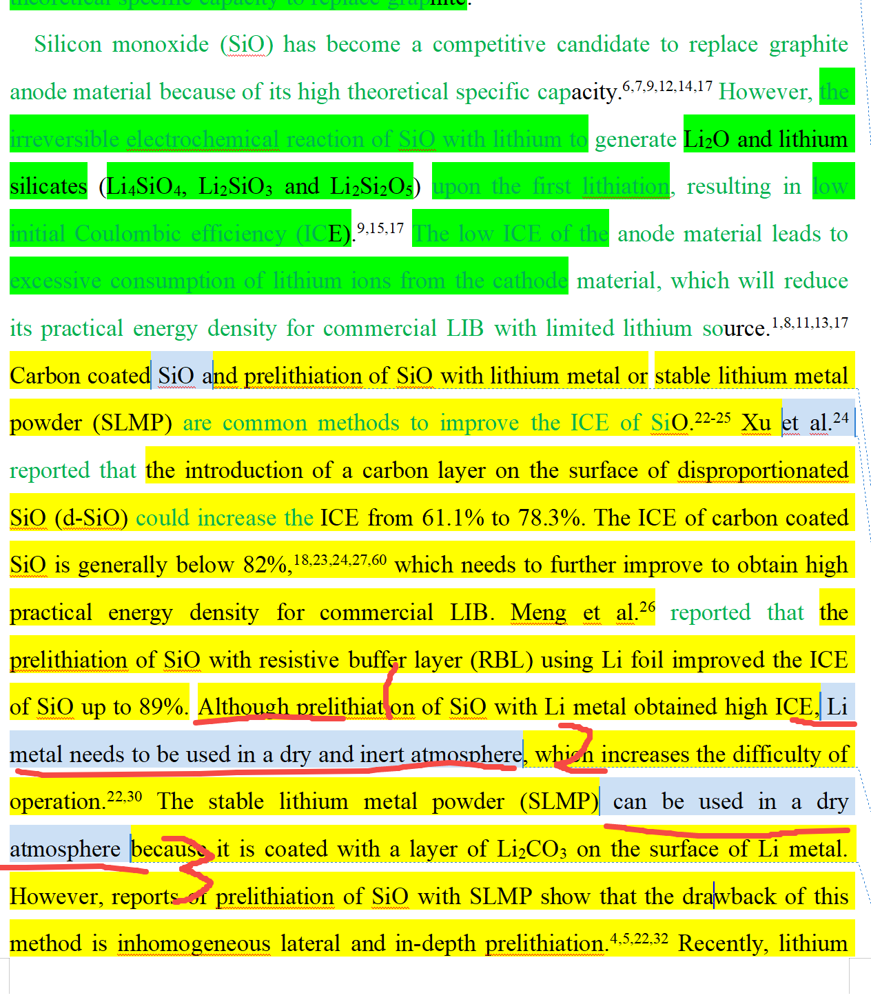

[来自： 科研论](https://wx.zsxq.com/group/15552141181242)

### 错误案例1.2.1、前言中提到的一些点，是关于前人研究不足的或者没搞清的或者没有实现的东西，但问题是自己的文章也并没有着重的、系统的搞明白这个问题，或者实现这个东西。总之，你写的每一句话，都要考虑到潜台词是不是涉及间接或者直接说别人不行，如果你说了别人不行，但你自己也没解决，那你就别提。比如你写芯片，你说别人没实现0.5nm芯片，那读者自然问了，你实现了么？？

比如下面说样品没有被成功制备和转移到阵列中的话，无法用相关平台进行电化学检测。那意思就是我们可以实现？但实际上我们也不能实现，一个东西都没制备好？你怎么表征？我们不也是这个东西制备好，然后出现在某一个array中，随后针对这个array中的样品去表征的么？所以你表达不准确导致逻辑不严谨：

However, the electrochemical detection could not be carried out by these platforms until the samples are successfully synthesized and introduced into the arrays or cells of microreactors.

### 错误案例1.2.2、下面这段话，提到的内容同样是学生自己的研究没有触及的。\[js1\]

The effect of disproportionation (formation of Si and SiO2 from SiO at high temperatures29,30) on ICE has been reported.26,27 Park et al. reported that the well-distributed Si nanocrystallites and amorphous SiOx were formed by the disproportionation reaction of SiO at appropriate temperature, which was beneficial to improve the ICE.21 Zhou et al. reported that the surface inert SiO2 layer after disproportionation treatment reduced the side reactions with an increased ICE.18 The results of Kitada et al. showed that disproportionation reaction had little effect on the ICE.19 Although different conclusions have been drawn, there are still some studies on the improvement of the ICE based on disproportionated SiO (d-SiO).

。。。。。。。

In this work, we demonstrate the synthesis of d-SiO/C/LSO (Li2SiO3 and Li2Si2O5) composite materials by a three-step method, i.e., disproportionation of micron-sized SiO with higher tap density than the nano-sized material25, CVD method to obtain carbon coated, high temperature treatment of a mixture of lithium hydride (LiH) and d-SiO/C.

上面学生这段文字中，提到“Although different conclusions have been drawn, there are still some studies on the improvement of the ICE based on disproportionated SiO (d-SiO).”中，即提到了“研究得出了不同的结论（different conclusions have been drawn）”，也就是潜台词是SiO的歧化反应对于提升ICE的效果存在分歧，那你意思你得搞明白这个？不然人家想，这个东西有分歧，和你有什么关系？

你如果说你也没讲清，那你特别要说文献存在不同结论，存在分歧又是要干嘛呢？

另外，从你前言之后的in the present work中的描述来看，你并没呼应到你做的研究和前人存在的分歧有什么关系，你只是说了你有歧化反应，然后包碳，再预锂化。

也就是说你前言大篇幅点评文献所讲的东西，在你论文中也并没提及。

解决办法：你要先想清楚，自己文章的贡献点（中心思想）到底是什么，比如1个或者2个（最好一个）。然后围绕你的贡献点，去重新组织文献点评部分，正好体现在和你研究的细分领域相关的地方，前人做了一些工作，比如涉及哪几类，其中比如a做了什么，b做了什么。但还存在什么问题。

接着就是in the present work，你做了什么。

所以你要搞明白，你的贡献到底是做了歧化+预锂化这种综合的方法提升了ICE（我认为是这个）、还是比如你这里很容易给人误导是想搞明白歧化对于ICE的作用，还是其他什么？

中心思想明确后，重新再来组织前言、包括结果和讨论，当然也包括其中的图片。

而且我看了你的图片，你并没系统做过SiO歧化的影响，只是选了个代表性的歧化SiO样品，然后处理了预锂化，所以你下面这个段落中提到的内容，大概率也是你论文中自己也没响应到的内容，所以要重新调整。我们最近有篇论文发表在carbon energy上的，你可以去看下，其中也提到了预镁、也有预锂，你可以看下我们是怎么引出的，那个就写的还可以。

### 错误案例1.2.3、同一个学生，同一篇论文，同样的错误模式，甚至连错误句子的开头“Although...”，都和上面的1.2.2完全一样。

上面红色部分，Although开头，就说明要说别人工作的缺点，然后后面的缺点提到了“Li metal needs to be used in a dry and inert atmosphere”（锂金属需要在干燥和惰性气氛下工作），那难道你报道的制备方法就不用了么？

其实你也是需要干燥和惰性气氛，所以你才用了手套箱的。

而且这还出现了3号部位的问题，3号部位又特别强调了另一个体系可以在干燥气氛下工作，这就给人一种感觉，你好像也要发展这种干燥气氛下工作的体系，但其实不是，其实你的重点根本不是工作气氛，因为这个也不是你研究的特色或者说贡献，你也没解决这个问题。

在你没解决问题的领域讨论过多，结果自己应该聚焦领域的没说，就会把读者的思路完全带乱了。

扫码加入星球

查看更多优质内容

https://wx.zsxq.com/mweb/views/joingroup/join\_group.html?group\_id=15552141181242