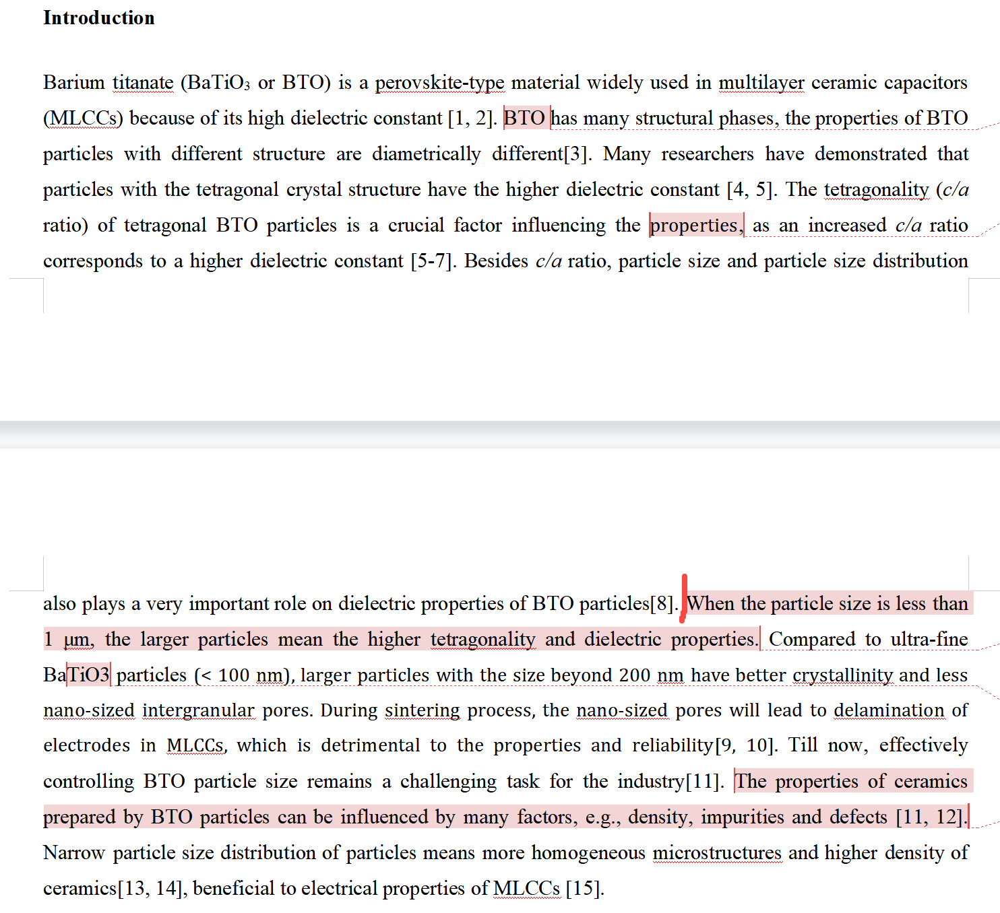
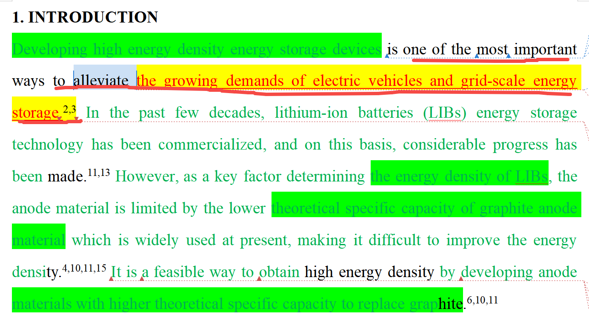
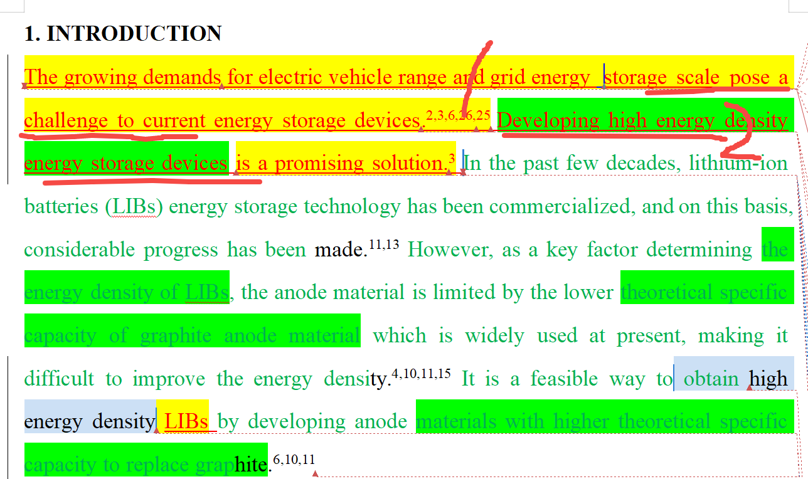
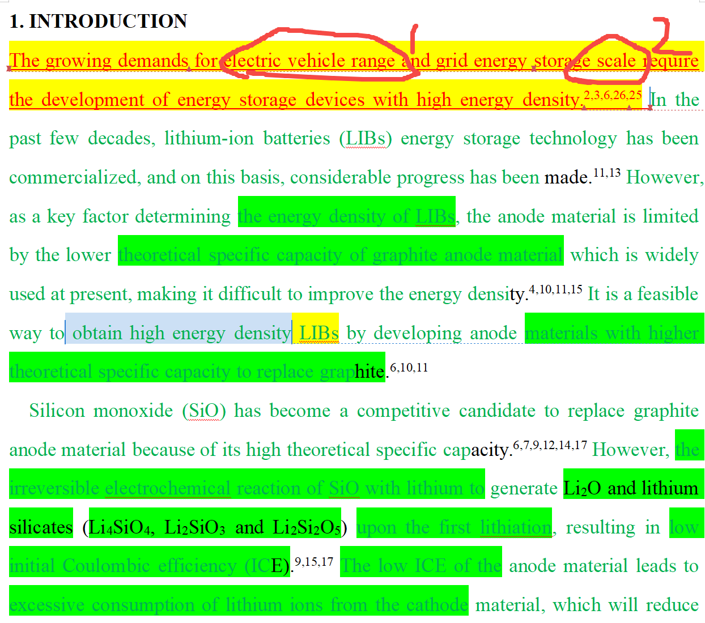
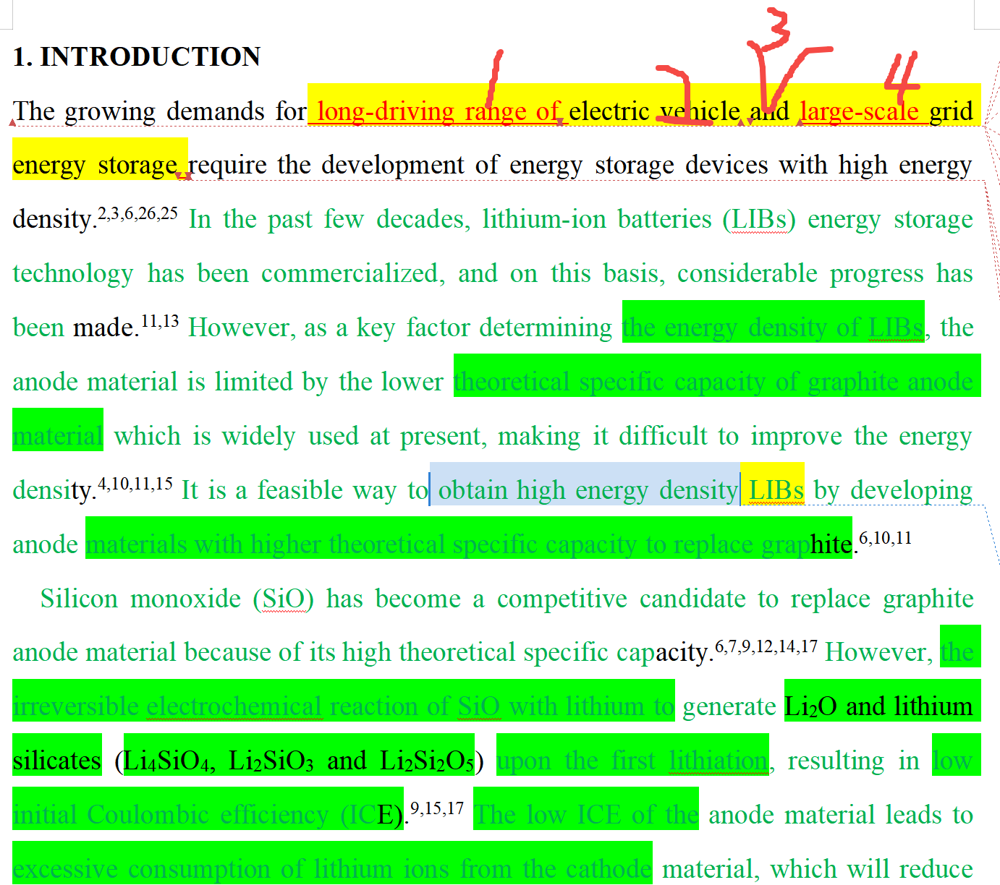
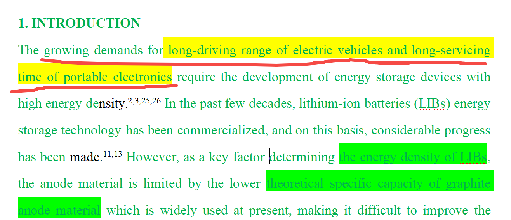
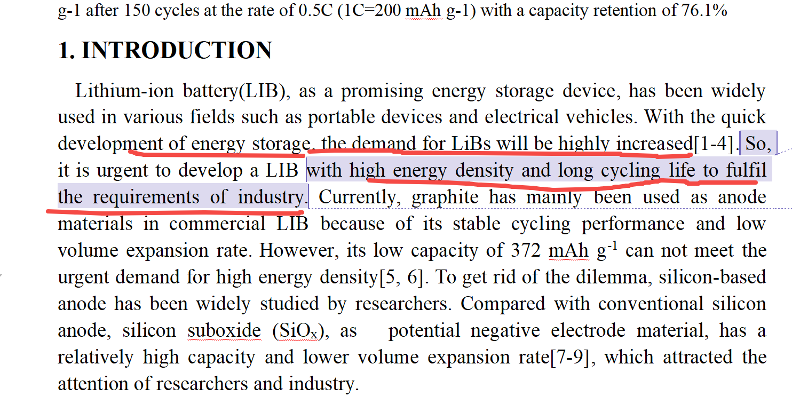
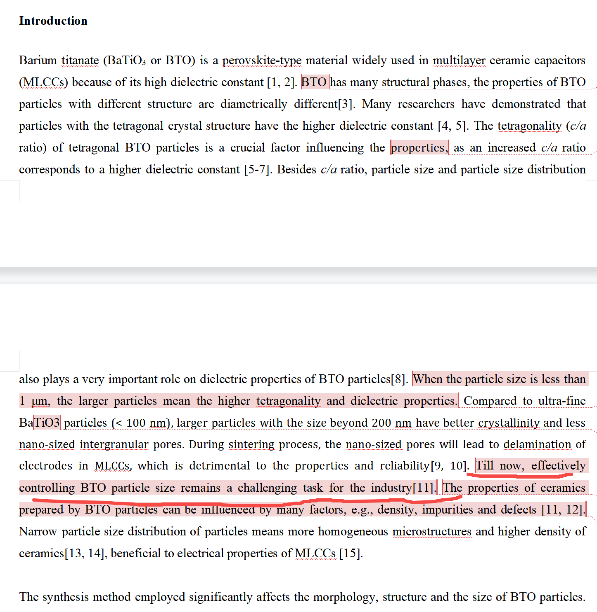
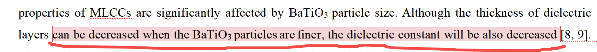
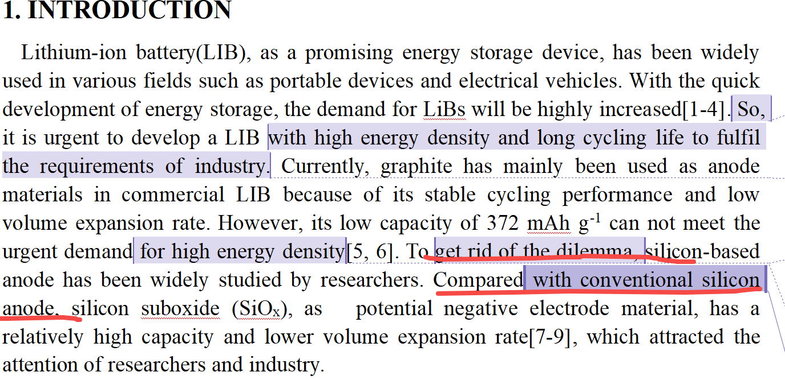

[来自： 科研论](https://wx.zsxq.com/group/15552141181242)

### 错误案例1.3.1、下面红色标记和整体段落存在2个归因错误。

先是标记1的部位因果关系错误，这种错误要多通过反面解读来找到，有些类似找茬的过程，即每句话都去问下，这个话有没有说错？可不可能是错的？怎么能证明这句话是错的？当然也不要过度钻牛角尖。

比如这里，你写大尺寸意味着更高的四方性和介电常数，显然不一定的，大尺寸的东西，c/a比控制的不好，同样可以四方性比小尺寸的差。这里面正确的逻辑是小尺寸的东西，相对于大尺寸的，不太容易把c/a比做到接近1.01，然后你要引文献，讲原因，所以主流的目前被应用的尺寸是多少多少nm（也就是你做的范围）。

你本意其实是想表达以上这些内容，但即使这样，这种表达是很差的一种，站不住脚，也是本处的问题2，你不能说大尺寸的容易c/a比高，所以我做大尺寸的，人家马上攻击，小尺寸也能做高，况且人家现在器件小型化，也很需要小尺寸的，难道做不好你就不做了？比如芯片现在从14nm到1nm以下，你说1nm很难做，所以我们做14nm的，这显然很荒唐。你假如要支撑自己做14nm，你得说14nm目前是被大量应用的，所以我做这个。

所以，你如果想支撑自己为什么要研究200nm左右的东西，这里更好的写法还是和产业结合，就说目前mlcc器件主流应用的还是比如200nm~500nm左右粒径的钛酸钡，要给理由，为什么。文字素材库中肯定有很多，去找下。这样才不容易被攻击。

但接着你就要讲明白，既然200nm被主流用了，你为什么还要研究？肯定是也存在一些问题，对吧。比如虽然200nm能做出，但粒径是不是控制的没那么单分散，或者你说传统的制备工艺是固相法，那固相法相对你这个方法的问题是什么？这样就能引到你的贡献了。

### 错误案例1.3.2、下面段落中提到了一个问题，但自己其实也没逃出这个问题。同时还存在归因错误。

When the battery discharges to a deep depth, the surface of the Zn paste anode will be covered by a thick layer of ZnO, which prevents the further reaction of the internal Zn.\[\] Meanwhile, the outermost ZnO layer is easy to separate from the inner Zn, which cannot be reduced in the charging process. Hence, the utilization rate of electrode materials and the cycling life of batteries are greatly limited. These problems have been effectively alleviated by introducing the zinc metal anode.\[\]

上面提到Zn paste电极存在怎么样的问题，那潜台词就是你用的电极没这种问题，否则你不是连你自己一起攻击了么？

但实际上，你用的zn电极照样存在这样的问题。zn电极表面同样可以出现ZnO，导致内部Zn无法继续反应。只不过你做实验的时候，为什么感觉不到这个问题，是因为你电解液用太多了，才导致他形成的不是ZnO，而是溶解到溶液中的Zn(OH)4-2离子，才给你错觉，这个锌电极反应好。但实际上是因为Zn paste是商业中使用的，不会让电解液那么过量。

所以最后一句说这些问题被Zn电极有效解决，是完全错误的。

当然，你本身Zn电极的表达也有问题，Zn paste也是锌电极。

我理解你想表达的是一整块纯的锌金属做电极，但之前也说了，这个也是错的，一个Zn是锌金属电极（整个锌片直接做电极），一个是Zn和氧化锌粉末做成的电极，难道后者就不是锌金属电极了？

### 错误案例1.3.3、表述不准确，导致逻辑关系错误。\[js1\]

Developing high energy density energy storage devices is one of the most important ways to alleviate environmental pollution and energy crisis.

上面这句话中，说发展高能量密度的储能器件可以解决能源危机（energy crisis），不准确，储能器件也是要充电的，比如你说的锂电池，他的电从哪里来的？

按照目前情况，是不是也大量来自煤炭、水利等的？所以其实也并没解决能源危机。

有时候素材库中也许你会发现和你表述逻辑类似的句子，但毕竟大量句子是没有被仔细批改就被发表的，你要从中寻找基于第一性原理看着靠谱的文字素材。

### 错误案例1.3.4a、表述不准确，导致逻辑关系不严谨。

上面截屏中标记部位错误，正确的认知应该是：发展高能量密度的储能器件无法缓解电动车和电网储能的需求，他们的需求在某个阶段是会持续上升的，发展高能量密度电池是为了满足他们的需求，而不是缓解需求，而且最好讲清楚是什么需求，导致要发展高能量密度的储能器件。

去文字素材库中看下，必然有很多此类表达。

### 错误案例1.3.4b、针对上面错误修改后的版本，还是不行，存在同样的错误。

第1句只是说对储能提出要求，也没说什么要求，结果第2句就说发展高能量密度的器件是个有效的解决方案，非常突兀。带着我说的问题，你去你文字素材库看，就知道别人是怎么过渡到高能量密度器件了。其实两句也可以合并成一句的，xxx的需求需要发展高能量密度的储能器件就好了，素材库中类似表述肯定很多的。

### 错误案例1.3.4c、针对1.3.3案例的第3次修改的版本，有进步，但细节表述还存在问题。

进步体现在了第一句和高能量密度关联上了，从而为后文展开提供支撑。

但细节表述还存在问题，如关于电动车续航里程的表述太中式英语（下面标记1的地方），解决方法就是要从文字素材库找到对应的表达，而且找到这样的表达后，还可以去全文数据库搜下，看是否有较多同类的表述，要一种大家广为接受的表述方式。

类似的，标记2的部位也类似问题。

### 错误案例1.3.4d、上面这个案例的第4次修改的版本，还是有表述不准确的问题，同时没有注意表达的对称结构（中英文都是存在这种对称结构的），还是导致叙述逻辑不准确。

第1句话试图说明为什么需要高能量密度的电池，他找了两个领域，大规模储能（标记4）和电动车（标记2），在标记2处，他给出了电动车需要长的续航里程（of之前的），但是大规模储能里面并没有对称的提供关于大规模储能的要求（标记3部位缺失）。

目前这样一个of，然后接着A and B，那就会认为A和B都是of之前的需求，即大规模储能也是要长续航里程，那显然不对。

而且更进一步的，其实大规模储能对高能量密度电池的需求不如消费电子迫切。你其实讲的应该是消费电子和电动车这两个领域，消费电子比如手机这种，你肯定是希望他工作时间尽可能长。所以还是从文字素材库当中去找别人做高能量密度电池是如何铺垫的，他们到底是怎么铺垫，怎么引出为什么要发展高能量密度电池的？你找一些支持消费电子支持电动车的。

### 错误案例1.3.4-最终修改、第5次修改，勉强可以用，虽然表述不太地道，因为头重脚轻了（看截屏中的划线部分），但至少不是像现在这种直接是错误的。

### 错误案例1.3.5、因果逻辑关系错误。\[srf1\]

So开头的那句话和之前的逻辑关系不正确。So只是笼统的说了储能的快速发展，对于锂电池的需求增加了，什么需求增加也不知道。

只是按照这句句子理解，也许会被理解为是对锂电池数量方面的需求大幅增长（需要供给更多的锂电池），当然我知道你讲的肯定不是这个。那接着的so开头的这句，提到的又是需要高能量密度和长循环寿命的锂电池，你前面虽然写了2句铺垫，但没有一句是和这个建立起来逻辑关系的。

比如你说消费电子、动力电池对使用时间、续航里程的要求不断增高，导致要发展高能量密度的电池，那个才是正确逻辑。

而且这里还有清单1.2中的错误，你提到长循环寿命，别人肯定预期你也解决了长循环寿命，但你显然是没解决的，你引入硅后，循环性能其实是有所牺牲的，所以这里你只要讲提高能量密度这个事情就好了。然后就会说到要引入硅，但引入硅有什么缺点，随后你怎么解决，像js写的，还有包括我们最近发carbon energy那篇（lb写的）的脉络都还行，你去看下。

### 错误案例1.3.6、引出的结论，论据不充分。

上图中标记的位置，这才一段话，你前面也没任何文献支撑，而且这也不算是个共识的问题。你直接就说，工业界有效控制尺寸目前还是个挑战。

事实上，商业样品都已经有尺寸控制的很好的了，你想表达的应该是同时要具备高c/a比，且有具有特定尺寸而且尺寸分布窄，这个有点难度，但其实这样写也不好。

你如果要定义什么东西是个很大的挑战，你起码要把文献先给点评了，就是前人工作先说了，然后通过前人工作就能反应出来，这个东西确实不容易解决。

你现在没任何同行工作交代，就自己说了个，那人家很容易不认可，他会说，我就解决了你说的问题。所以有些人直接看到你这么写，就可以把你给否了，觉得你都不清楚大家做了些什么。

这里，你只要说工业界的要求是什么就好了，比如为什么要c/a高，而且光c/a高不够，还要粒径分布窄，就是尺寸均一，讲清楚这是为什么，当然和器件性能联系起来。所以你这里只要讲什么什么东西是highly desired就好了，或者it is highly desired to需要什么样的东西，而不是你自己来定义一个这个领域挑战是什么，结果定义的还不准确。

当然也不要无脑照搬我上段说的，具体可以参考素材库，有些场合，确实也可以自己总结和下这个定义，但你这里不合适，用我的引出方法更合适。比如你如果做芯片的，说1nm以下是挑战，那不引文献别人也认可；或者钛酸钡这里，你说50nm尺寸的还要高c/a，那人家业内的也会认可。而不是你这里来了个尺寸控制是难题，但明明业内都大量尺寸控制过的样品存在了。

### 错误案例1.3.7、引出的结论，论据不充分。will是很绝对的词，意味着必然会这样。但显然不是的，钛酸钡粒径下降，并不意味着介电常数下降。

### 错误案例1.3.8、表述不存在证据，很容易被攻击。\[srf1\]

上面第2处下划线的地方，说与传统硅负极比较，但并不存在什么传统硅负极，这个东西本来就是才刚刚商业化的。而且这样说了，和上面第一处下划线的地方，也明显矛盾了，本来就说为了解决石墨的问题，才刚开始研究硅这个东西的，潜台词就是这东西是新的，但怎么就变成出来传统的硅负极了？

### 错误案例1.3.9、表述不符合事实，且与常识和逻辑相悖

看上文两处标记9的部位：说锌电池具有excellent performance（优异的性能），在电动车领域中应用（Electric vehicles）。这显然不符合事实。这些领域中目前应用的还是锂电池，锌电池不如它，所以这些领域才看不到锌电池。所以我们要研究和发表文章的目的也是为了提升锌电池性能的，都优异了，而且还是excellent的了，那你要研究什么呢？

你接着必然会说他还有其他缺点，比如第二段之后，那然后马上又和你9处说的内容冲突了。

而且，这些领域中都广泛应用了锂电池，结果你引言当中还大篇幅的批评锂不行，看1号部位。既然锂，你都认为不行，那在这个领域中不如锂的锌怎么就excellent了呢？

### 错误案例1.3.10、表述不严谨，无法支撑所提观点

标记为8的这处句子说的是锌镍电池，然后锌镍电池里面又提到“abundant Resources（资源丰富）”，“预期在大规模储能储能中（ Large scale energy storage）应用”。但实际上镍的资源并没有那么丰富，所以导致镍的价格是比较高的，这其实反而是锌镍电池在大规模储能领域中应用的一个痛点，即和你的观点完全是相反的。

扫码加入星球

查看更多优质内容

https://wx.zsxq.com/mweb/views/joingroup/join\_group.html?group\_id=15552141181242