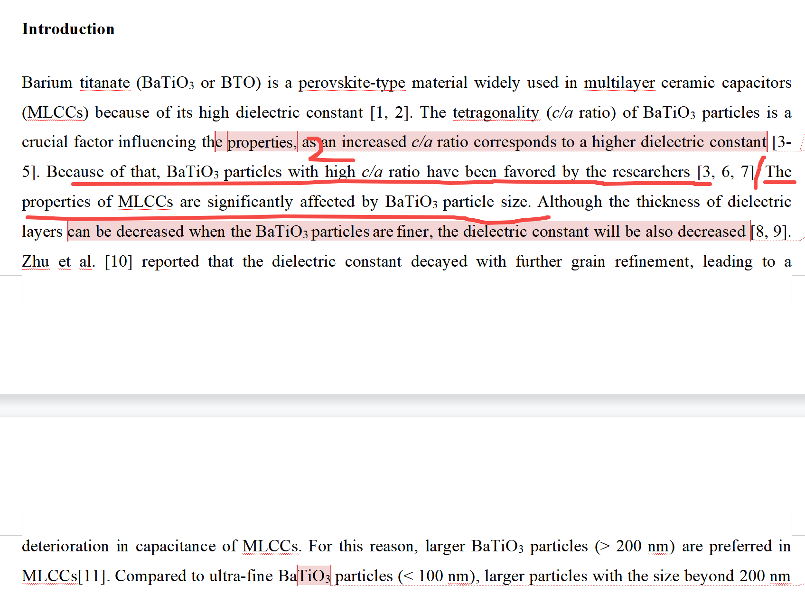

[来自： 科研论](https://wx.zsxq.com/group/15552141181242)

### 错误案例1.4.1、表述逻辑被中断、被割裂。\[pqc1\]

截屏中标记1部位之前在说c/a比的事情，但这里突然说了另外个粒径的事情，也没任何过度，比如前面也没说In addition引导，或者句子也没说are also affected之类的，表明你在讨论另外个东西了。

你看文字素材库的时候，一定要先看起码10篇以上，2.1号前言文字素材库中，还没被你打乱顺序的文献，仔细看他们每一句句子和句子之间是怎么过度，衔接的。然后用一个适合你的结构，你这篇整体还是很差，第3次说了，组里的pxx、wtt也已经写了类似的论文了，而且写法是和你很接近的，但他们都没此类过度的问题。

而且第2个标记处也有问题，没什么信息量。你才说了c/a比，就说研究工作者要获得高c/a比，那接着说粒径重要，又要说研究者也希望此类粒径控制的样品？这样表达下去就很累赘了，你2.1号前言文字素材库没用好，否则几乎不会有这种表达不很流畅的文献的存在的，随便采用哪种结构都不会是目前这种效果。

扫码加入星球

查看更多优质内容

https://wx.zsxq.com/mweb/views/joingroup/join\_group.html?group\_id=15552141181242