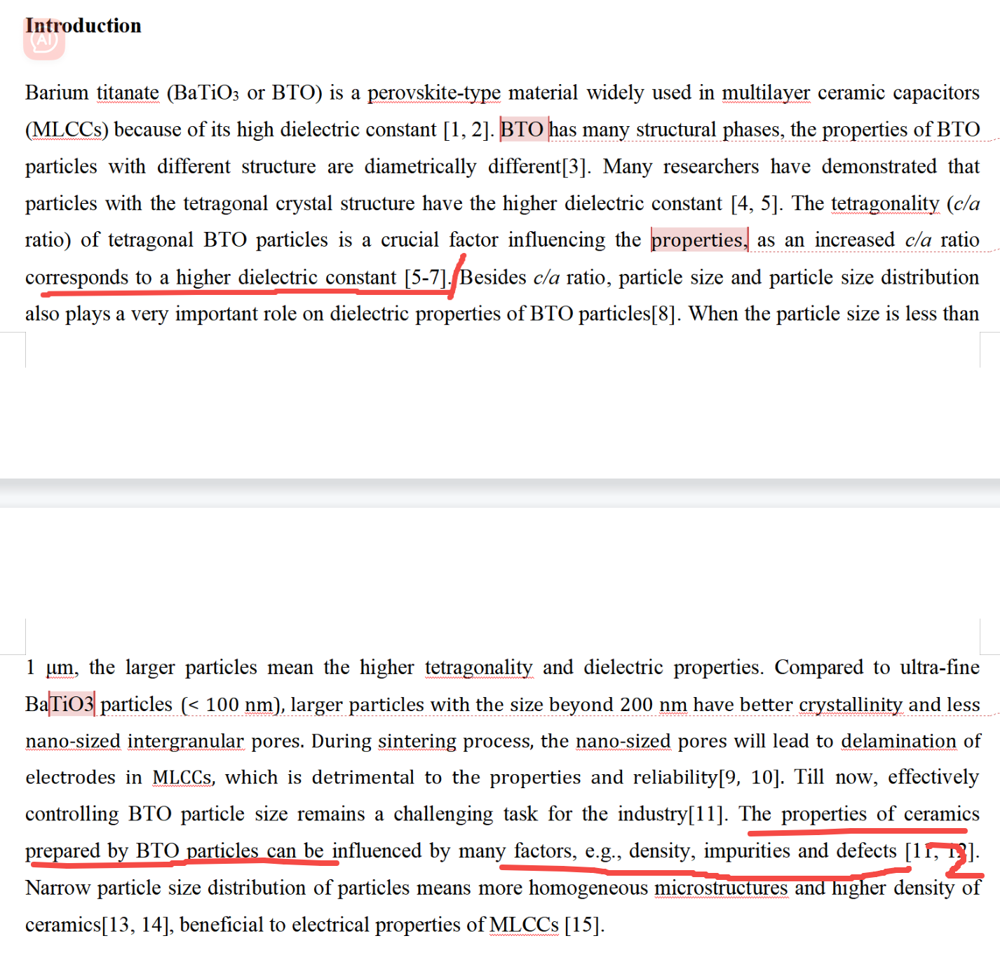
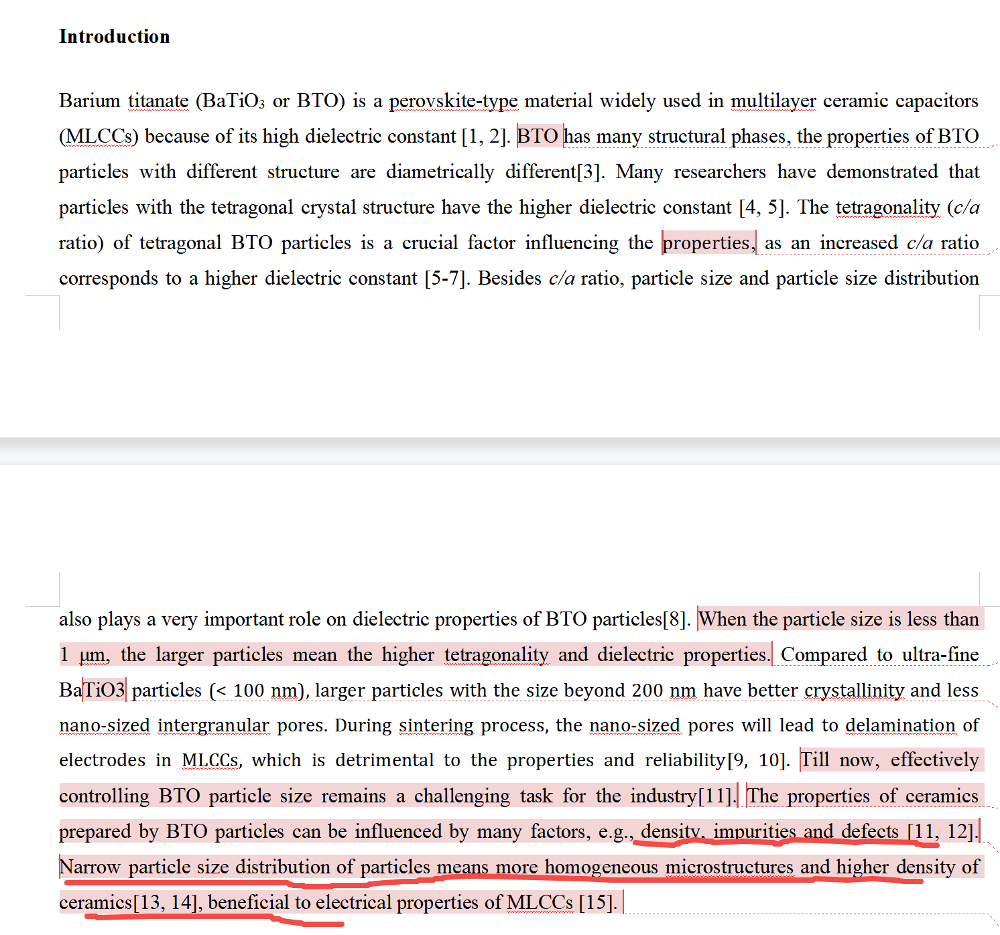

[来自： 科研论](https://wx.zsxq.com/group/15552141181242)

### 错误案例1.5.1、写作太累赘和啰嗦，在不是自己重点的内容上，花费太多篇幅。此外，提到的有些东西，包括前人文献或者领域的问题，也是自己没解决的（你自己也没解决，你提了干嘛呢？你提了后，人家自然问，那你做了么？结果你也没做）。而且，应该要重点写的部分，完全没体现。\[pqc1\]

先看标记1的部位，下面整整4句话，才绕到ca比的事情。

比如第2句，很累赘，没实质性传达，钛酸钡很多结构，不同结构性能不同（接近废话了，一般不同结构都会多少对应不同的性能。那你做的是什么结构，和你做的什么关系，到底什么结构是什么性能，而且你的主题是要围绕mlcc器件性能展开的，这个和mlcc器件性能有什么关系？毕竟很多东西都有很多结构，不同结构大部分情况都性能不同，比如水、碳，不都这样么）？

第3句，大量研究者表明四方相颗粒具有高的介电性能，但第4句又来了说四方相是个重要因素，你第3句不是体现这个意思了么？就绕来绕去，才给出一个干货性信息。比如改成我这样：第一句已经提到了mlcc中广泛用钛酸钡，而且要联系到为什么，因为和介电常数相关。那么只要一句话就可以过渡到正题了。 不是mlcc对介电常数有要求么，那么 （下划线部分是我给你的思考，不是让你写进去的文字，后面的才是）为了提高介电常数，大量研究学者致力于获得具有高c/a比的钛酸钡（c/a 1.01，理论上具有最高介电常数等【这个你自己确认下】）。然后就可以过渡到粒径、粒径分布这2个因素也很重要。

接着截屏中标记的第2处，提到钛酸钡的密度、纯度、缺陷问题，但这些你自己全文压根没研究到。你看看pxx、尤其wtt的论文中，同样涉及要控制粒径，而且她还获得了不同的粒径，她是怎么说的？

此后文献的组织，也要围绕你文章贡献点来展开，你要先想好自己文章贡献点是什么，然后再来根据这个组织。比如你觉得你贡献点是同时获得高c/a，窄尺寸分布，那你想好后，就要让读者，包括审稿人，尽快get到你到底要干嘛。别人没耐心读了7，8句话，才逐步get到你到底要干嘛。除非有的人写作过渡逻辑很紧致，那有可能顺着一步步看好多话，得知你到底要干嘛（类似抽丝剥茧的感觉）。如果没这种写作能力的，就参考文字素材库，找到最合适的就好了。而且我们组都发了几篇了，也可以作为素材库，他们也都不存在你这样的问题。

### 错误案例1.5.2、表述逻辑被中断、被割裂；归因错误；提到别人的问题，自己也没涉及。

上面这段，倒数第2句话还在提什么密度、缺陷和杂质对器件性能影响（而且这句话也存在典型错误，清单中其他地方也提到了，就是讲了个自己研究压根没涉及的，但又容易让人去联想你是不是做了的事情），结果下面1句话，就是最后1句话，突然跑出来提窄尺寸分布的事情。

当然如果我这么说，学生估计会继续和我解释：这个窄尺寸分布意味着缺少少，密度高什么的。但显然不是的，所以我在清单中的使用中，大量都提及：no explain，我指出的问题，不是让你给我解释的，而是说你那样写，别人就会那样思考，你认为别人思考错了，那也不是别人的问题，而是你表达的问题。你要修正的是自己的表达，而不是去解释。解释就意味着你希望修正别人的理解，但你要知道，你稿件投出后，被拒了就是被拒了，你很难去修正别人的理解（虽然有人会说可以argue，但毕竟成功率是低的，而且为什么不第一次就表达的不要让人有歧义或者误导性理解呢？）。

扫码加入星球

查看更多优质内容

https://wx.zsxq.com/mweb/views/joingroup/join\_group.html?group\_id=15552141181242