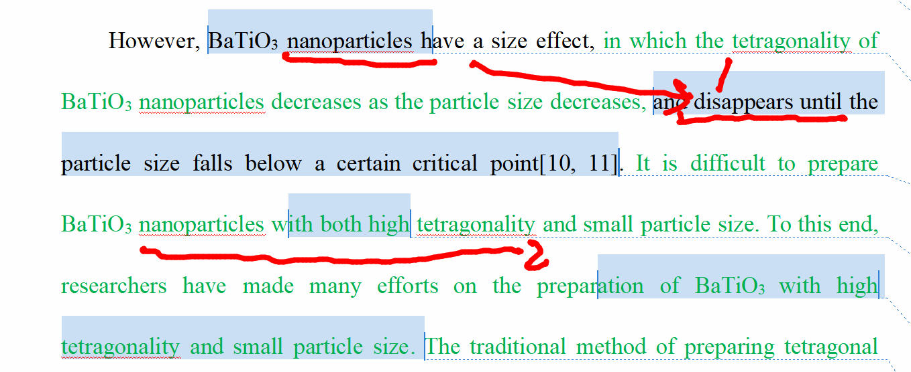
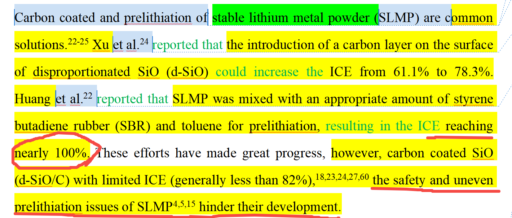
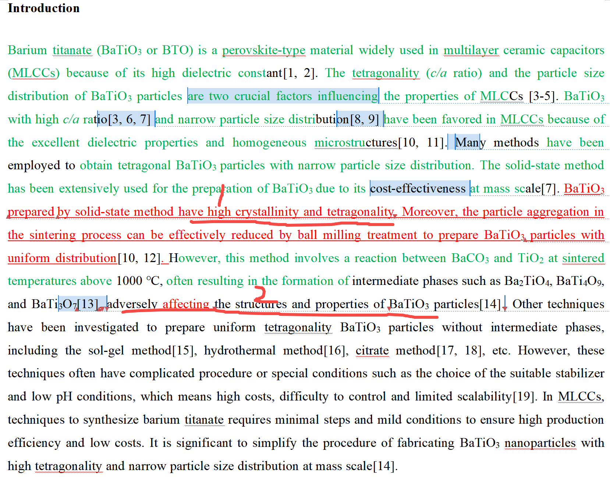
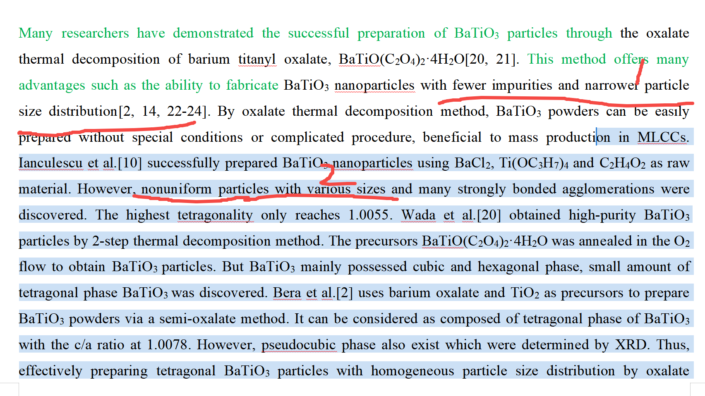

[来自： 科研论](https://wx.zsxq.com/group/15552141181242)

### 错误案例1.6.1、前后2句话自相矛盾。

第1句话提到纳米颗粒的四方性会消失，第2句话又说要制备同时具有小尺寸和四方性的样品，前后矛盾，按第一句话的说法，小尺寸到纳米颗粒，四方性就没了，那怎么同时可以获得小尺寸和四方性呢？

即使第一句话，加上了低于临界尺寸四方性会消失也存在逻辑问题。如果低于临界尺寸，四方性会消失，那么你意思你就是在高于临界尺寸去制备，那大家都这么做的，也是已知事实，你没什么贡献了。而如果你说你做的东西很小尺寸，甚至低于你所谓的临界尺寸，还有四方性，那和你之前的描述冲突。

正确做法应该是说清楚，为什么随着粒径降低，她这个四方性的保持很困难。困难不等于你这边说的很绝对的"disappers"，只要找到困难原因，针对原因去设计思路，就可以解决这个困难，那么也就是你的贡献。

### 错误案例1.6.2、写的每一句话，你一定要反过来想，我怎么能挑出这句话的毛病，直到挑不出毛病就ok了。

To solve these problems, efforts have been devoted on fabricating the current collector,\[12\] anode material,\[13-15\] separator,\[16, 17\] and electrolyte,\[18, 19\] while these fabricating routes are complex and expensive in industrial practice. According to the literatures and our previous work, there still lacks comprehensive studies on the facile strategies for practical battery.\[9\] Another easy approach is to decorate anode particles with functional binders, where the formation of Zn dendrites during dissolution/deposition cycles can be suppressed.\[20\] Nevertheless, the effect of binders is a complicated issue and has never been fully understood. Fundamentally, binders can maintain the structural integrity of anodes, significantly affecting the battery performance, despite their low ratio in the entire anode. As for the practical Zn anodes, water-soluble polymeric binders are usually employed to glue the anode particles owing to the less toxicity and lower cost than the non-aqueous binders using organic solvents.

以上第1处和第2处黄色部位，先前提到了集流体，阳极材料和隔膜这些，到还是勉强可以做制备过程复杂和昂贵，但最后的电解质呢，首先电解质也不太适合前面用fabricating（制造）连接，其次电解质改性这些会很复杂而且昂贵么？

然后第3处黄色的内容，指代不清楚，按你的表达，就变成：实用电池的简便策略？这句话别人根本看不懂。应该是：制备实用电池的简易策略。就是你在practical battery之前少了一个制备的表述。

第4处黄色部位，has never been 这种太极端和攻击性满格的词汇不要使用，素材库中大量温和的表达方式，never been就意味着你要穷尽世界上所有专利、文献、会议报到等，你确定你都全部穷尽和看完，没有遗漏了？起码也要加上to the best of our knowledge。

第5处黄色部位，水溶性的胶粘剂就一定比非水溶性的毒性低？完全不是的，溶于水的也可能有大量剧毒的有机物。

### 错误案例1.6.3、论据无法支撑论点，而且存在自相矛盾，论述突兀等问题。

以上内容，最后1句提到SLMP方法存在安全和预锂不均匀的问题，但从前面引用文献情况来看，完全get不到这点，前面引用的文献说的效果都特别好了，都接近100%了，这都是理论上限了。那既然不均匀，是什么意思？是有的地方100%，有的地方首效很差？这都没体现进来，如果不是的话，就意味着之前文献全部样品都100%，那你后面说预锂不均匀，也矛盾。

而且，那个所谓的不安全，也特别突兀，都压根没交代一些比如SLMP方法和安全性的关联，直接就说人家不安全。

素材库中也一定有，比如起码会从他要使用纯的锂金属出发，来阐明会有不安全的问题，那正好人家也可以看到你用的是什么东西，是不是安全性问题有注意到。

### 错误案例1.6.4、标记1处说采用这种方法可以获得高结晶性和四方性的材料。但是标记2处就说采用这种方法会有引入杂质，对结构和性能都有负面影响。这两处表述前后矛盾。\[pqc1\]

### 错误案例1.6.5、标记1处说采用这种方法可以获得少的杂质和窄的粒径分布。结果举出来的例子又是不能够获得均匀的粒径分布，得到的是不均匀的、不同尺寸的颗粒（标记2处）。\[pqc1\]

而且我还随便翻了一眼，他里面存在大量的矛盾的问题，还有一些可能是句子出现的比较早，过了几段落之后可能忘记了，导致矛盾，有的如同上面2个错误案例，只是隔了两句话就会发现矛盾。

所以又可以发现同一个学生，同一个论文，同样的思维bug，导致文中多处此类错误。

扫码加入星球

查看更多优质内容

https://wx.zsxq.com/mweb/views/joingroup/join\_group.html?group\_id=15552141181242