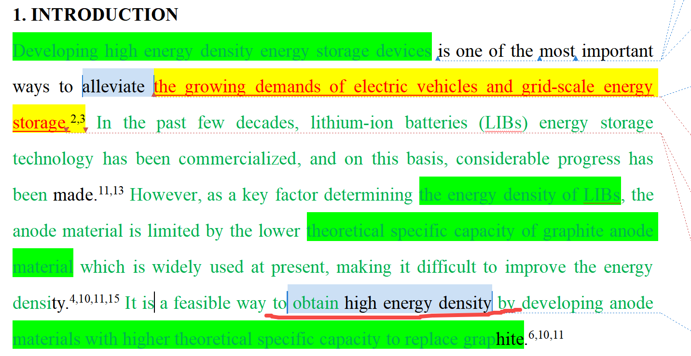

[来自： 科研论](https://wx.zsxq.com/group/15552141181242)

### 错误案例1.7.1、下面截屏下划线标记的部位：获得高能量密度(obtain high energy density)，表达不严谨。你需要讲清楚获得什么东西（锂电池）的高能量密度或者进一步提升锂电池的能量密度，不然给人看着没头没脑的感觉，也很口语化。\[js1\]

### 错误案例1.7.2、截屏标记处，你这里实际上想表达的是，SiO通过碳包覆和预锂化是提高其首效的常用方法，但这里完全没提到SiO的东西，也没提到关于提高首效，别人看了就会很莫名。这里还会发现一个有趣现象，就每个人的固有思维习惯bug，这样的bug几乎会带入他每一个写作习惯中，但是他没意识到。上面那个错误也是同个学生，同个问题，既表达时候经常会缺少主语、宾语之类的。

扫码加入星球

查看更多优质内容

https://wx.zsxq.com/mweb/views/joingroup/join\_group.html?group\_id=15552141181242