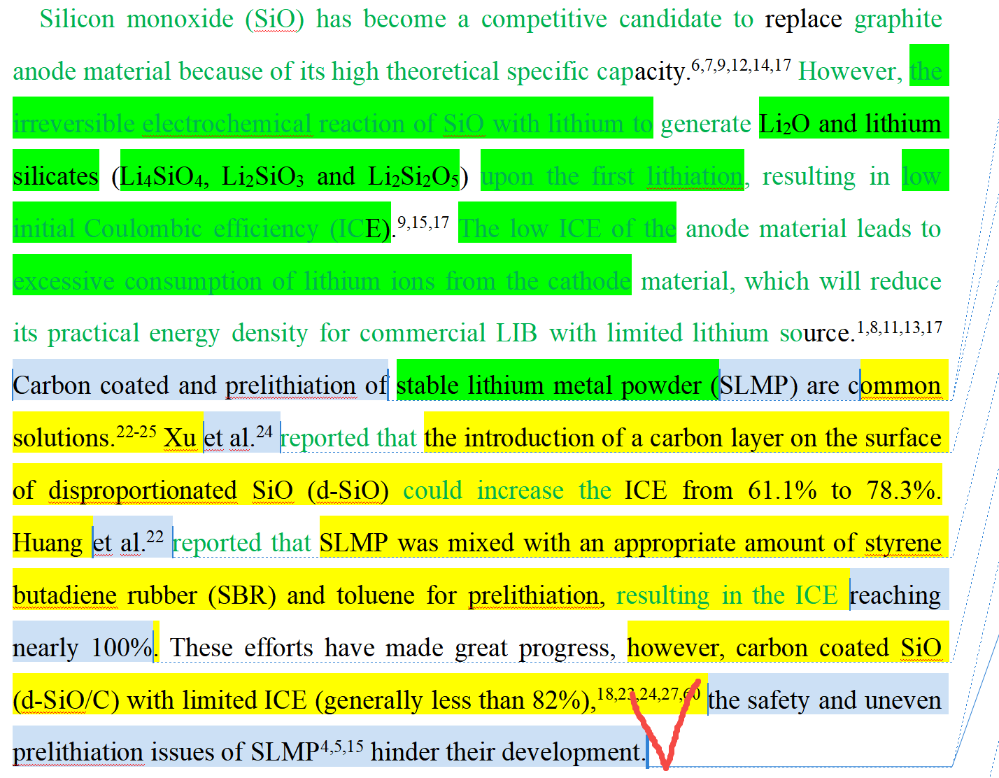

[来自： 科研论](https://wx.zsxq.com/group/15552141181242)

### 错误案例1.8.1、遗漏引用和学生研究相关的文献。

前面文献讲了SLMP方法的问题，但其实也有文献报道采用LiH而非纯锂金属的，所以应该接着要说这些文献的，不能无视其他人的工作。

比如接着最后一句话可以说，为解决使用纯锂金属粉末相关的xx问题，也有文献报道采用xxx方法（在本案例中，就是要追加引用LiH的报道），加上这个方法的效果。

然后就可以in the present work，你做了什么，而且要确保你做的东西肯定和前人报道是有一些差别的，这个在实验阶段方案，0~1阶段的idea确认和1到10阶段的图片素材库工作就应该确认了。

扫码加入星球

查看更多优质内容

https://wx.zsxq.com/mweb/views/joingroup/join\_group.html?group\_id=15552141181242