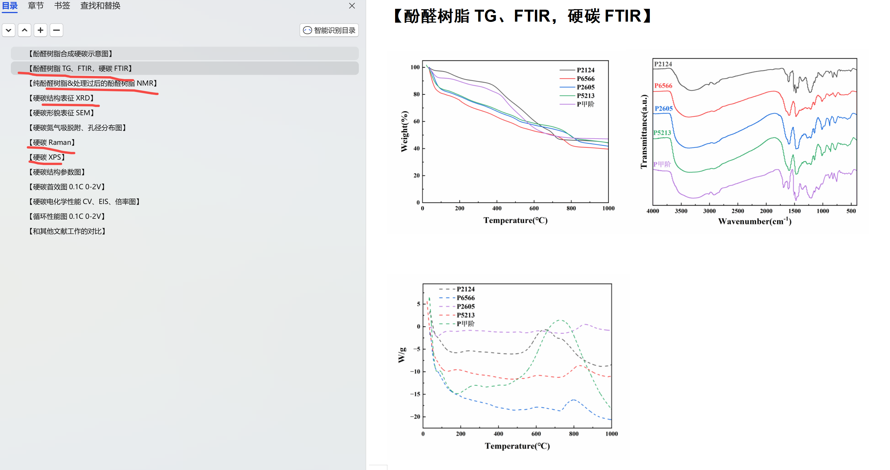

[来自： 科研论](https://wx.zsxq.com/group/15552141181242)

### 案例2.0.1、当在论文框架中填充自己数据的时候，还要比对自己搜集的数据和目标文献的异同。

比如像上面论文框架中的TG、FTIR、NMR、XRD、XPS，包括CV、EIS等，都可以比对一下自己的数据和目标文献的异同，而且目标文献尽量不要只看一篇。目标文献需要比较靠谱的文献，然后看个至少两篇。

这个工作的目的是看你收集的数据是否存在重大的bug或瑕疵。

扫码加入星球

查看更多优质内容

https://wx.zsxq.com/mweb/views/joingroup/join\_group.html?group\_id=15552141181242