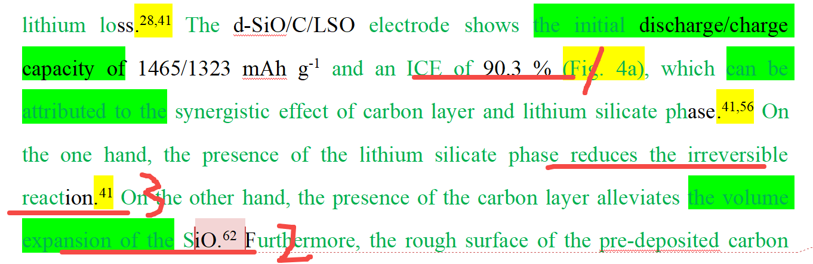

[来自： 科研论](https://wx.zsxq.com/group/15552141181242)

### 错误案例2.2.1、表述还没有触及要讨论的点就戛然而止了。

上面的2、3两处都是要讨论1处ICE高的原因。

其中3处提到了降低不可逆反应，这个是和ICE高是有关系的。

但是2处只是说了碳层可以缓解体积膨胀。那么这个和ICE高的关系是什么呢？

扫码加入星球

查看更多优质内容

https://wx.zsxq.com/mweb/views/joingroup/join\_group.html?group\_id=15552141181242