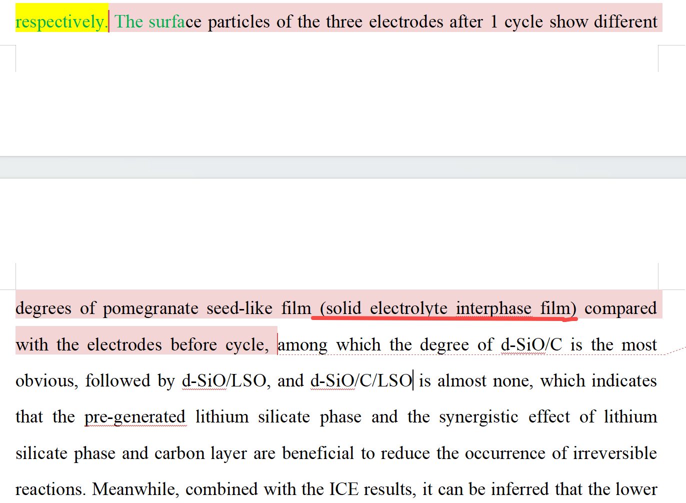
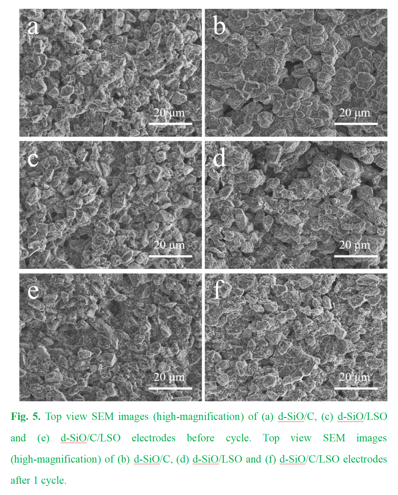
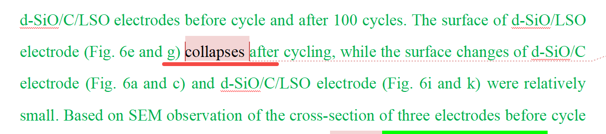
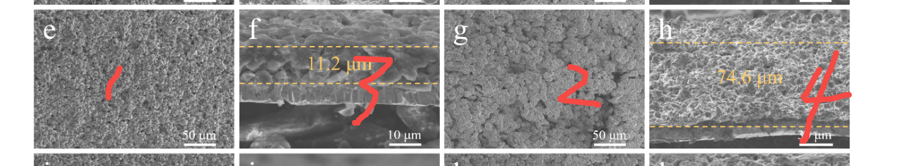

[来自： 科研论](https://wx.zsxq.com/group/15552141181242)

### 错误案例2.3.1、文中提到的讨论无法从图表中看出来。

上面提到了形成SEI膜。但结合下面的图表来看；b、d、f与a、c、e相比，看不出什么太大的区别。那既然a、c、e是没有SEI膜的，因为那个时候都还没开始工作，那为什么b、d、f就认为上面能看到一个SEI膜呢？而且还是明显（ obvious）的？

### 错误案例2.3.2、针对结果的讨论不够准确。

这里学生用了collapses，有坍塌的意思。但结合下面的结果来看：

2和1相比，也就是4和3相比，可以看到这个电极材料是膨胀了。所以和原先看上去，结构看着更有点蓬松，松散的感觉。而且它膨胀了6倍之多，所以用坍塌是不够合理的。

扫码加入星球

查看更多优质内容

https://wx.zsxq.com/mweb/views/joingroup/join\_group.html?group\_id=15552141181242