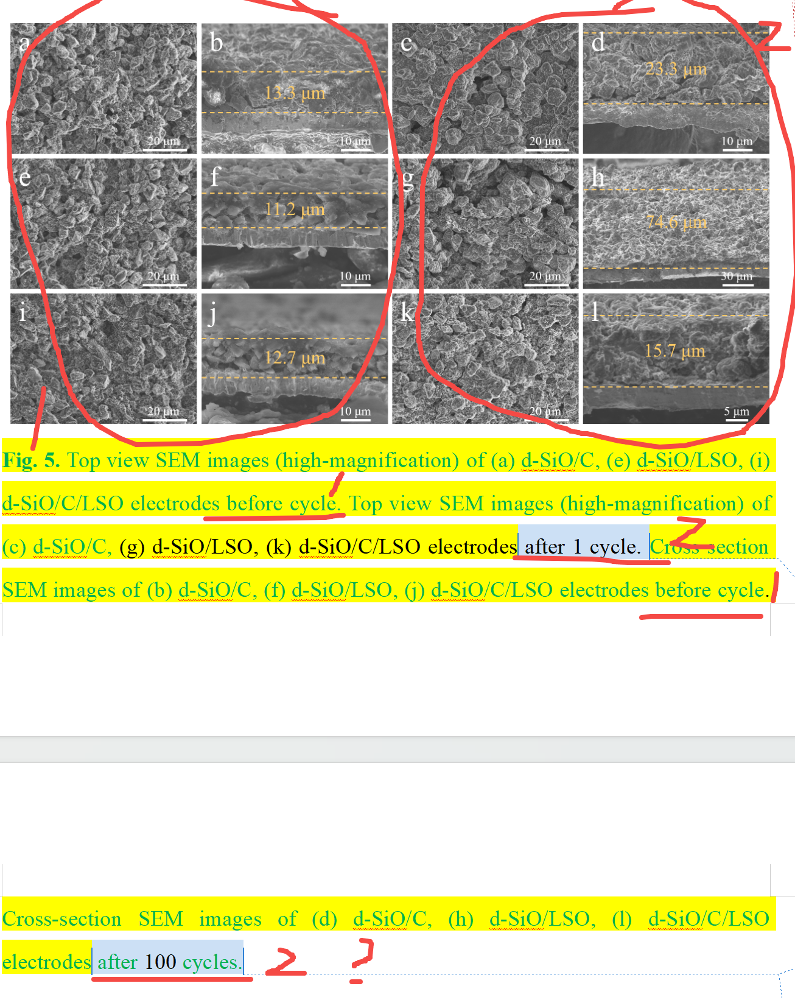

[来自： 科研论](https://wx.zsxq.com/group/15552141181242)

### 错误案例3.1.1、看上去应该是隶属于同一逻辑层次的结果，但他们的条件不一样。

左边标记1的圈中的图片涉及两个类型的结果（截面图和顶视图），然后他们都是同样的条件（在循环前 before cycle）。

那么右边标记2的圈中的图片，也应该是同样的条件，但是他一个是1圈后，一个是100圈后，那人家马上就问了，1圈后的截面图是什么样的呢？或者100圈后的顶视图是什么样的呢？

扫码加入星球

查看更多优质内容

https://wx.zsxq.com/mweb/views/joingroup/join\_group.html?group\_id=15552141181242