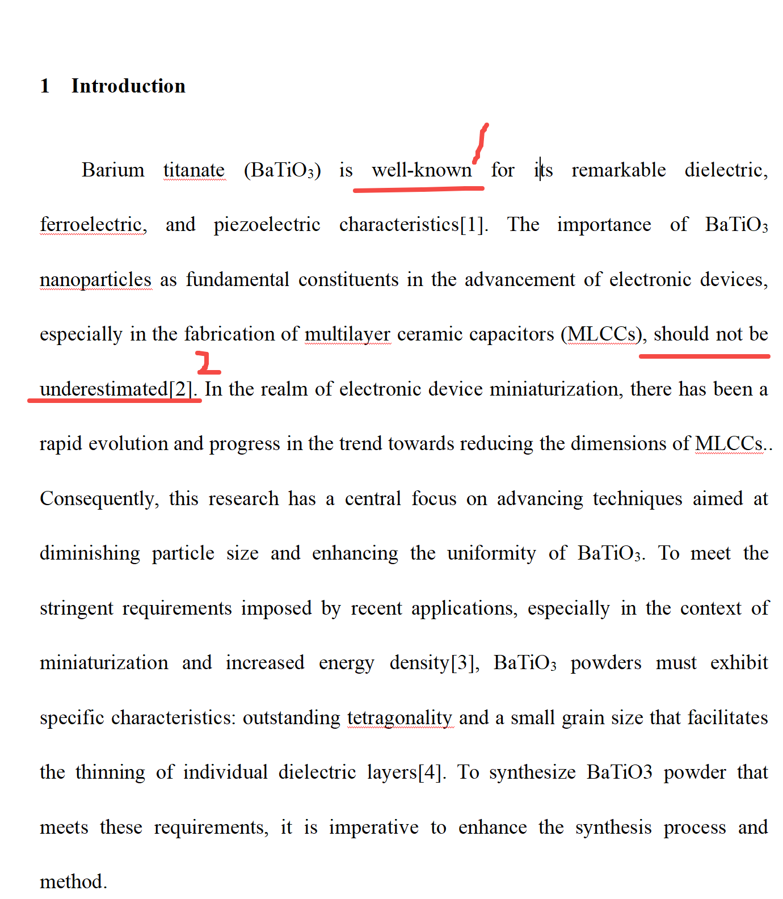
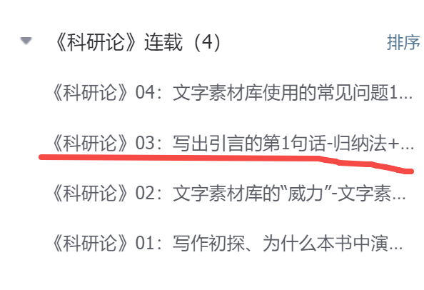
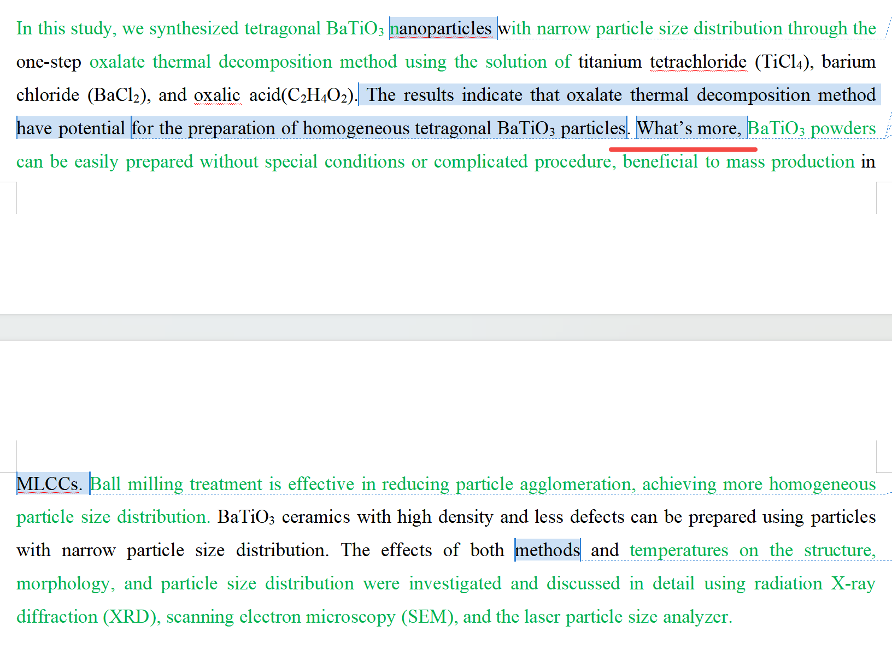
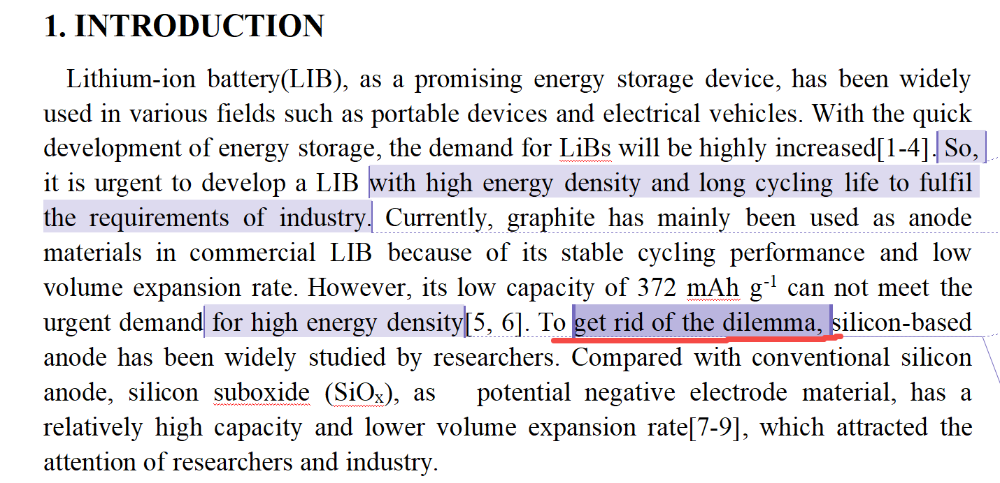

[来自： 科研论](https://wx.zsxq.com/group/15552141181242)

### 错误案例4.1.1、采用的表达方式不符合学术表述风格。

比如上面标记2处的should not be underestimated（不能够被低估）。这种都是受过去高考作文或者考研英语影响过深所致的，因为他们那里面的表述还不追求非常标准的学术化，因为毕竟不是写学术论文。

其实你除了这第1个问题，光是这几句话，还有另外两个问题，都是非常明显的考四六级作文的那种痕迹，而且还背了一些模板，也看得出背了一些句子，平时也经经常积累英语，我大概能估计到你的6级分数可能在500分以上。

但比较遗憾的就是太受过去的影响（比如构造长难句，使用平时积累的一些英语表达等），而没有用上我说的方法，所以你第1次成文的质量甚至还不如那些英语6级400分的人，因为他们知道自己英语成绩不行，所以就老老实实用了我的方法。但是你没有用我的方法，所以出来的第1稿质量非常差（之后在其他部分还会展开这个段落存在的其他问题，比如车轱辘文表述等，姑且不说里面存在的大量逻辑错误）。

然后你会觉得这种表达看着似乎还蛮高大上的，所以几乎每句都在频繁使用，但是在学术界的语言体系中不是这套体系。

如果做了文字素材库，而且文字素材库中参考文献选取合理的话，几乎不会见到这种表达的，而且就算你能见到这种表达，那概率可能也在5%以下，那你干嘛不用一种95%以上概率，别人看了更舒服的那种表达方式呢？

而且如果能出现5%左右的概率，那也是因为你参考文献选取不合理，我觉得如果选取合理的话，应该这个概率是0%。

比如选取不合理的理由是可能某些内容也是个学生写的，然后呢，没有经过特别好的把关就被发出来了，然后你还把这样的文献去作为素材库，那就会出现我说的小概率，所以我当时就说如果选取合理的话，素材库中应该是不会见到这种表达的。

那么怎么叫参考文献选取合理。首先要把知识库做好，从知识库中选取能做素材库的文献： **这些文献基本上是由两类型组成的，** 第一类文献是来自于跟你要投稿的目标期刊差不多level的期刊，或者就是来源于目标期刊的（假设 Advanced Materials，如果目标期刊的文献数量足够的话，如果不够的话，那么你就可以把期刊的范围再延伸下）。

因为第1类文献你限定期刊了，那么有可能里面有一些研究跟你的相关度不是那么的高。

所以接下来就会有第2类文献，是不限定期刊的，但是和你做的研究相关度特别高的文献。

这两类文献的数量加起来也不用太多，比如像你的话 **不超过20篇就行了，但是也不要低于15篇** 。

接着把这20篇文献形成《引言文字素材库1号文件》，《2.1号文件》，《2.2号文件》、《2.3号文件》就可以了。

在2.3号文件中，这个文件会提示你自己的论文中，第1句话写什么，第2句话写什么，第3句话写什么，然后在这个提示词下方还会有20个例句供你参考。

那么你有了这20个例句，到底怎么生成你自己的一句话，而且这句话要和别人不重复，而且表达又要符合学术规范，我下面有一个1万字以上的演示：

比如在这个科研论的03篇：

[https://articles.zsxq.com/id\_k2d4l4s3r446.html](https://articles.zsxq.com/id_k2d4l4s3r446.html)

我自己像素级的手把手的给你写出了引言的第1句话，他其实是从9个例句出发就能写出第1句话了，而且这句句子既没有和别人重复的问题，也不存在表述不学术化的问题。比如里面会提到使用这9个例句所涉及的比如归纳法和比大小的方法。

你要按照这种方法重新改写你的每一句话，包括第1句话用的这个well-known也特别奇怪。学术界的语言，比如会说这个东西被广泛研究，在mlcc领域当中被广泛应用等等，但是不会用well-known这种表述。

比如第2句话说了一长串东西，然后说这个东西不可被忽视，那学术界就直接会说碳酸钡是制备/制造MLCC器件的主要或者说核心材料。而不会说这个东西是不可忽视的，因为我上面说的这句话就已经体现了这个意思了。

你要用一些客观的表述来支撑这个东西是不可忽视的，而不是仅用文字来说明他不可忽视。

而且你这句话的长度非常长，都跨越四行了，学术界的表述其实是很少有此类长句的，尽量不要超过3行，当然我知道你们考六级都喜欢什么一句句子整很长，甚至六七行（因为你们看了一些宝典或者教就是这么弄的，还得塞点从句啊什么进去，而且你里面还有头重脚轻的问题）。

比如我前面说的头重脚轻，“should not be underestimated”，这个should前面的主语非常长，其实英语表述也不太喜欢这种类似的句子的，所以他们才会有很长的句子要用“it is xxxxx”去引导的。

后面的第3、4、5句话全部存在此类问题，我一看就知道不是一个规范的做了文字素材库之后能提取出来的表达，所以全部要重写一下。

重写的方式就是我上面说的，你看看我给你示范的引言的第1句话怎么写的，而且我最近还会发上来第2句话怎么写的。你看了两三句之后，就应该知道自己的每一句话是怎么写的了。

### 错误案例4.1.2、类似的下面的what's more也是和上面案例一样的问题，都是属于把以前高中写英语作文的一些表述用到学术论文写作中了。

### 错误案例4.1.3、你要引出为试图解决某个问题，采用了xxx方法，文字素材库中有很多表达方法，用那种高频的，不要用小众的且口语化的表达，比如下面标记红线处的。而且真的能“get rid of”（摆脱）么？其实不一定的。比如学术界的语言会说：to address什么什么问题，而不是“Get rid of the dilemma”（这种表达是你们可能在英文课本里会看到的，但不是学术publication中经常看到的）。

扫码加入星球

查看更多优质内容

https://wx.zsxq.com/mweb/views/joingroup/join\_group.html?group\_id=15552141181242