[来自： 科研论](https://wx.zsxq.com/group/15552141181242)

### 错误案例4.2.1、表述的主体内容缺失，给人没头没脑的感觉。

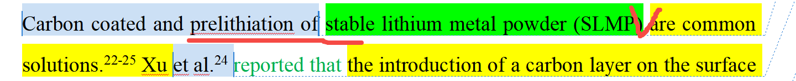

他这里实际上想表达的是，SiO通过碳包覆和预锂化是提高其首效的常用方法，但这里完全没提到SiO，也没提到关于提高首效，别人看了就会很莫名。

明白上面这点后，就会得知prelithiation of的表达也不准确，应该是SiO通过SLMP来实现预锂化，所以介词不是用of，应该是类似through, by之类的词。

这就是我说的，你要清楚自己到底触及了哪个东西，是不是你触及的哪个东西。

### 错误案例4.2.2、不要笼统的说影响性能（influencing the properties），到底什么性能？其实把逗号后面合并上来就好了，就直接说是介电性能。

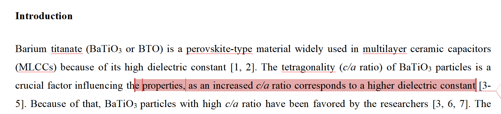

### 错误案例4.2.3、以下有5处表述不精准或者不准确的地方。

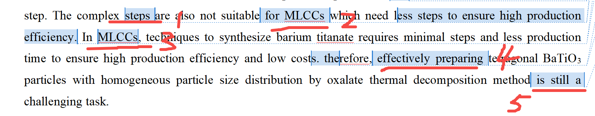

1处和2处：2处的MLCC指的是一个器件。器件是无所谓步骤太复杂，不适合的（1处），你想说的实际上是制造这个器件的流程太复杂的话，会引入一些问题，你觉得不合适，但你这个认知同样存在问题：

你这个材料是做MLCC器件的原料之一。实际生产MLCC器件的时候，厂家已经有这个材料了，然后再加上其他的一些材料，烧结成MLCC。所以他们涉及的生产流程是把这个材料和其他的材料一起混合起来，然后烧制成器件。某个材料的制备工艺复杂不复杂，并不直接和他们生产器件相关。

第3处也是，不存在说在一个器件中需要怎么样的一个技术。而比如应该是在某一个产业中或者某一个领域中，需要一个怎么样的技术。

4处：车轱辘文，说的很笼统，这样的话放到所有的语境当中都“适合”，什么叫“effectively preparing”？怎么叫有效呢？按照你前面的说法给出的，就是说要ca比高，然后粒径分布窄，那么你以上点评的文献其实都达到了。但你还说他们做的不行，所以你想表达的其实是短流程、短时间或者说耗能少的制备方式，还是一个挑战。

5处：... method still remains a....，会比你目前表达更及意。

### 错误案例4.2.3、这个颗粒已经超过100纳米了，不能叫纳米颗粒，或者说它是纳米尺寸的。

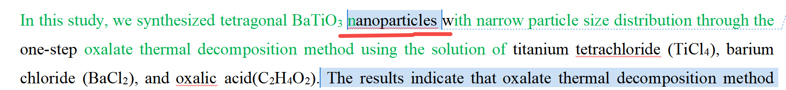

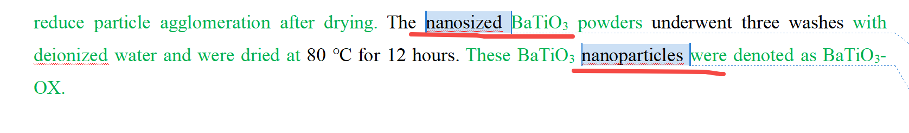

### 错误案例4.2.4、标记下划线也是表述没有触及最底层，所以显得像车轱辘文一样，什么叫“方法的效果”（ effects of both methods）？或者你起码说不同制备方法，或者就直接表述出来这两个什么方法。或者更有逻辑一点：你研究了方法A的什么什么参数对于什么什么的影响，同时又和方法B获得的材料对比（这样一来别人就能理解你为什么同时要做了两个方法，不是说简单的为了堆工作量）。

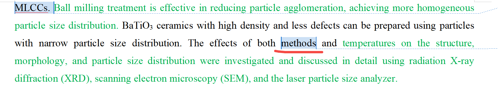

### 错误案例4.2.4、下面说到制备颗粒，那到底是制备的什么东西的颗粒？

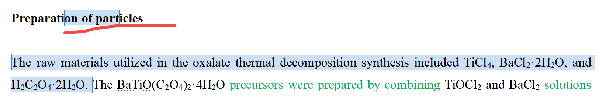

### 错误案例4.2.5、指代不清晰

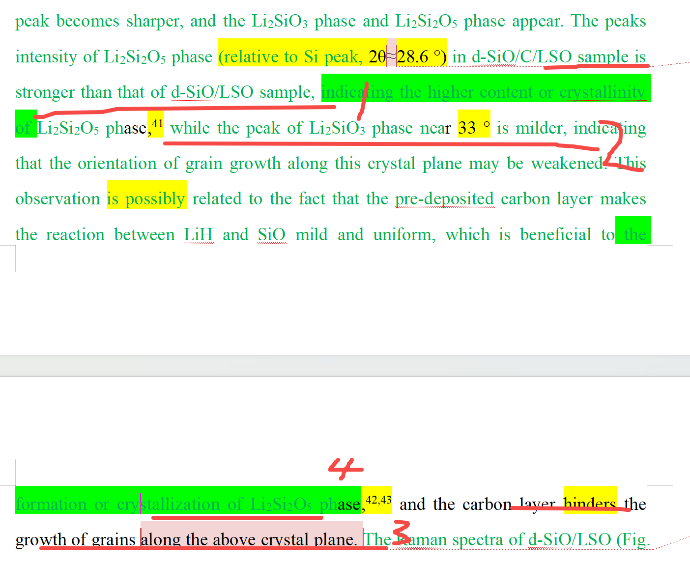

3号部位部位说above crystal plane，这里根本就判断不出来到底说的是哪个物相，因为1、2、4涉及了两个物相，然后有的又是结晶度高了，有的又是说结晶度弱。

### 错案案例4.2.6、XPS的几个峰是通过分峰得到的，所以严格来说，不能说它有5个峰组成的，就不是“composed of”

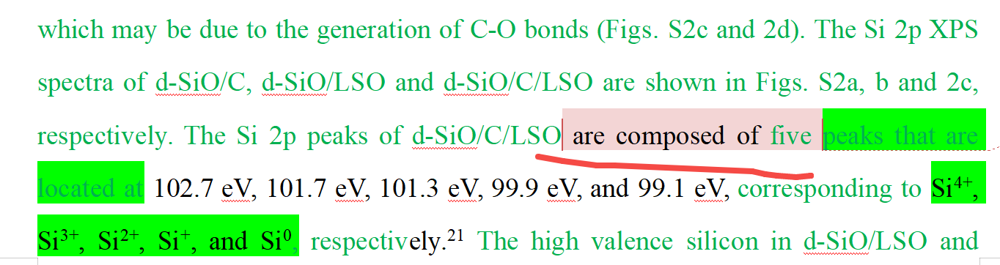

你要看一下xps描述的素材库，这种类似用去卷积分峰处理得到的几个峰，应该怎么表达？你也不要看了一个用composed of的，就认为就是用这个的，你要多看几个，万一那个人写的也不地道呢？

### 错案案例4.2.7、表述车轱辘文，没具体讲清楚

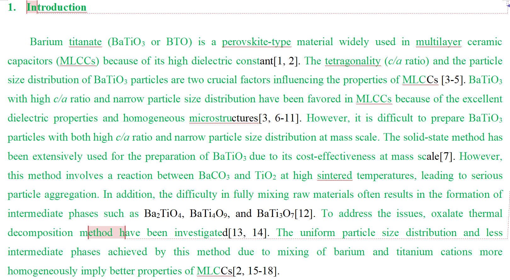

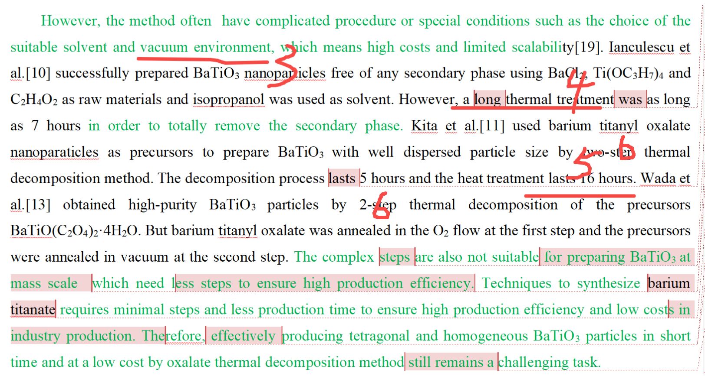

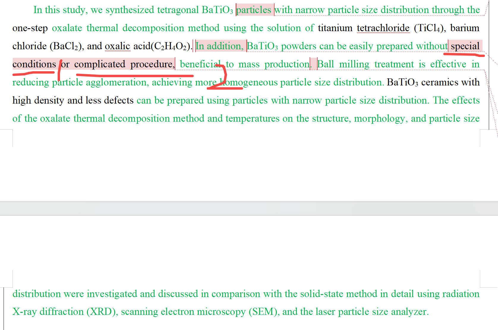

下面1处，说不需要特别条件（Special conditions），那么你这里说的特别条件到底指的是什么条件呢？

结合前文来看，比如之前的3处，学生这里指的应该是他这里不需要使用真空环境。当然如果这么写，潜台词就是别人是使用真空环境的，那你要确认你对比的这些文献是不是确实使用的真空环境？

如果是这样的话，那么就直接精确的说他不需要使用真空环境。

2处的complicated procedure（复杂过程）也是同样问题，指的具体是什么复杂过程，哪个地方复杂了？

也是结合前文来看，似乎是学生要想要表达，他这里用的时间比较少，而别人的时间很长，比如从4处可以看出，学生一直在说别人的处理时间，那言下之意就是这个处理时间比较长，学生涉及的处理时间比较短。

此外学生也在前面列出了之前的方法是two-step（标记6处），意思是自己的步骤会少一些。

那同样可以精确说自己的步骤短，耗时少，而不是车轱辘文般的说without complicated procedure。

### 错误案例4.2.8、再次发现同一个学生错误模式全都是一样的，以下4处都属于同一个表述不准确的错误

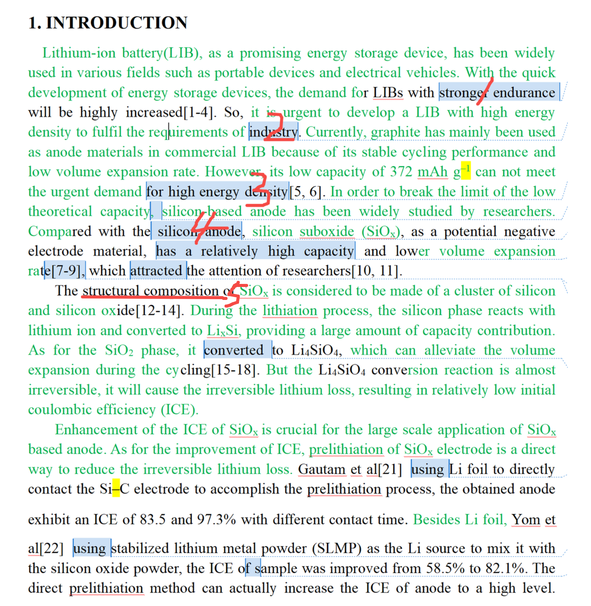

第1处的stronger endurance，这个endurance是怎么理解？其实学生想表达的是一个电动车或者电动工具，它的续航时间或者使用时间能更久。但这个endurance目前是连着电池（LIBs）的，人家就不理解这个endurance是什么意思，读者很容易get不到，你指的是这个电池的放电时间要久，还是可能还会理解为持久性是不是说循环寿命久？

解决方式很简单，还是看素材库，因为如果我说用什么词，那他最后还是无法学会使用素材库的方式来写作。科研论中已经一句话一句话的教你怎么写，而且我演示的这三句话还都是和锂电池用硅负极相关的：

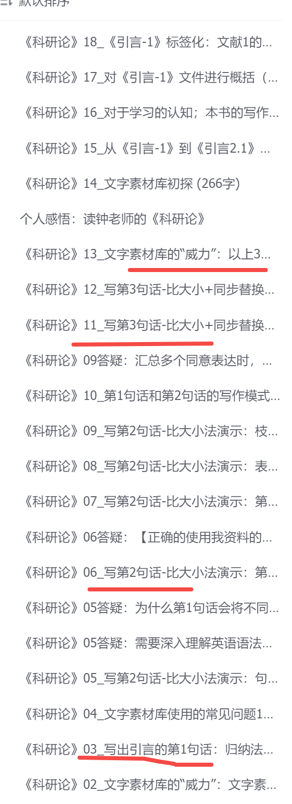

第2处的industry同样表述不准确。提升锂电池的能量密度，在消费电子领域里面也是有需求的，想想你用的手机，所以并不只是满足工业界的需求。

第3处的for high energy density就结束了。你可以看到我上面的例句是怎么写的。比如不会有这种没头没脑的表述，具体是什么东西的高能量密度？比如是：为了提升锂离子电池的能量密度。

第4处也不准确，氧化亚硅电极同样同样会被认为是硅电极，你这里其实比较的是纯硅，即pure silicon，而且你也不要说电极（electrode），因为电极里面还要加其他东西的，比如导电助剂，胶粘剂等。

第5处，什么叫“结构的组分”（Structural composition）呢？也许你在素材库中看到过这样表达，但是不要只看一份。而且如果新人吃不准的话，尽量用表述主流一些的表达。你第一步写的文字，起码不要让人阅读起来有障碍。

### 错误案例4.2.9、多处表述不精确/准确的问题

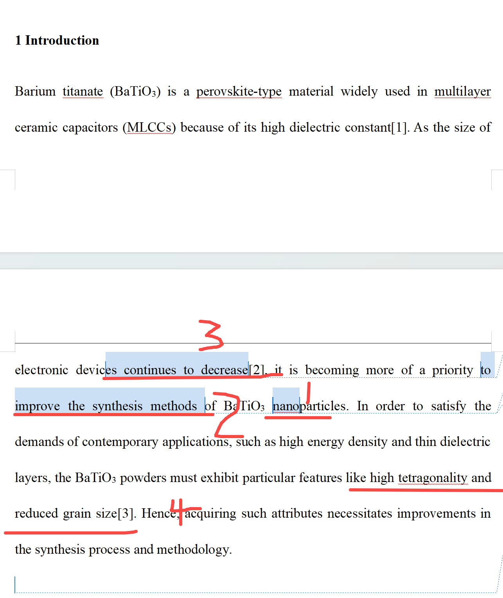

第一处，学生合成的颗粒最小的都比100纳米多，这种都不能叫纳米颗粒，就在这个checklist的错误案例4.2.3中都已经提到这个问题了，所以这种清单使用方式完全是错的，就说明学生根本没看，所以碰到这种类型的问题，如果再让下一次再让我看到学生根本没有对照过错误清单，那我只要看到一处同样的问题，我就不会继续往下看了，不会像这里指出4处他都没有看清单的问题。

第2处还是本处清单专门给出的表达不精确性的问题，什么叫提高合成手段？既然上面3提到了器件尺寸在减小，那后面说的就应该跟器件尺寸减少相关的东西，比如第4点就可以直接改造后接上去了：这个碳酸钡颗粒要把它粒径做小，同时还要保留它的四方性（如果四方性前面有铺垫的话，因为四方性跟介电性能有关系）。而不是很笼统的说一段车轱辘文，提高合成方法，怎么样叫提高合成方法？指的是合成方法要达到的效果还是什么？而且如果说是效果，那具体什么效果呢？还是说合成方法的效率？还是它的成本就完全不明确？

### 错误案例4.2.10、表述不精准、没触及底层、不准确

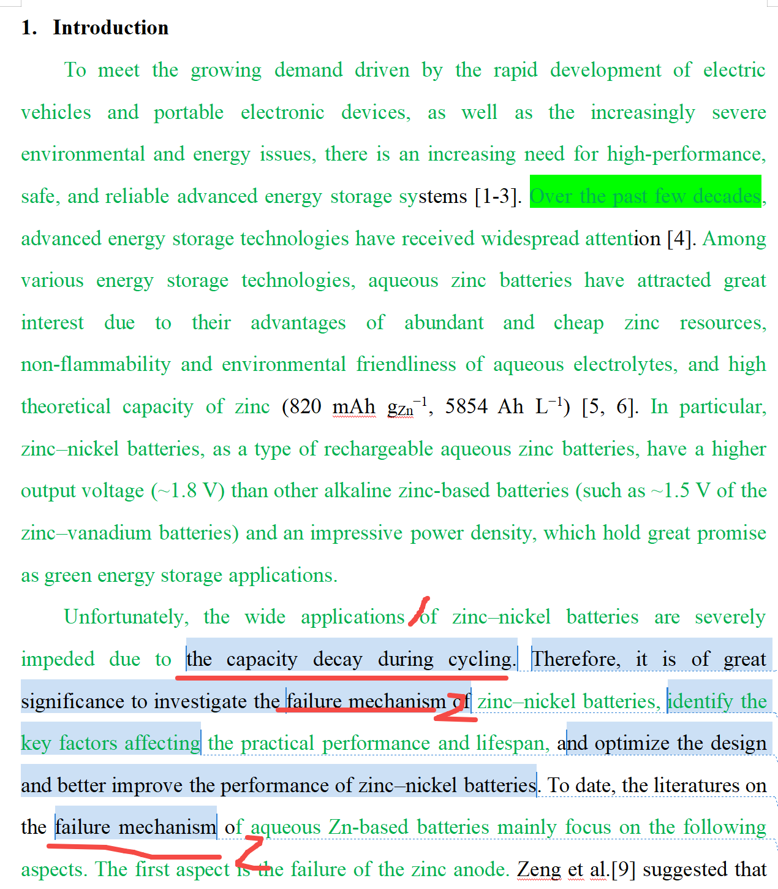

1处说到循环中，容量衰减，严重限制了锌镍电池的广泛应用，但严格来说，所有的电池，循环过程中，都会容量衰减，包括锂电池也是，但锂电池目前不也广泛应用的？而你2处提到的又是失效机制，失效是个严重性质的问题了（比如电池不能工作了），而1处的容量衰减也可以理解为循环过程中缓和的容量衰减（并不意味着无法工作，手机一年后容量是刚买来时候的80%，不也还能工作？没到失效的程度），对应不上2处的failure mechanism。通过文字素材库（语料库）结合你自己的实验结果，想清楚，你针对的到底是电池的什么问题去研究的，通篇都对着这点来说。

扫码加入星球

查看更多优质内容

https://wx.zsxq.com/mweb/views/joingroup/join\_group.html?group\_id=15552141181242