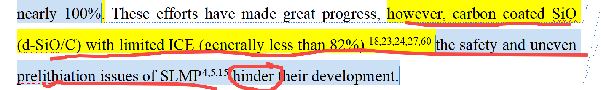

[来自： 科研论](https://wx.zsxq.com/group/15552141181242)

### 错误案例3.3.1、这句话，主语过长了，hinder前面全部是主语。完全可以拆开2个句子，或者一个句子，当中用and连接，前面比如就是碳包覆的目前ICE还比较有限，一般低于xxx等，后面再描述SLMP的问题。

扫码加入星球

查看更多优质内容

https://wx.zsxq.com/mweb/views/joingroup/join\_group.html?group\_id=15552141181242