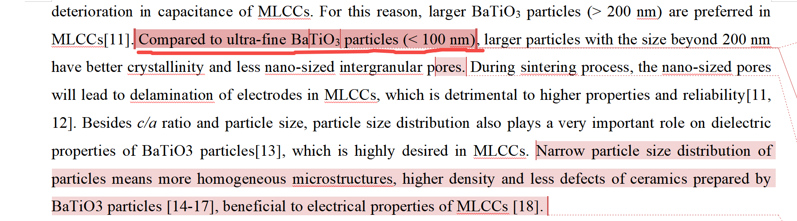
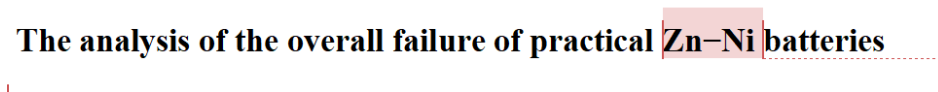
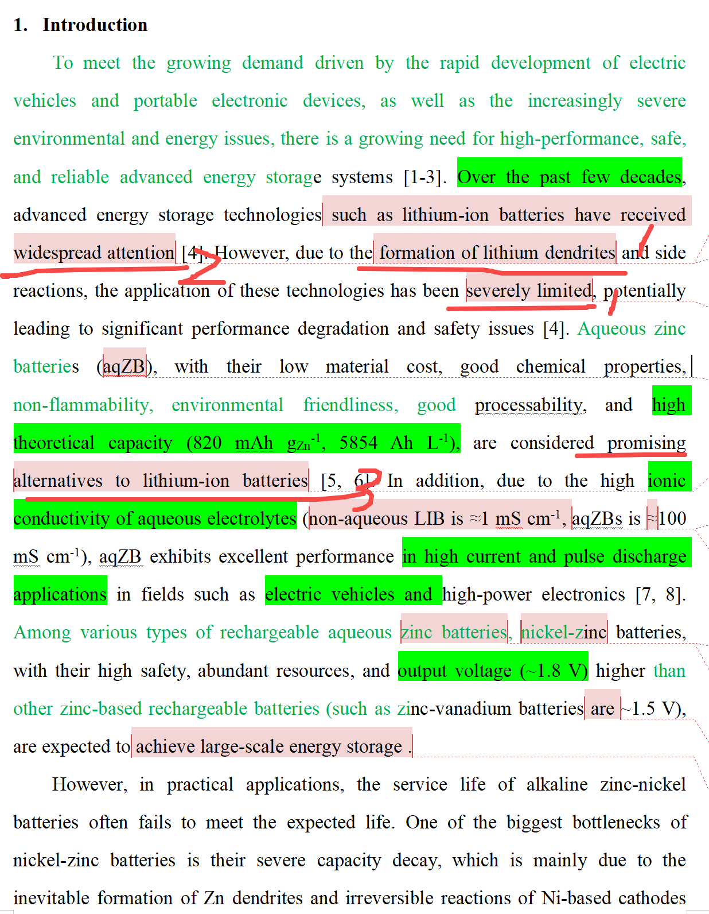

[来自： 科研论](https://wx.zsxq.com/group/15552141181242)

### 错误案例4.4.1、下面的案例，如果你做的是200nm以上的样品，你就说200nm样品的好处就行了，你不要去攻击别人100nm以下的问题，这样别人就会跳出来，谁说100nm不行的？100nm也可以结晶度好和缺陷少的。

### 错误案例4.4.2、为了说自己的体系如何好，就过度说别人的体系不好，而且说的完全不符合事实

1处说Li会形成枝晶，严重阻碍了这个技术的应用，这是典型的不符合事实的描述。我们现在用的手机以及其他的大量消费电子器件，包括电动车，以及目前大储中，都大量的在应用锂离子电池，而且这个用量还在不断增大。并不是你说的，严重阻碍技术应用。

而且如果你说严重阻碍技术应用，还和上一句话，也就是2处所说的内容自相矛盾。2处还在说锂离子电池被大量广泛应用，结果1处就说这个技术应用受到了严重的阻碍。

因为以上问题，你的第3处也是立不住脚的，别人不一定认可，锌电池是可以作为锂离子电池替代物的。比如像这种很重视能量密度的手机，还有电动车，特别是续航里程要求高的电动车，几乎目前是看不到能量密度低的，锌电池的应用空间的。何况两者之间的寿命差距还很大。

解决办法很简单，还是素材库没做好，写锌电池的人又不是你一个，我们组就写了10多篇了，你说你要发1区论文，那我们组写锌镍电池的，目前没有一个不发在1区论文上的。你看看他们是怎么引出锌电池的？你但凡看个5篇就知道了，基本上很少这样子引出的，如果他先要用锂离子电池引出也是有道理的。像你新人如果不会写的，那你就不要冒险用这种打压踩踏别人来提高自己的手法，你就老老实实说锌电池有什么优势，所以我们研究锌电池，然后锌电池当中又为什么选了锌镍去研究就行了。

再重复下，关于锂离子电池的表述全部删掉，只讲锌电池的事情。而且用好素材库，起码有个10篇锌镍电池组成的素材库。也不用超过12篇。看完后，再结合用我说的方法，就知道如何写了：去看下checklist中所有关于前言的。 **注意一定不要有某个句子和别人的表述一样，判断标准：句子内的5个单词不要和别人重复。** **这就是为什么要让你准备10篇的原因，你从10篇中不同的句子中进行排列组合，就不会与10篇中的任何一篇重复了。但如果参考过别人的表述的话，该引用的还是一定要引用。**

扫码加入星球

查看更多优质内容

https://wx.zsxq.com/mweb/views/joingroup/join\_group.html?group\_id=15552141181242