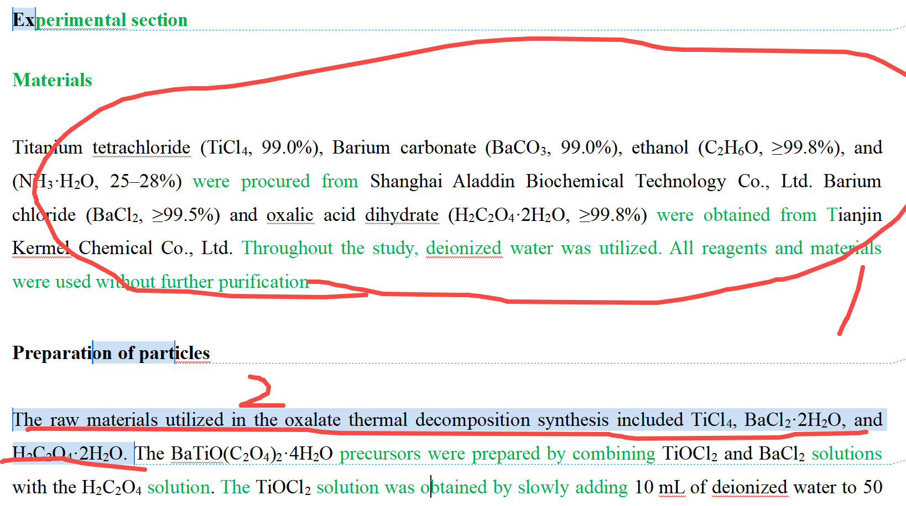

[来自： 科研论](https://wx.zsxq.com/group/15552141181242)

### 错误案例4.5.1、下面标记2处表述意思重复，而且说的内容没有额外信息量。

首先标记1处已经给了实验中用到的原料了，这些原料中的部分肯定是用来合成标记2处的材料的，没必要多此一举继续重复的说一下要合成的材料需要用到1处中写的哪些原料。而且你接下来讲合成步骤的时候，会用到哪些原料就会逐一提及了，而且会按照时间先后顺序提到这些原料的使用方式，所以标记2处的这句话也没有提供什么额外的信息。

你既然这一小节说的是怎么制备什么材料，那你就把跟制备相关的步骤按一定的逻辑罗列出来，完了之后自然会知道用的是哪些原料。

扫码加入星球

查看更多优质内容

https://wx.zsxq.com/mweb/views/joingroup/join\_group.html?group\_id=15552141181242