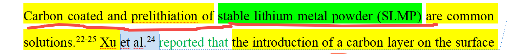

[来自： 科研论](https://wx.zsxq.com/group/15552141181242)

### 4.6、and前后的东西，不属于一个尺度/性质的

#### 错误案例4.6.1、下面红色标记处，从and后的名词属性来看，前面也应该调整成名词属性表达，类似carbon coating（可以用支持全文搜索的数据库去查下就知道了）

扫码加入星球

查看更多优质内容

https://wx.zsxq.com/mweb/views/joingroup/join\_group.html?group\_id=15552141181242