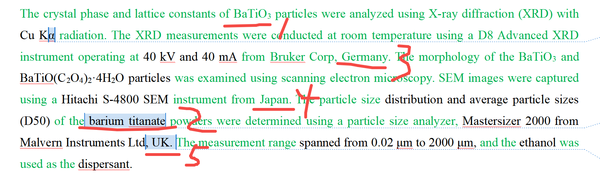

[来自： 科研论](https://wx.zsxq.com/group/15552141181242)

### 错误案例4.7.1、全称和简称用法不统一。

1处和2处一会儿用化学式表示，一会儿又用全称表示。

3处和4处用的是全称，5处用的又是简称。

而且以上内容是属于同一范畴的。

扫码加入星球

查看更多优质内容

https://wx.zsxq.com/mweb/views/joingroup/join\_group.html?group\_id=15552141181242