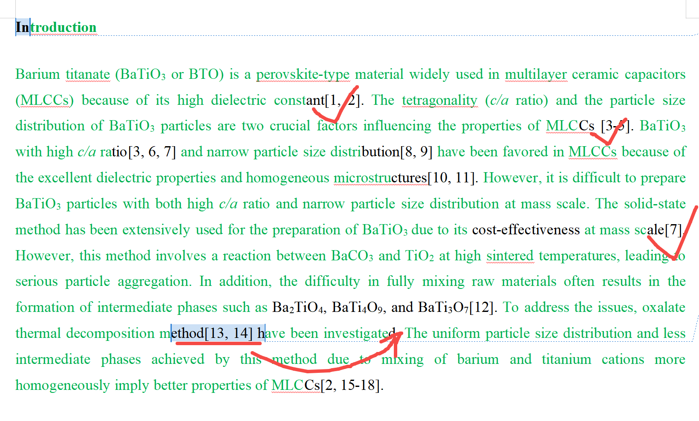

[来自： 科研论](https://wx.zsxq.com/group/15552141181242)

### 错误案例5.1.1、下图参考文献13、14，应该和其他大部分文献一样，引在句子最后。除非在一句话中涉及了多个方法，那么他可以在每个方法之后引用对应的参考文献。

扫码加入星球

查看更多优质内容

https://wx.zsxq.com/mweb/views/joingroup/join\_group.html?group\_id=15552141181242