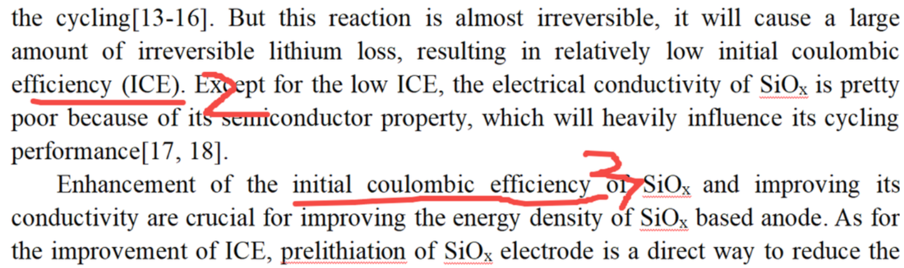
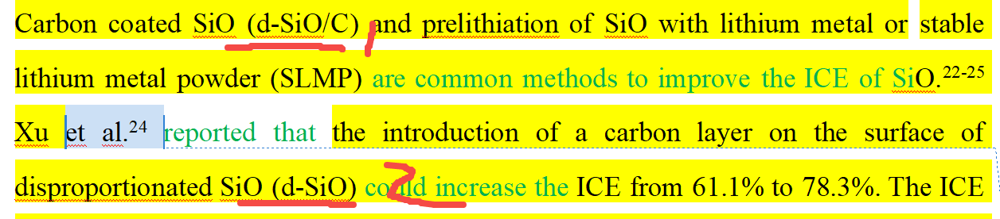
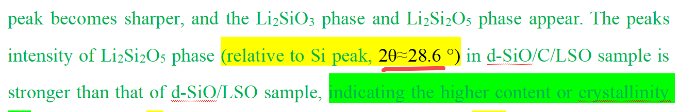
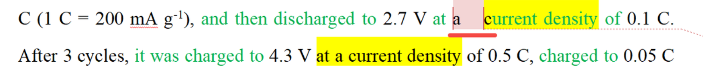
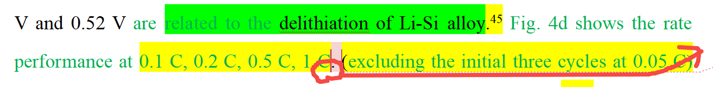
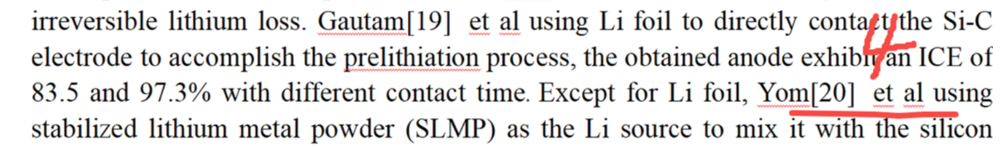

[来自： 科研论](https://wx.zsxq.com/group/15552141181242)

### 5.1、缩写

#### 错误案例5.1.1、下面截屏中的2处已经出现缩写了，3处又用全称、4处引用不对。\[srf论文1\]

#### 错误案例5.1.2、缩写第一次出现的时候，没对应全称或者全称有误。

d-SiO这个缩写第1次出现的时候，没有对应的全称的，或者说对应的全称不对。正确的对应全称是在下面第2处才出现的，disproportinated SiO, d表示disproportinated。

解决方法其实第1处别缩写就好了，或者第1处就把全称写完整，同时给出缩写的写法。

### 5.2、使用的符号不符合英文的习惯

#### 错误案例5.2.1、下面截屏中的约等于有误，应该是~，看文字素材库就知道了

### 5.3、空格问题

#### 错误案例5.3.1、下面的截屏中，标记位置多空了一格

### 5.4、句号位置

#### 错误案例5.4.1、句号应该放在括号的后面

### 5.5、文献在正文中的引用

#### 错误案例5.5.1、看同类素材就知道了，大部分情况，文献标记应该是放在et al后的，具体取决于目标投稿格式。

### 5.1、缩写

#### 错误案例5.1.1、下面截屏中的2处已经出现缩写了，3处又用全称、4处引用不对。\[srf论文1\]

#### 错误案例5.1.2、缩写第一次出现的时候，没对应全称或者全称有误。

d-SiO这个缩写第1次出现的时候，没有对应的全称的，或者说对应的全称不对。正确的对应全称是在下面第2处才出现的，disproportinated SiO, d表示disproportinated。

解决方法其实第1处别缩写就好了，或者第1处就把全称写完整，同时给出缩写的写法。

### 5.2、使用的符号不符合英文的习惯

#### 错误案例5.2.1、下面截屏中的约等于有误，应该是~，看文字素材库就知道了

### 5.3、空格问题

#### 错误案例5.3.1、下面的截屏中，标记位置多空了一格

### 5.4、句号位置

#### 错误案例5.4.1、句号应该放在括号的后面

### 5.5、文献在正文中的引用

#### 错误案例5.5.1、看同类素材就知道了，大部分情况，文献标记应该是放在et al后的，具体取决于目标投稿格式。

扫码加入星球

查看更多优质内容

https://wx.zsxq.com/mweb/views/joingroup/join\_group.html?group\_id=15552141181242