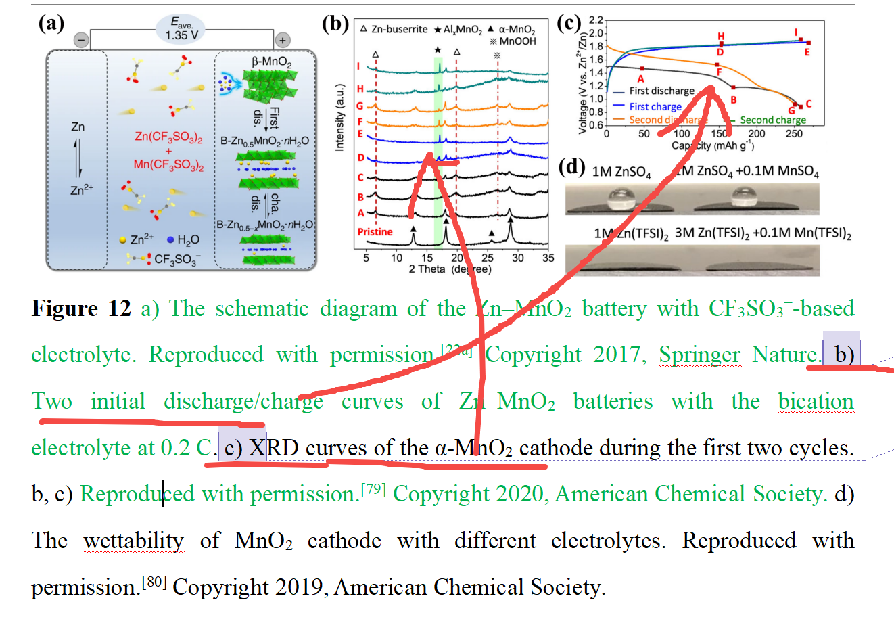

[来自： 科研论](https://wx.zsxq.com/group/15552141181242)

### 目前为止，我指导的学生中，还没有任何一个学生包括我，没有犯过这种左右搞反的问题。

### 案例6.1.1、下面的图b的说明明显是对应的图c，而图c的注释对应的又是图b。

扫码加入星球

查看更多优质内容

https://wx.zsxq.com/mweb/views/joingroup/join\_group.html?group\_id=15552141181242