[来自： 科研论](https://wx.zsxq.com/group/15552141181242)

## ！！一定先用一些软件，类似grammarly等先自查全文，确保不要有语法错误

### 7.1、时态

#### 错误案例7.1.1、标记2处的“are”应该和前面的“was”时态一致。而且之前标记处也有多个时态问题，你在描述过去做的一个实验（加热多久，多少时间等），应该是用一般过去时。

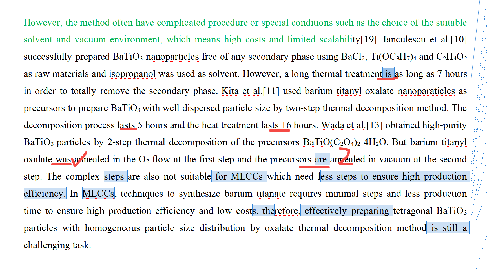

#### 错误案例7.1.2、时态不统一

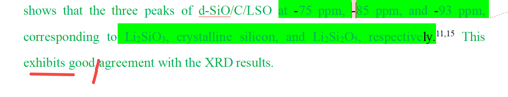

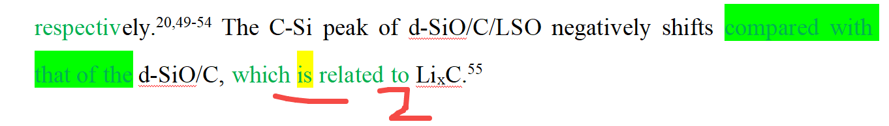

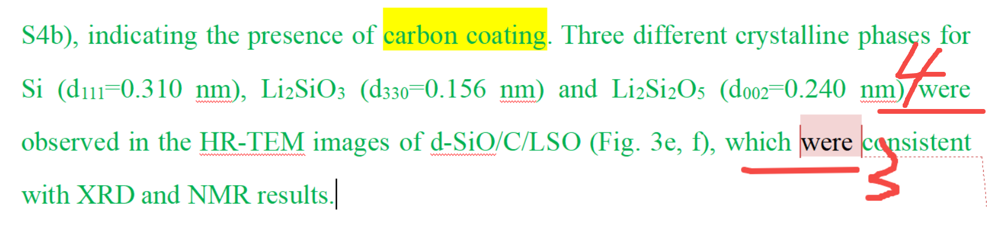

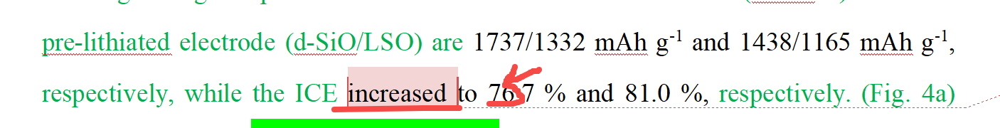

上面1处、2处用的一般现在式，然后3处用的又是一般过去式，应该都统一成跟1处2处一样，因为这是现在正在描述结果。

如果是描述过去的一个动作，比如过去做了一个怎么样的实验，那么可以用一般过去式。

如果是看图说话阶段，包括从看图说话当中给出什么讨论，这都可以用一般现在时。

### 7.2、主谓宾结构问题

#### 错误案例7.2.1、一个句子，两套谓语结构，且又不是出现在从句中的。

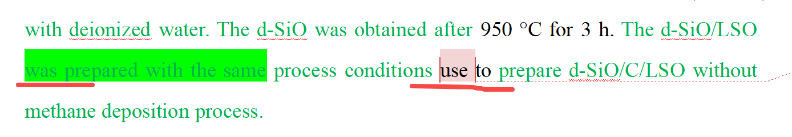

比如第二个应该是used，

#### 错误案例7.2.2、同上，一个句子，两套谓语结构，且又不是出现在从句中的。这里又能发现同一个学生，因为他的错误模式是一样的，导致这样的错误会在文中的多处发现。

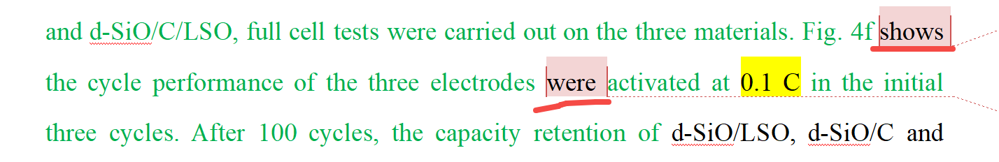

最简单的改法就是把后面的were去掉。

#### 错误案例7.2.3、下文标记7处，such as后面出现are，比如可以改成such as ~1.5 V of.. batteries)

#### 错案案例7.2.4、以下6处还是同样的错误，而且是很严重的语法错误，基本上是初中生就学习的。这种简单的语法错误，你最起码用一些工具都能排查出来的。

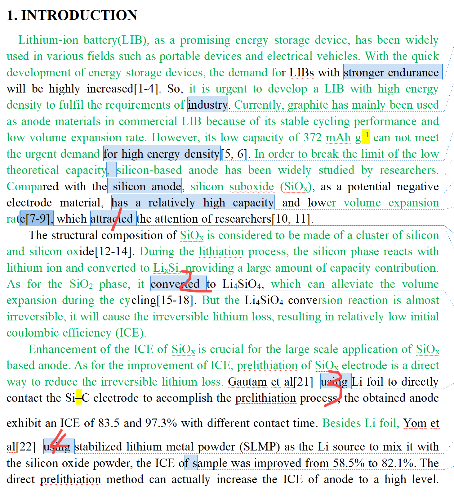

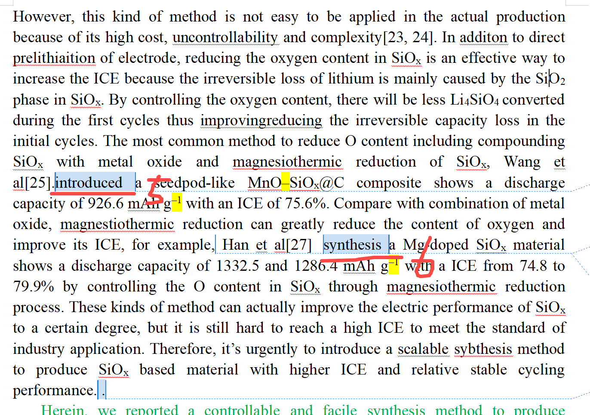

第3和第4处，人后面直接跟着doing，而不是do动词。

1处和2处，主动语态、被动语态没搞清。

5处和6处的时态也不统一，而且6处的语法也错误。

### 7.3、其他

#### 错误案例7.3.1、After后面应该是名词属性的东西，这里用了washed（动词）的

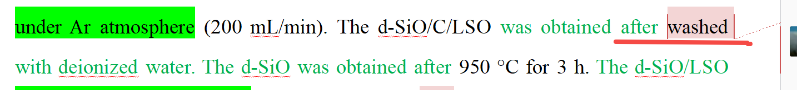

#### 错误案例7.3.2、介词使用不恰当

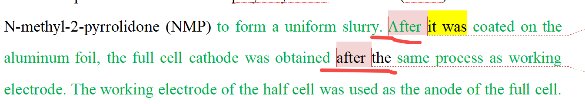

这里连续出现两个after，一方面重复，另一方面后面那个after用by更合适。

#### 错误案例7.3.3、标点符号导致的语法错误，如下面少了个逗号

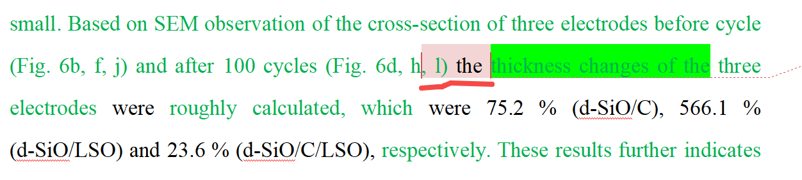

#### 错误案例7.3.4、大量软件识别出来的错误也没改

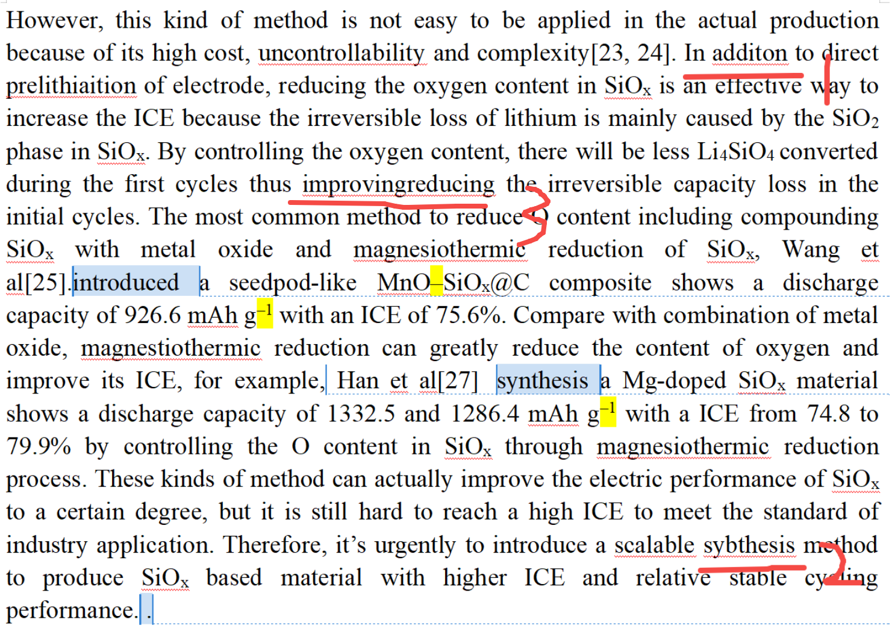

以上1处和2处软件都已经标记红色了，也就是提示你拼写错误了。包括3处没有空格，同样也提示给你了。

而且这只是最简单的word/wps的识别功能，你应该再用其他语法软件去查一下，确保全文没有类似语法错误了。

扫码加入星球

查看更多优质内容

https://wx.zsxq.com/mweb/views/joingroup/join\_group.html?group\_id=15552141181242