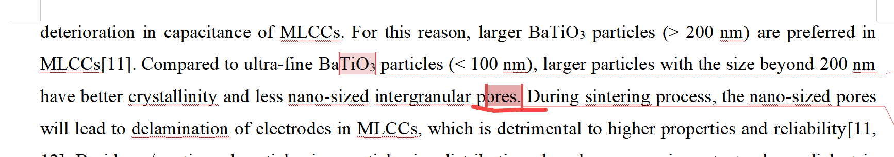
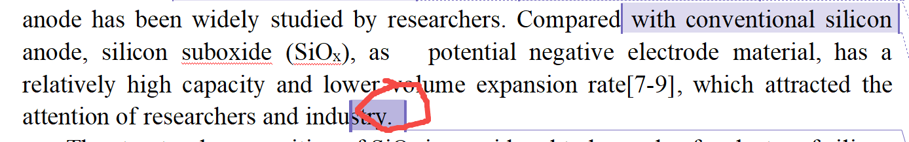

[来自： 科研论](https://wx.zsxq.com/group/15552141181242)

### 8.1、相关论据没有文献支撑

#### 错误案例8.1.1、下面这句话，会有人不认同的，你需要找到别人报道的文献，而且最好不要只有1篇去支撑引用。

#### 错误案例8.1.2、既然都说了吸引了研究者的注意了，结果也没什么文献。怎么表明吸引研究者注意了？

### 8.1、相关论据没有文献支撑

#### 错误案例8.1.1、下面这句话，会有人不认同的，你需要找到别人报道的文献，而且最好不要只有1篇去支撑引用。

#### 错误案例8.1.2、既然都说了吸引了研究者的注意了，结果也没什么文献。怎么表明吸引研究者注意了？

扫码加入星球

查看更多优质内容

https://wx.zsxq.com/mweb/views/joingroup/join\_group.html?group\_id=15552141181242