[来自： 科研论](https://wx.zsxq.com/group/15552141181242)

### 9.1.1、综述论文中的文献引用的版权问题：引用版权信息对应的文献和实际引用的文献不是同一个。综述论文中引用别人文献中的图片的时候，是要申请版权的。

#### 案例9.1.1.1、下面这篇文献中实际引用的68篇，题目是graphene开头的，但学生索引版权的文献，题目开头是electrochemically，明显不是同一篇。

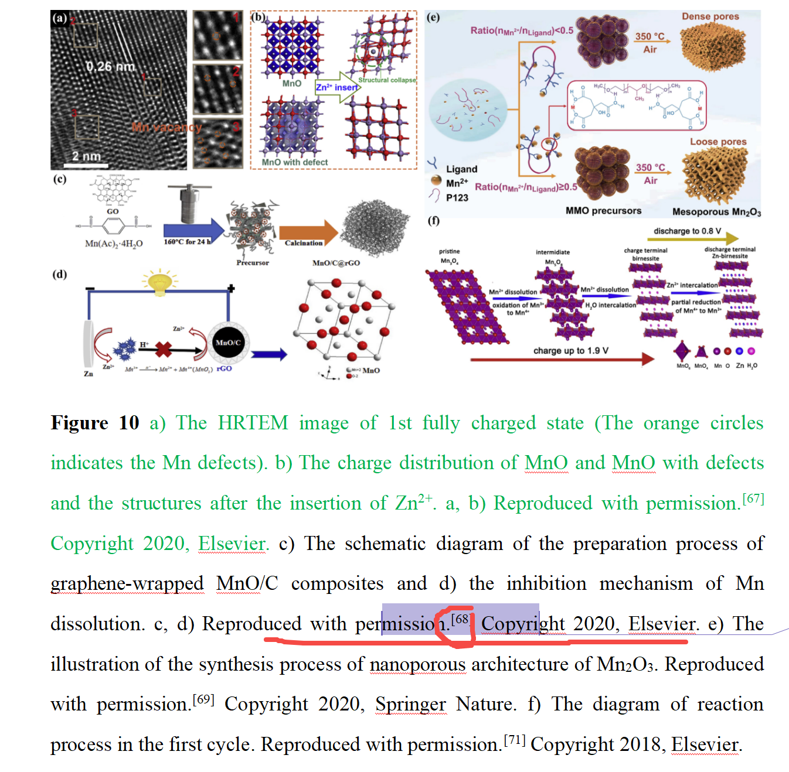

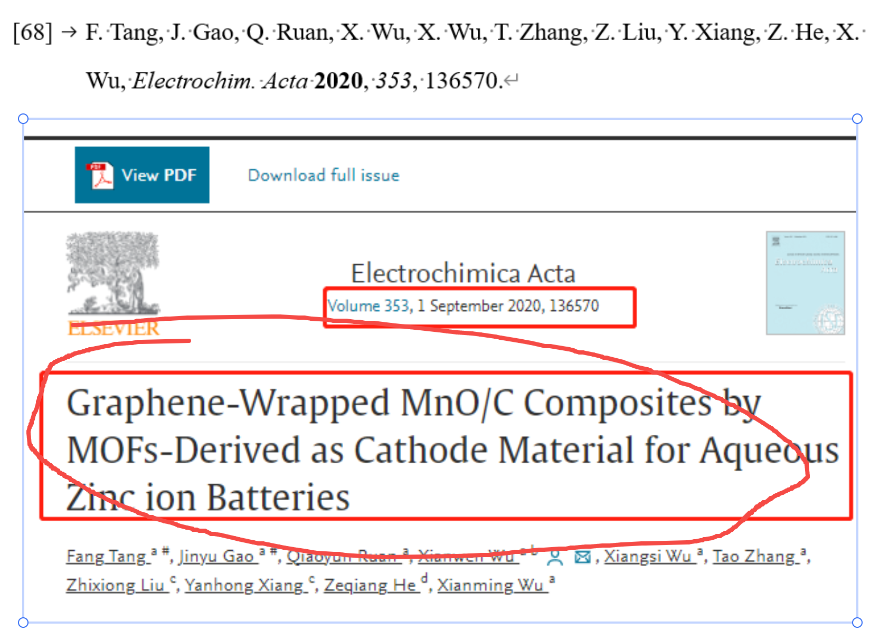

##### 下面是索引版权的文献：

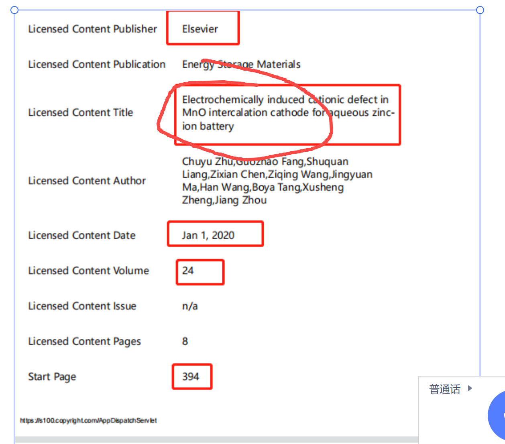

### 9.1.2、综述类写作时，引用别人图片时的证据准备方式不对。正确的证据顺序以下文的文献71的引用为例：

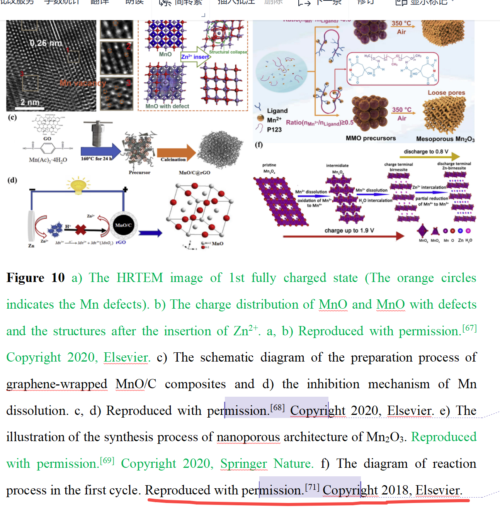

#### 应该是1、先复制文中的文字，方便我定位搜索，见下方截屏的1号部位。

#### 随后2、给出版权引用证据，下图2号部位。这里的2号是OA刊物，也要提供证据。

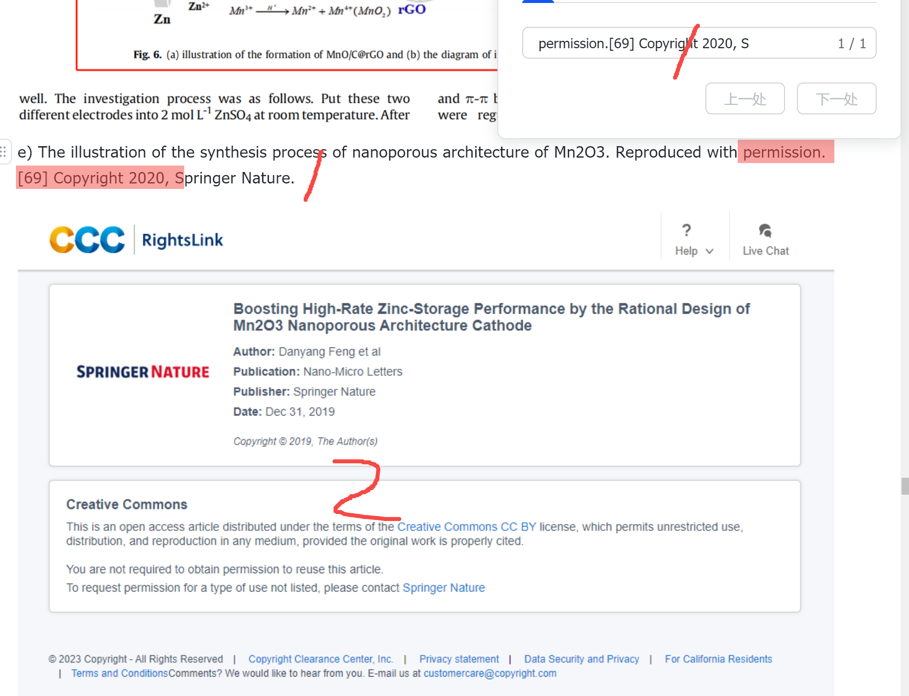

##### 如果不是OA的期刊，可能就会像下面这样：

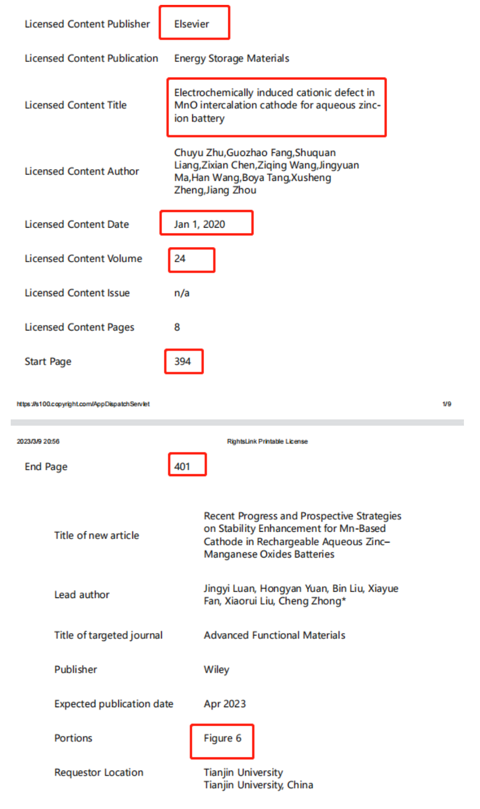

#### 接着3，为了证明你自己论文中引用的参考文献没有格式错误，而且信息是和你索引版权的文献信息一致，需要截屏提供引用的参考文献，注意是截屏！！这样上下标、格式之类的问题，自己也能发现，效果是下图3号部位。

#### 而且注意3号标记下方，需要继续截屏提供文献信息，这样你才能知道这个学生引的文献到底有没有格式和引用的信息错误，即文献信息的截屏中要包含作者、期刊、卷期号、年份等，这样可以确认学生的参考文献引用的是对的。学生在这里也可以自查，是不是信息有误。比如有的学生会作者写错，期刊打错，年份和卷期号打错之类的。

#### 但这个学生做的太麻烦了，还做了很多方框之类的标记，其实不需要的，只要包含这些信息，我就能找到的。

#### 接着4，这个学生做错了，自己也增加了工作量。这步需要截屏你引用的文献中的图片，并包含图片注释（Figure caption），从而可以让我比对你引的文献中的图片和你自己论文中实际引的图片是不是同一个。

#### 这步有重要细节要注意！！比如不要重复截屏，这样增加彼此工作量，下图4部位的截屏图片是不需要的，只需要保留5号部位图片就行了。但是5号部位的图片，必须用一个完整的截屏（类似一镜到底的方式），不仅要包含你论文中引用的图片和图片注释，截屏中还要包含能体现确实是来自引用文献的证据。

#### 以前经常有学生，截屏的图片确实是自己的论文中出现过的，但问题是截屏的图片是来自于另一个文献，根本不是学生论文中引用的文献（这其实也是网上一些蹭流量的造谣帖的常用手法，就是图片单独拆开来看，每一张确实有出处，但合并在一起后，传达的信息是错的，但是又很容易让人误以为这个信息是对的）。所以用我说的这种方式，可避免这个问题。注意这个图片中的5号部位上方红圈处有F Tang et al....等，通过这个信息你就可以比对是不是证据中的图片是来自于引用文献中的了。

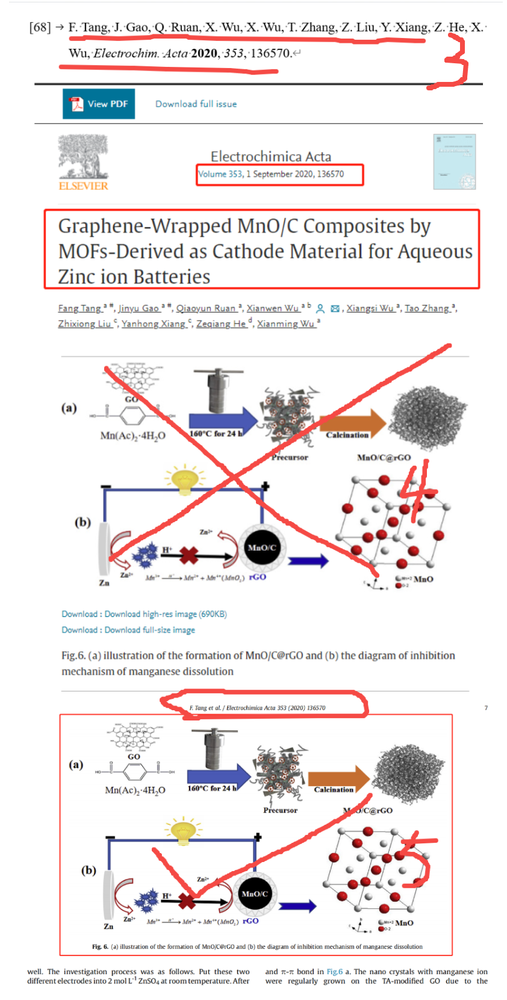

##### 比如下面就是错误案例，学生只截屏了引用的图片，红框部位，但没有截屏这个图片来自什么文献的，注意是要完整的一个截屏，不能分开截屏，比如截屏一个图片，再截屏一个文献信息，那同样不能作为证据的，比如学生可能是单独看截屏的信息对的，单独看截屏的图片信息也对的，但图片并不是来自于那个文献。像下面这样，根本不知道这个图片是来自于什么文献的，所以无法作为证据。

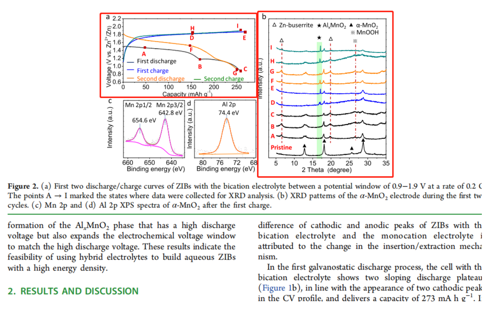

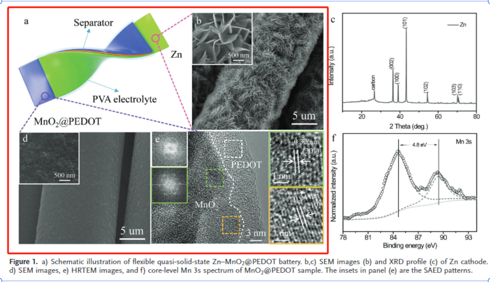

##### 下面这些也全部是错误案例，即使是SI，也可以一镜到底方式截屏包含文献信息的，这种文献信息不用全部包含的，哪怕非常少量都行，比如一个页码+期刊，一个作者信息等，只要能稍微去和引用文献的信息关联起来，证明确实图片来自引用文献即可。比如SI的话，可以将整体缩小截屏也行的。

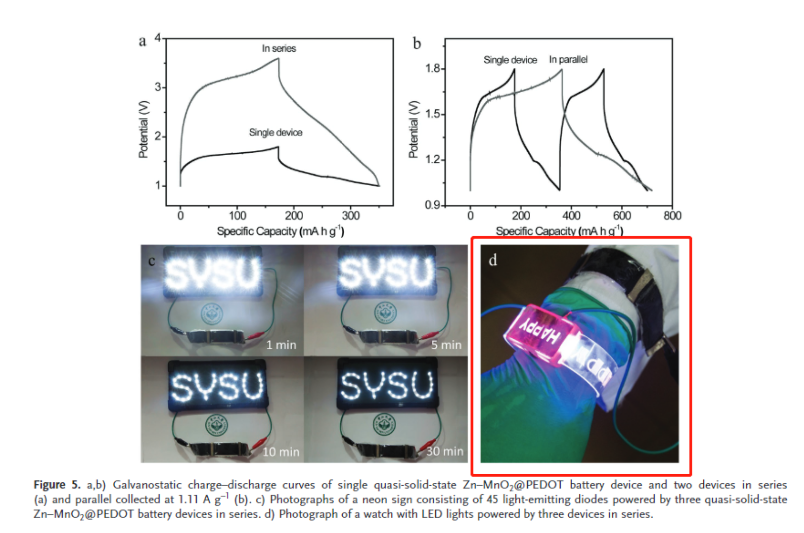

#### 接近正确的案例：以下案例都注意到了我上面说的几点问题了，不过有个细节要注意。5号截屏需要确保清晰度，起码能让我看到截屏上面的文献信息，这样才能够进行核对，确保清晰度的方法也很简单的，比如飞书状态下，ctrl+shift+a那个截屏就是非常清晰的。

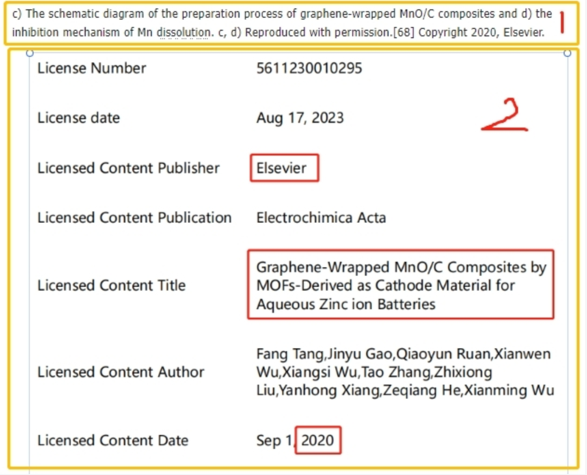

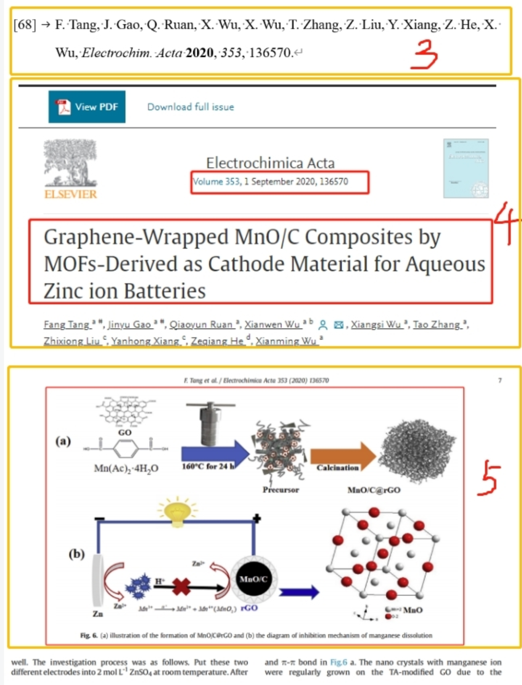

扫码加入星球

查看更多优质内容

https://wx.zsxq.com/mweb/views/joingroup/join\_group.html?group\_id=15552141181242