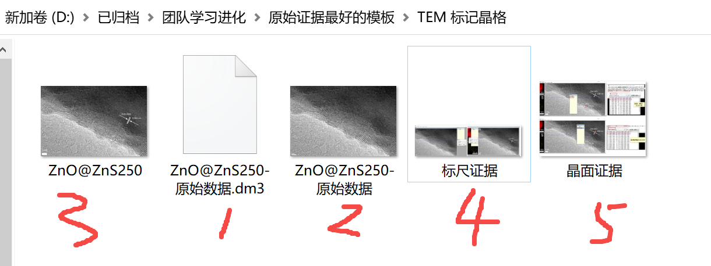
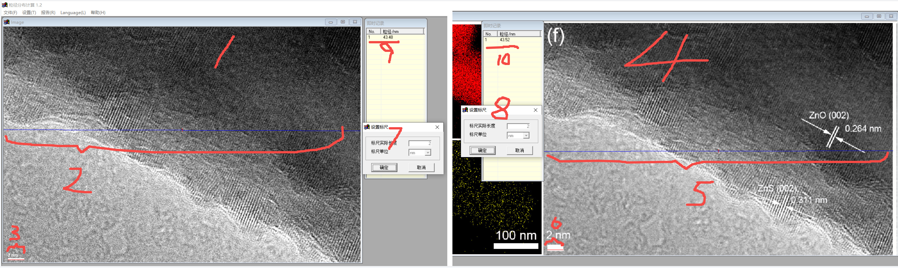
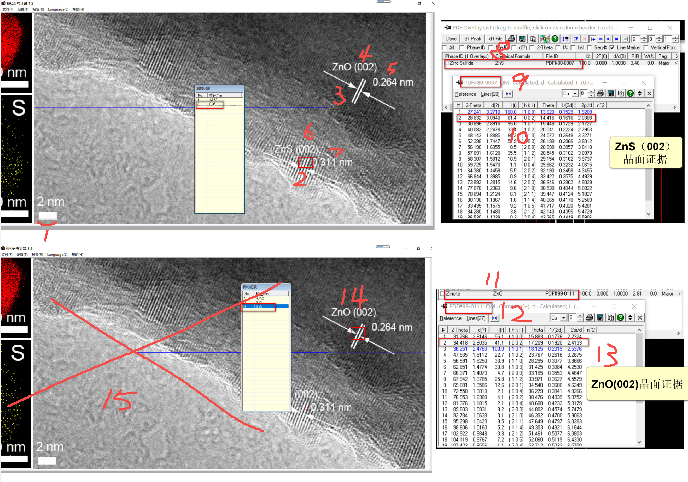
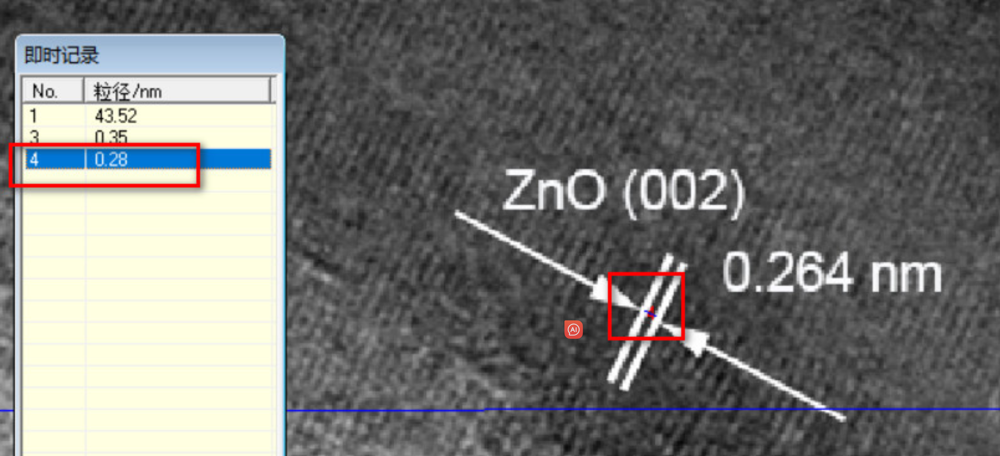
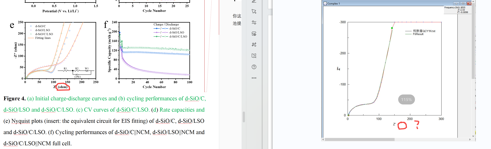
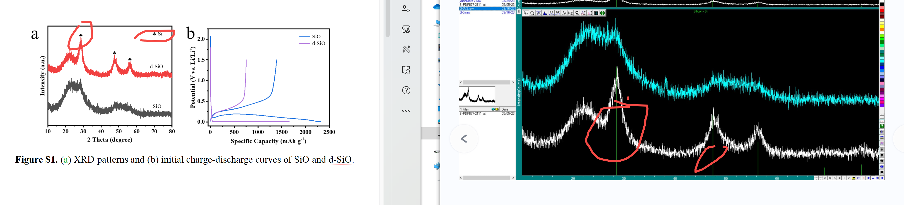
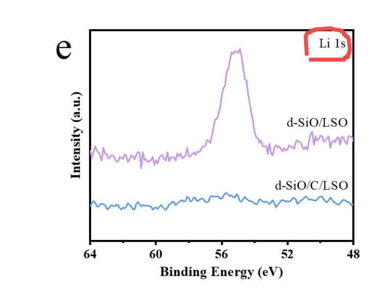

[来自： 科研论](https://wx.zsxq.com/group/15552141181242)

### 案例9.2.1、TEM晶格标记，晶格标记完，还要用下面的简易方式进行最终校对，以防图片出现明显bug，这个方法也非常简单。

就是你的目录要包含以上5个图片，或者也不一定是严格的5个文件，包含以上5个元素也行，但最好就是控制在5个图片，就像他这样做。这种方式我会检查的最快。

其中1号文件后缀dm3的就是原始文件。2号文件就是原始文件导出的原始图片。3号文件就是你自己论文里用的图片。

4号文件是像下面这样的，我会标记出来几个细节，你一定要注意。

其中左边的图1就是 **原始图片** ，也就是上面说的2号文件打开后的情况。然后你用软件在3号部位，也就是标尺这里划一条线，线的长度是和这个标尺的长度一样。那么你就可以用这个标尺为长度单位，去校准你自己做的图对不对了。

所以接着你就在图1的2号部位这里划一条线，线的长度就是这个图片的宽度，然后接着在右边的图，也就是你自己论文中用的图片，在5号部位划一条线，线的长度同样是这个图片的长度，正常情况下，标记2处和5处的距离应该是差不多的。然后同时在你做的图片的标尺这里划一条线，也就是6号部位，线的长度同样等于标尺的长度。如果做的对的话，6号部位的长度是和3号部位一样的，也就是说8号部位的数据是和7号数据一致的，然后9号部位的数据同样和10号部位的数据一致。

**这么做的目的：** 截止目前为止，我在所有学生中，全部发现这种标记错误的问题。有的可能是图片处理过程中，比如放大缩小的过程中没有同比例放大缩小引起的，有的可能是其他问题，所以用这种校对方式可以确认学生图上标的标尺没标错。

下面再说明5号证据图片的情况：

先点1号部位，这个时候这张图片是你自己论文中用的图片。然后1号部位标记的长度就是这个标尺的长度，这样你就可以以你的标尺作为一个锚，去核对你里面标记的晶格常数对不对了。你可能会说这个晶格常数的距离太小了，你不好点，那么你就像下面这样，你把它放放大就可以点了，案例中的这个学生也能操作，所以你肯定也可以操作的。

所以接着你就是去点2号部位，2号部位比如图中你不是写了0.311纳米吗？然后你就看一下你这个两根标记的引导线当中的距离是不是0.311nm左右，同时给出证据，就是图片中黄色的部位。你会看到这个图片中的黄色部位是带有数字的，其中的数字就应该跟你图片标记中写的数据是一样或者接近的。

类似的，如果你图片中还存在其他部位也标记了晶格常数，那么你就再划一下相应的距离，比如像他这个里还会有3号部位。但是最好不要像这个学生这样，分开两张图去划线，最好都划线在一张图上，就是我下面打了个叉，最好不要再有下面这张图了，你就只对着这一张图片划线就好了。

通过以上方法可以证明你图片中标记的数据没错，但这个还没完，因为你图片中还会有其他的注释，比如你说这个是(002)的晶面，你说这个是个什么物质，那同样要提供证据。就是在上图右边8~13部位。你注意看其中红色方框标记的，都跟你自己论文图片中标记的内容（包括文字和数字）完全对应的，比如它有物质（8、11），然后有这个物质对应的卡片（9、12）， **你要注意9和12里面是有卡片编号的，8和11的截屏里面也有卡片编号** ，这样才能知道你说的这个卡片是这个物质的。

否则就有可能你物质是有的，卡片也是有的，但这两个没关系，这是证据文件中 **常见的一种错误** ，就是每张图片都有证据，但是合在一起是错的，这个也是我在另外一个checklist清单当中也讲过的造假的常用手法。然后10和13处的目的就是为了证明你图片中标的这个数字是对的，比如这个晶面对应的晶格常数就是这个数字。

这样就整个图片中涉及的所有要素就全有证据了。总之你要换位思考，你图上做的每一个处理你都要反过来说，我怎么证明这个东西是对的没有写错？而且还不能用太多的证据去证明，这样工作量太大，要用最少的证据实现这个证明。

实际操作的时候，你可以把这个标记晶格常数地方的位置放得非常大，这样你点一个直线是不难的。

### 案例9.2.2、下面这个案例中提供的证据没法证明单位写的对不对。左边论文图片中写的是欧姆，但是右边证据中是没有单位的，万一这个证据的单位是千欧姆之类的呢？（不要答复原始证据中，就是没有单位之类的）

### 案例9.2.3、下面左边图中标记了Si的峰，但右边证据中是有几根绿色的线标记，但没有给出这标记的线，到底是什么东西。

### 案例9.2.4、下面这个图中你写了Li，但没证据支撑。

解决方法：你提供原始数据的目录中，再要提供至少两个来自文献中的图片证据或者其他证据，表明你图中的Li没有写错。

当然我知道你这个例子没有错，但其他学生有可能会错，那如果做了我这个操作，他就能确保它上面的标记没写错。

比如可能会错把把这个位置的峰写成别的峰，比如Si之类的，通过我这种操作，再做证据时，他就能自查发现这样的问题。

扫码加入星球

查看更多优质内容

https://wx.zsxq.com/mweb/views/joingroup/join\_group.html?group\_id=15552141181242