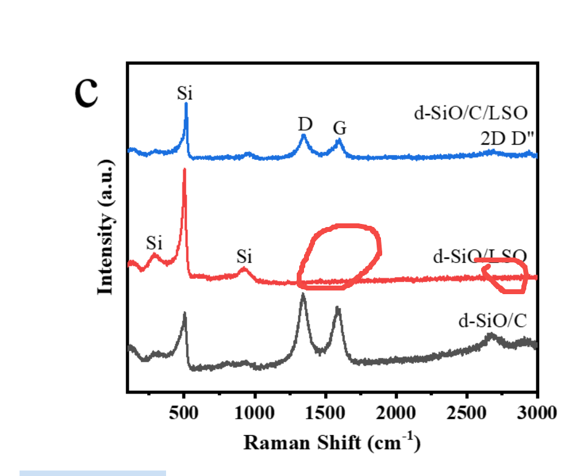
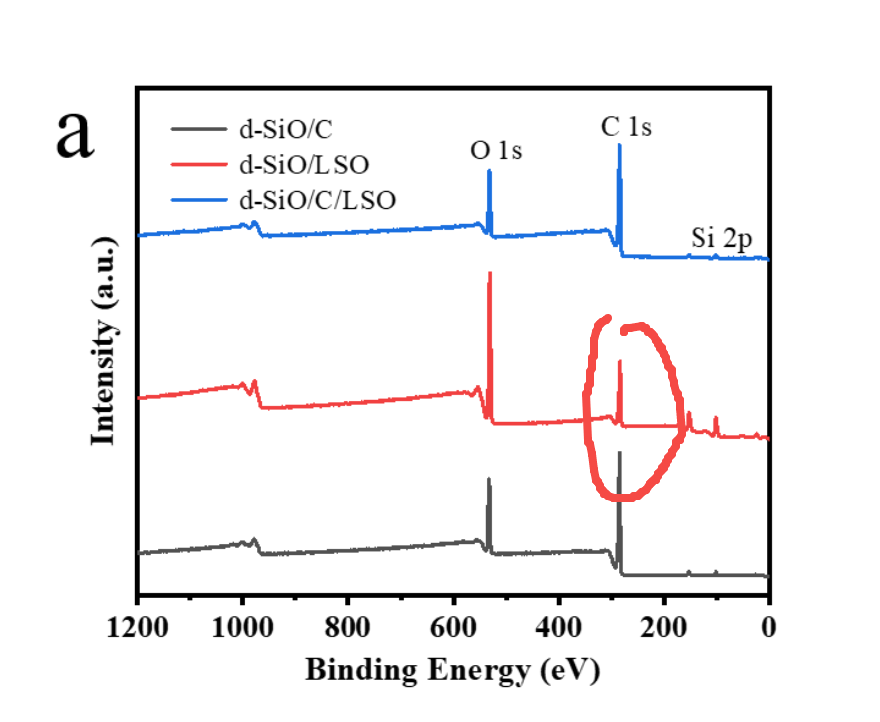

[来自： 科研论](https://wx.zsxq.com/group/15552141181242)

### 论文中给出的图表互相之间有冲突，或者不自洽。

### 校对证据的时候，还需要将不同图片之间的结果互相印证的去看，看是否存在结果冲突。有的冲突，可能是实验没注意细节引起的，有的则是现有实验手段无法排查此问题，那就如实反映即可。

### 也就是我常说的，在1到10阶段中搜集比对素材库、做实验、和写作，三者是同步进行的，而且其中一个步骤的推进经常会影响其他步骤，比如你写的过程中发现哪里不对了，那么你实验要再次确认一下：

#### 案例11.2.1、下面的图1，raman没有检测到红色的样品存在碳的信号，但是图2的xps，却提示红色样品有不小的碳信号。而且raman和xps都是表面灵敏的检测手段。\[js1\]

图1

图2

**以下为学生的解释：**

根据老师对案例11.2.1和案例11.3.1提出的意见，给出如下证据：

自己文章中的碳峰，还有可能的两种原因：

【略】

### 论文中给出的图表互相之间有冲突，或者不自洽。

### 校对证据的时候，还需要将不同图片之间的结果互相印证的去看，看是否存在结果冲突。有的冲突，可能是实验没注意细节引起的，有的则是现有实验手段无法排查此问题，那就如实反映即可。

### 也就是我常说的，在1到10阶段中搜集比对素材库、做实验、和写作，三者是同步进行的，而且其中一个步骤的推进经常会影响其他步骤，比如你写的过程中发现哪里不对了，那么你实验要再次确认一下：

#### 案例11.2.1、下面的图1，raman没有检测到红色的样品存在碳的信号，但是图2的xps，却提示红色样品有不小的碳信号。而且raman和xps都是表面灵敏的检测手段。\[js1\]

图1

图2

**以下为学生的解释：**

根据老师对案例11.2.1和案例11.3.1提出的意见，给出如下证据：

自己文章中的碳峰，还有可能的两种原因：

【略】

扫码加入星球

查看更多优质内容

https://wx.zsxq.com/mweb/views/joingroup/join\_group.html?group\_id=15552141181242