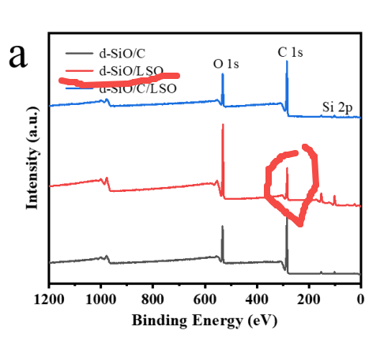
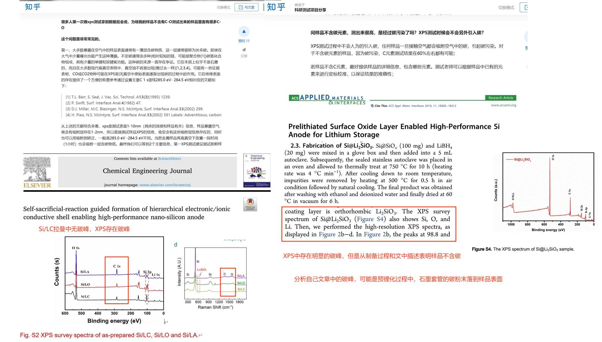

[来自： 科研论](https://wx.zsxq.com/group/15552141181242)

### 注意将我里面的每一个案例都看完整，有时候一个现象不符合你认为的常识，但反而是真实存在的。符合你常识的那个认知，反而是在真实世界中不存在或者很少见的。

#### 案例9.4.1、下图中，红色曲线是一个不含碳的样品，当然包括表面也没有碳，但为什么XPS会有碳的信号？

当然这里就是我11.3这个大标题所说的，不一定是不符合常识的现象，就是不存在的。比如是不是这个样品表面本身就带有一些有机物的污染（甚至是特意引入的有机物），这些通过重复实验很容易验证的。还是说你做的过程中人为引入的一些污染。

如果是人为实验不规范所引入的，那么就要重新表征。如果是这个体系本身所带有的，只是和我们常识认知有点相悖，那么你就收集好证据，就让审稿人问起的时候能提供。

**以下为学生的解释：**

根据老师对案例11.2.1和案例11.3.1提出的意见，给出如下证据：

自己文章中的碳峰，还有可能的两种原因：

【略】

扫码加入星球

查看更多优质内容

https://wx.zsxq.com/mweb/views/joingroup/join\_group.html?group\_id=15552141181242