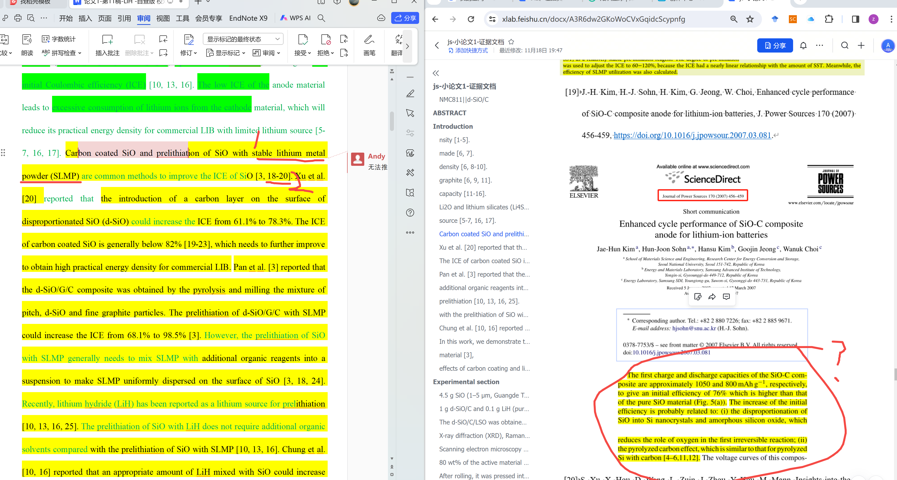
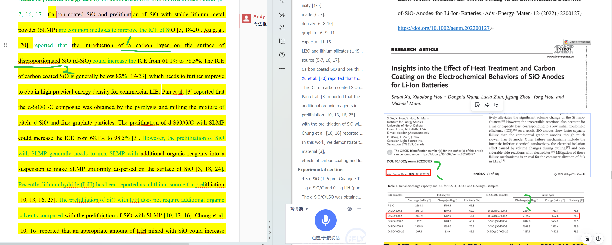
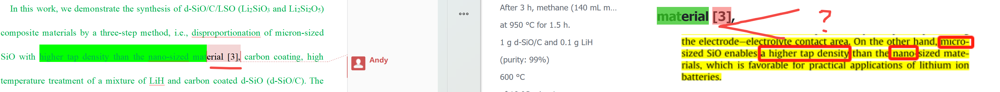
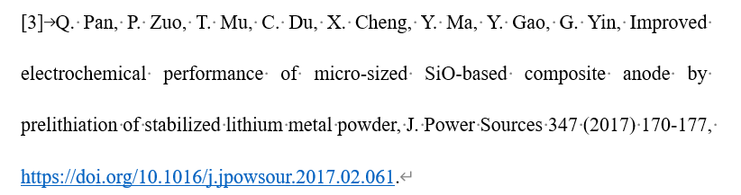
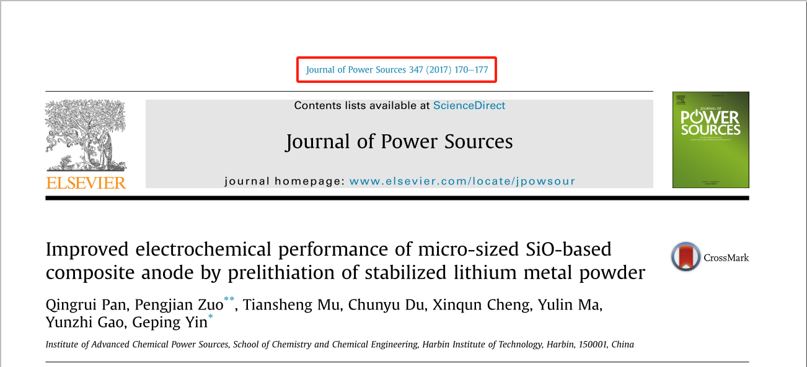
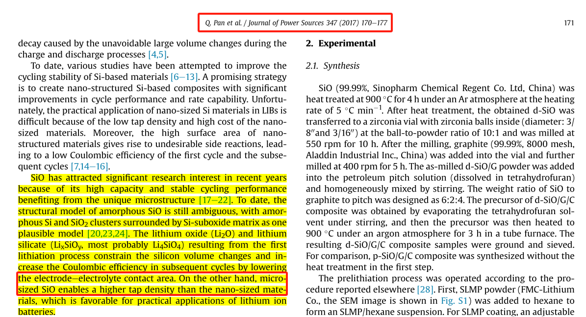

[来自： 科研论](https://wx.zsxq.com/group/15552141181242)

### 错误案例9.7.1、引用文献提供的证据截屏，无法支持论文中所说内容

上面左边是论文，2号部位引用了参考文献。

需要证明，这个参考文献没引用错，是跟这句话有关的，那么这个参考文献当中是要体现，是提到了1号部位的SLMP，但是从参考文献19，包括后面的20，还有前面的18和3，都根本看不到SLMP方面的表述，也就是说都不知道这些参考文献是不是用了这个方法。

### 错误案例9.7.2、引用文献提供的证据截屏，无法快速定位到论文中黑色部位的关键词。黑色部位表示要核对的地方，所以黑色部位都应该在证据文档中能快速找到对应的关键词。

比如左边论文中，黑色部位提到的carbon layer、disproportionated等关键词在右边的证据文档中都无法找到。

### 错误案例9.7.3、右边证据文档中，先要提供\[3\]号文献在你原文中的截屏，下方提供证据表明你\[3\]号文献的相关信息，包括作者、标题、卷期号、年份都别写错（截屏官网信息即可），随后下方才是提供\[3\]号文献中的证据，表明你这句话没引错。而且提供证据的时候，文献中的图和文字还要多截屏一些，能截屏到参考文献信息。防止你文献错乱，比如证据是有的，但是这个证据是来自其他文献，而不是\[3\]号文献的。所以截屏要注意清晰度！否则没法看清文献出处。

#### 正确做法：

**mat** **erial** **\[3\],**

说明：

上面第一行先提供搜索词，如“ **mat** **erial** **\[3\],**”，这样我就可以用ctrl+F进行搜索。

接着，第二行截屏提供相关文献（即文献\[3\]）在论文中的格式，确保格式正确。注意是截屏，不是直接复制原文，这样才可以检查格式。

第三行是提供证据，表明学生没有将文献\[3\]的格式写错，所以其中会有作者、题目、期刊、年份、卷期、页码信息。

第四行则是再次截屏文献\[3\]中的相关内容，表明学生原文中的表述没有错误。所以你会看到截屏中有红色框标记。此外，注意这部分的截屏还要包含文件的头部或者尾部信息，留意上方的方框，这样可以表明你提供的用于证明你引用正确的相关内容确实是出自文献\[3\]，否则有可能出现这种情况，比如你用于证明的内容是出自文献\[5\]的，但你放到了文献\[3\]的下方，如果分开截屏的话，就没法排除此类bug了。

扫码加入星球

查看更多优质内容

https://wx.zsxq.com/mweb/views/joingroup/join\_group.html?group\_id=15552141181242