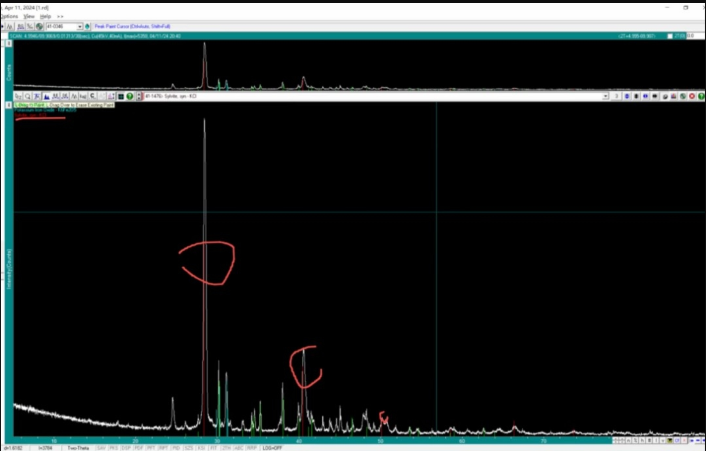
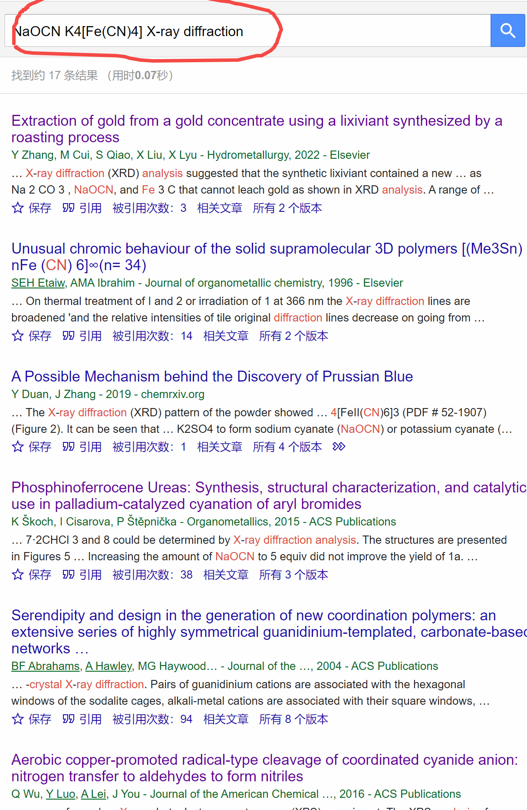
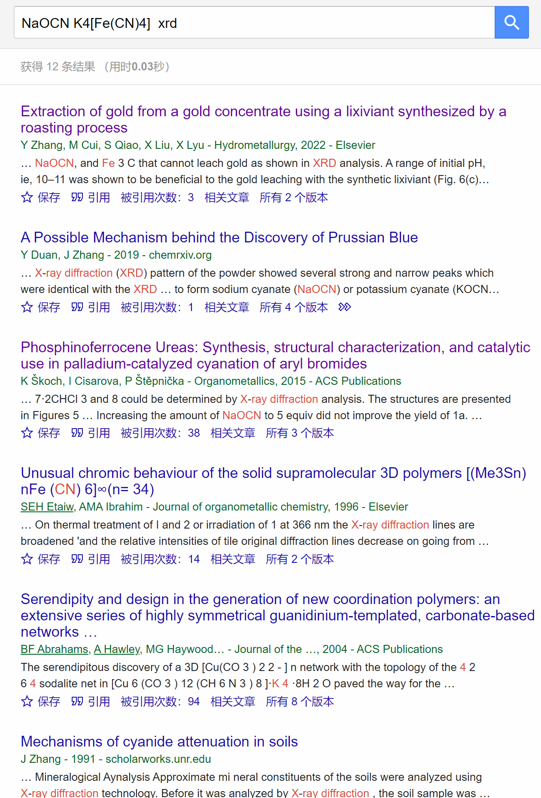
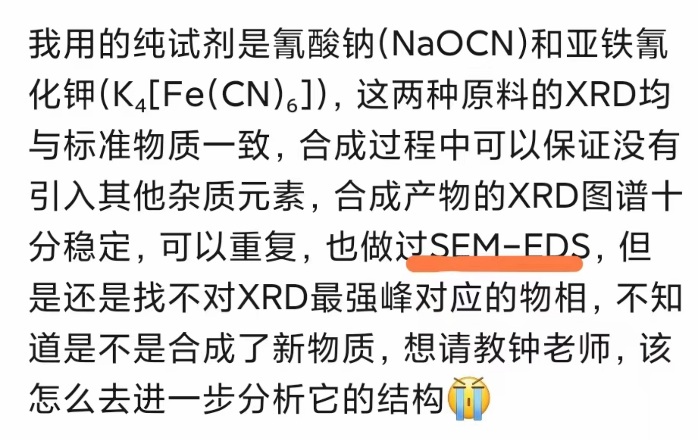
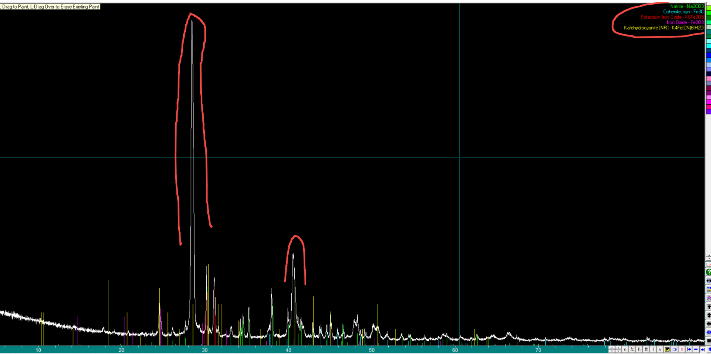

[来自： 科研论](https://wx.zsxq.com/group/15552141181242)

https://t.zsxq.com/Cfwhn

关于上次有位同学问的xrd寻峰，还需要知道更多的信息，比如合成方法和溶剂等，否则自由寻峰模式下，会看到最强峰对应了KCl，这个东西有可能在合成过程中引入吗？

另外，注意我的检索方式：

有没有用这样的方式去做钓鱼法搜索，并逐一浏览其中相关的文献。

另外，下面这点也很重要。

你合成过程中，比如是不是用的坩埚，炉子是不是马弗炉之类的？要彻底确认这些东西是不是会引入杂质，其实这些东西也会让你合成的产物引入杂质的，用eds来分析，分辨率还不够，你可以做个全谱的icp，确认没有引入其他杂质。

上次检索过，这两个最高峰和KCl匹配程度很高的。但你说没有别的元素掺入（但这点存疑，所以让你做全谱icp）。如果仅仅局限在你前驱体的元素，这两个最高峰能匹配出来的是FeO(OH)，和K4Fe(CN)6-6H2O。

扫码加入星球

查看更多优质内容

https://wx.zsxq.com/mweb/views/joingroup/join\_group.html?group\_id=15552141181242