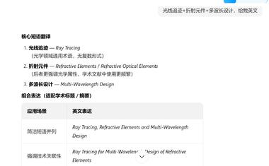
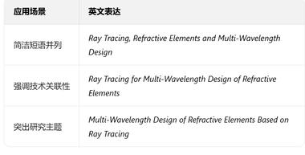
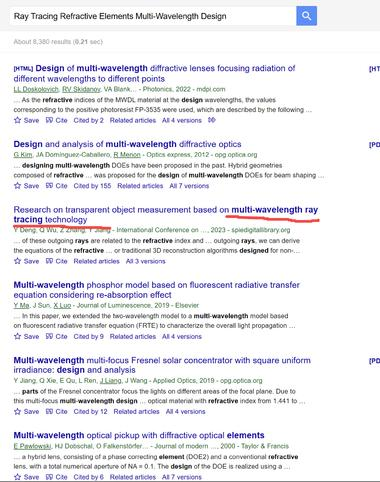

详情返回 科研论

来自：科研论进入星球

【微纳光学方向，希望能够用光线追迹的办法实现微纳元件和折射元件混合的多波长设计，怎么判断这个方向是否有人做过呢？（1511字）】 问题：钟老师您好，我是做微纳光学方向的，想做折射光学系统和微纳光学元件的联合优化设计，希望能够用光线追迹的办法实现微纳元件和折射元件混合的多波长设计，怎么判断这个方向是否有人做过呢？ 回答： 这是非常典型的能够用钓鱼法思路解决的问题。此前我们具体实施手段是通过在支持全文搜索的搜索引擎上搜索的。而且这个时候就不用很考虑关键词的设计了，基本上把你感兴趣的关键词直译过来，先去搜索一轮就行了。如果有匹配度高的结果应该会显示在前面。 比如从标题中可以提取“能够用光线追迹的办法实现微纳元件和折射元件混合的多波长设计”，有些没意义的词我们去掉，变成：“光线追迹实现微纳元件和折射元件混合的多波长设计”，其实实现这种词也可以不要，因为英文表达太多了，你也不知道人家用哪种。比如based on、for都可以实现类似意思。所以你的搜索就是希望同时包含“光线追迹”和“微纳元件和折射元件混合的多波长设计”的，我们用“光线追迹+微纳元件和折射元件混合的多波长设计”表示，其实你直接输入“光线追迹微纳元件和折射元件混合的多波长设计”最后也是同样效果，搜索引擎搜的时候也是把你这个短语拆分成很多词语去搜的。 但微纳元件其实也没很大的实体意义，人家可能确实做微纳元件，但人家只说3nm器件，不说我是微纳器件，这样你也很容易遗漏，而且元件太笼统了，现在微电子器件元件大的就上千种，细分上万种之多，人家可能说了具体啥元件，也不一定提元件两个字，所以这个东西我觉得可以去掉。但折射元件因为很具体可以保留。那最后就变成搜“光线追迹+折射元件+多波长设计”，先试试这个。随便问个AI或者翻译软件，先看看直译的英文，如图1。 然后把获得这串英文，直接在学术G中搜索，图2。而且AI还很贴心告诉你这3个关键词的组合，不过我们暂时不需要组合，就把3个关键字都输入进去搜就行了。 比如图3中，能看到一些关键词覆盖了你的选题（比如我下划线的地方），你可以具体看看相关，然后拉个几页，就知道有没有做和你类似的研究了。你可以根据搜出的情况继续新增或者删除或者调整检索式，你能看到这种方式会在全文里匹配。如果采用鲸吞法，要求你检索式设置的比较好，万一你设置不当，主题（摘要、标题、关键词）中没包含你的搜索词，但这篇文献其实是你要找的，就会遗漏了。但钓鱼法因为是可以执行全文搜索，容错率高许多。当然钓鱼法搜集的文献不全，但如果是你说的这种，只是知道有没有人做，不在乎全不全，那就很适合。 然后现在有了AI的加持，其实就可以先问问AI，这也隶属于钓鱼法的范畴。优先推荐问G的AI。因为钓鱼法本身也是在学术G上实施的。我这里随便问下豆包，几乎就把你问我的，问豆包就行了。但提示词中加上需要给出具体出处这句话，比如我问：希望能够用光线追迹的办法实现微纳元件和折射元件混合的多波长设计，怎么判断这个方向是否有人做过呢？要求给我提供具体的文献出处，要求文献尽量多一点。看图4。 图4是个长截屏，注意往下拉。 豆包的问题是没法接入学术数据库，所以他的信息肯定很不全的，但如果豆包都说有人做，那肯定已经很多人研究了。而G因为有学术G的数据库，理论上应该会接触更多的已报道文献。 当然别看到AI给的文献，就张口就来这是幻觉，他给你doi，给你名称了，你去查下到底有没有。 还有多用几个AI，看看他们返回的文献结果有什么不同的，你就可以查缺补漏下。 当然，过去还有人会问如果问G的AI，我不知道英文咋说... 这个你让AI给你翻译成英文都行。

...

展开全部

   

最后编辑：2025-12-11 15:58

觉得很赞