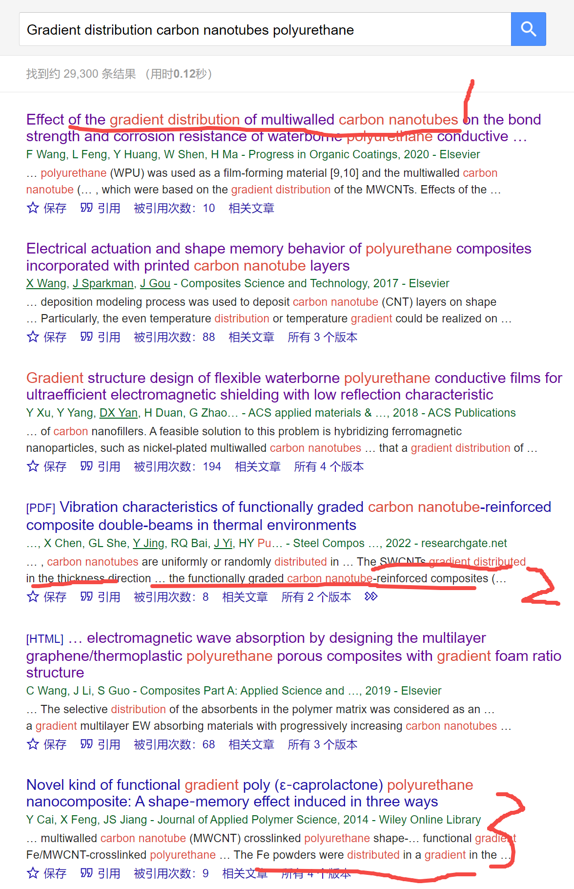
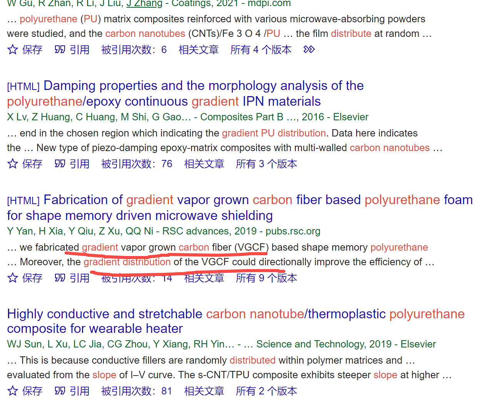
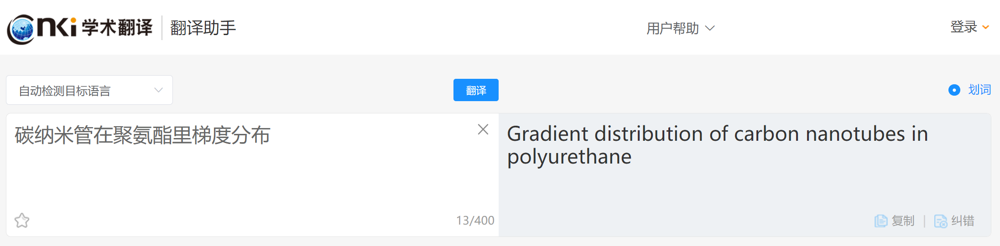

[来自： 科研论](https://wx.zsxq.com/group/15552141181242)

### 【1151字答复-问题序号204】

### 【答复】

类似这种具体如何解决的问题，我答复方式会特殊一些，就类似下面这个案例一样：

[https://www.bilibili.com/video/BV1BP4y1b7Hm/](https://www.bilibili.com/video/BV1BP4y1b7Hm/)

我是通过不断问学生问题，让学生不断熟悉我的5步骤，最终自己找到解决方案的。关于5步骤，看下面链接： [https://www.bilibili.com/read/cv26369099/](https://www.bilibili.com/read/cv26369099/)

虽然上面这个链接是讲发论文的，但实验也在里面讲的，毕竟没实验，也没法发小论文。

因为如果不这样的话，就算我回答了这个问题，那后期实验过程中，还有可能出现新的问题，以后工作中也有可能出现新的问题。总有一天这个问题可能你需要自己用科学的方法去回答，没有人能给你现成的答案了。

所以现在开始启发式的问学生问题，然后引导她自己找到解决方案，按第二个链接中的框架，我们先步骤1，钓鱼法去搜索：

比如其中标记1和2的位置，是和学生的研究体系一模一样的，即碳纳米管在厚度方向梯度分布。

然后标记3的位置也是可以参考的，因为他虽然没有提到是碳纳米管梯度分布，但提到是铁金属粉末的梯度分布，其实同样也是可以借鉴表征方法的。

然后这个页面我没拉完整，所以你可以继续去看一下后面的结果，有没有可以启发你的，应该还会有的。

那么有了之后，你把这些文献统一都导入文献库中，然后只看其中关于表征部分的，看一下他们是怎么证明他们这些东西是梯度分布的，毕竟也是口说无凭的，他们既然说是梯度分布，那么他们用的方法是什么？他们用的方法也一定可以用到你的方法中，因为跟你的体系是一模一样的，同样是碳纳米管，同样基体是聚氨酯。然后体系不那么一样的，比如梯度分布的铁粉末，表征方法也是可以借鉴的。

如果以上文献中还是找不到表征方法，那么你要给我提供证据，表明你确实看过这些文献。

如果我确认你看的方法是正确的之后，接下来可以再调整关键词，获得更多的文献，比如不一定要碳纳米管+聚氨酯+梯度分布碳，纳米管可以换成别的东西，比如碳纤维，或者只保留梯度分布+聚氨酯，而且聚氨酯也同样可以换，就总之你就是要知道有机物当中加了一个导电的东西，而且又是梯度分布的，怎么去证明它是梯度分布的？所以也可以尝试看其他体系，我相信分母多了后，必然能找到一个表征方法的。

比如你继续翻翻下面的结果，就能看到碳纤维的表达方式：

而且这篇也提到了碳纤维梯度分布。

至于有人问是不是要对领域有一定了解才能用这种方法，其实完全不是的。你就是对这个领域不了解也可以用这个方法，而且就是通过用这个方法来让你对这个领域了解的。比如你不了解的情况下，你会说我怎么搜关键词都不知道，但你看下面就知道了，就基本上就是无脑的一种操作：

比如我用的检索式就是从上面翻译过来的。

扫码加入星球

查看更多优质内容

https://wx.zsxq.com/mweb/views/joingroup/join\_group.html?group\_id=15552141181242