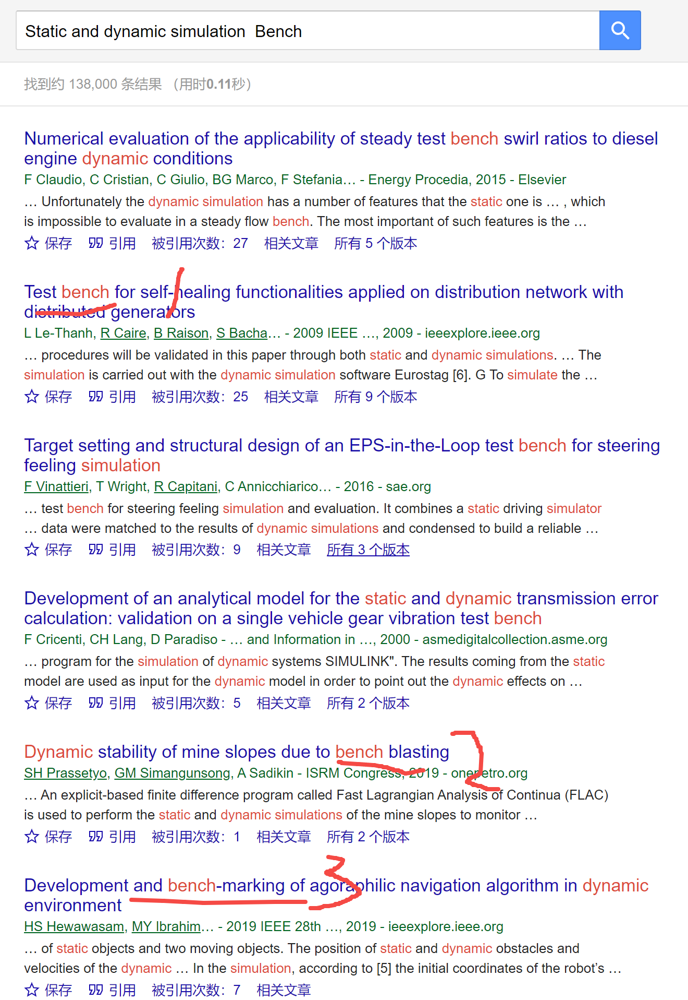
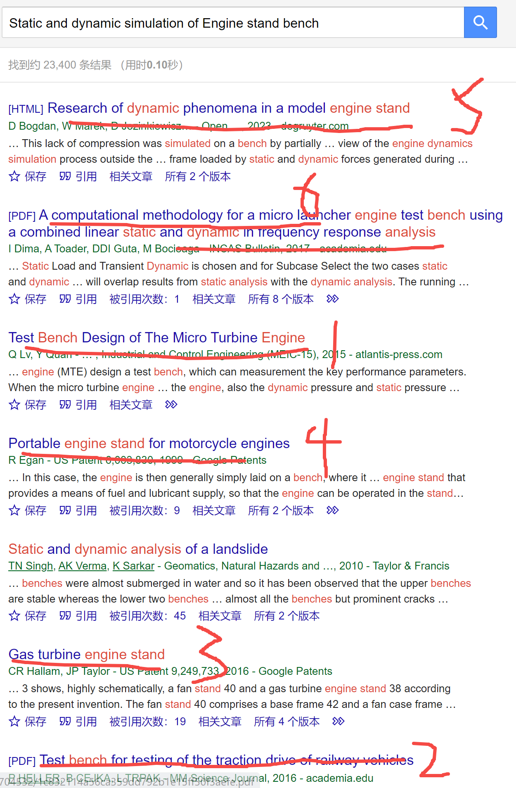
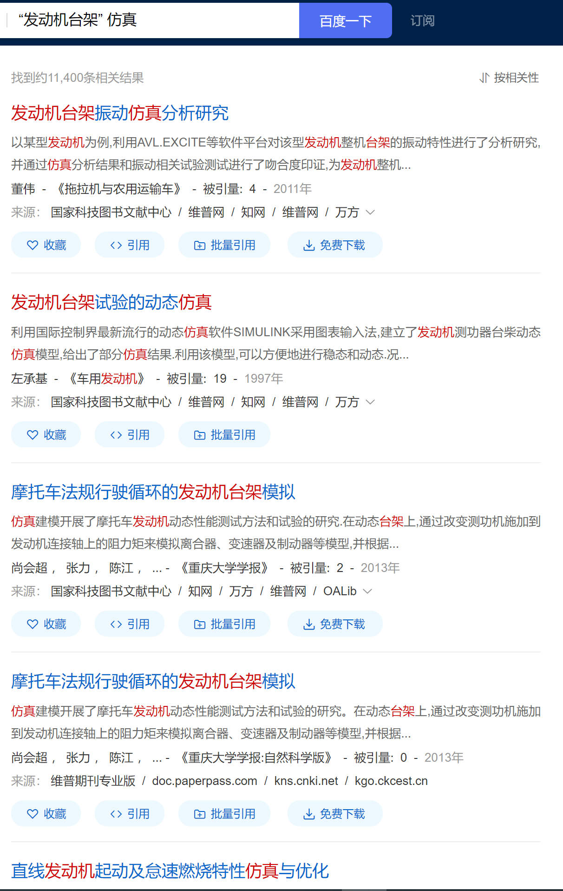

[来自： 科研论](https://wx.zsxq.com/group/15552141181242)

**【2291字回复-问题序号9】**

钟老师，您好，我是今年即将进入研二的一个学生。我现在主要负责的都是老师接到的横向和长期合作企业的横向，其内容基本是一些台架的静力学和动力学仿真。研一期间我多次暗示老师分配一个方向，但是都没成功。

这次暑假他突然让我自己想一个方向，切入口就从我的工作内容开始。

之前没有师兄做过这个方向，我现在很迷茫，不知道怎么开始想思路。用老师的检索式方法我也没成功，组合了很多种都只找到了大量不相关的论文。请问钟老师能指导一下吗？

**【答复】**

其实你现在还不只是检索的问题，你是要通过检索找到选题，也就是知道你要做什么样的工作，然后把这样的工作放到毕业论文中，从而顺利毕业。

只要知道少许关键字就已经能够帮助选题了，比如我下面就会用【钓鱼法】再次演示下，但是考虑仅利用【钓鱼法】选题可能会对整个课题背景的认知不够全面，所以步骤1中我是同时搭配了两种方法，第2种是【鲸吞法】。

具体关于这两种是什么意思，为什么可以帮助选题，你点开检索式专栏，再点开解决问题专栏每篇帖子都看一下，就能了解了。

**一定要每篇看下，** 看完后，你自己的课题怎么选，你自己毕业论文怎么规划就会有思路了，虽然他们的研究领域和你不同，但你也可以学习到的。就像我不是你这个领域的，但为什么也能解决你这个领域问题，就是因为底层的逻辑都是一样的。

比如我现在开始采用钓鱼法进行操作，随便用直译的方式去搜索：

图1

看到以上结果后，就意识到你提问中的问题了，你只是说一些“台架”，但台架其实有挺多类型的，或者挺多应用领域的，如果只是说台架，然后你又把台架的英文单词，比如 bench platform stand之类去搜索的话，会得到大量其他领域和你不相关的检索结果（我上面标记的那些检索记录），比如bench在计算机领域中有被广泛应用，有工作台的意思。

我估计你找不到相关的结果，也是这个原因。

所以接着很简单，你要把台架进一步进行修饰，找到更精确的词。既然你说你做的是企业的课题，横向的课题，那他们这个台架到底是个什么台架呢？是用来承载一种机械装置的台架还是测试用的台架？那如果是承载某个装置的话，它承载什么类型的装置，发动机还是什么东西的台架？这肯定是有一个定语或者说有一种状语进一步修饰这个台架的。

**很多学生说，不知道怎么从现实世界或者我说的真实世界中找需求，我上面这段说的就是真实世界，你只是说你搜不到文献，那你放眼四周看一看呢，你做的这个课题到底是个什么东西？你有没有去搜和这个东西相关的内容？**

一旦考虑了这个东西，后续的检索肯定就会更精准了，然后也能提示你的研究课题了。

因为你这里没有给出，只是说“一些台架”，我也不知道究竟是什么台架，所以我就随便举个例子，假如是发动机台架，那么我们再次钓鱼法搜索【 **所以这里再次提醒大家，提问时候一定要描述精确，因为你描述的越精确，我给你带来的帮助越大。像这个案例由于描述不精确，我只能举这个发动机台架的例子，有也有可他做的是另一种台架。而且从这里也能看出，如果你能够按照我的方法，去不断的精准的描述你的问题，你会发现其实你的问题已经解决了** 】：

图2

这次的结果就基本都是相关的了，而且扫一眼这些结果，只要看标题，就能大概知道你的选题方向会在什么地方了。当然我前面说了，这样的方式可能是不全面的，后面可以结合鲸吞法更全面的了解你的选题，而且找到你的实验或者理论模拟方案。

比如从结果1~4来看，一种选题类型是可以关于设计这个台架的（设计台架当然也涉及仿真的内容），而且仔细看一下1~4的标题，这种设计他也是可以再分为两种类型的，比如一种是已有的领域，但是我把它设计的更合理一点，可以满足一些更苛刻的测试或者测试的效果能更好。另外一种呢，可能是一些新的还没用台架的领域，我针对这种应用设计一种更符合新领域使用的这么一种台架类型（比如结果4的便携式台架）。无论以上两种类型的哪一个，是不是也都可以用上仿真的？

当然我这里只是非常粗浅的搜索，你可以也在中文的搜索引擎里面也这样操作一下，比如：

图3

关于我为什么发动机台架两边加双引号，这个在检索视频中反复讲过多次，你自己测一下就知道了，还有有了之前的经验，我们发现也没有必要非要加上静力学和动力学，就保留仿真就行了。

这次的结果同样是很相关的，那么你就看一下为什么那么多人做仿真，然后把这些文献都形成文献库，再进行标签化或者说分类分组的操作，也就是步骤2和3。

经过了步骤2和3，你起码会知道大家都做了哪些仿真，是干嘛的，为什么有那么多仿真的工作可以做（一天时间就足够了，只是看个标题就行）？然后再次结合真实世界的需求，看一下这个企业找你们到底是干嘛的，企业找你们是天然存在真实世界需求的，因为他要付给你们钱的，他付给你们钱，必然是期待解决某个 **需求** ，收获一些结果的。

那么你就根据这个企业的需求，然后结合文献库中的相应分组文献，看如何可以一小步一小步的解决企业需求，每一个step，其实都是一个论文，不一定要你一个论文就彻底搞定企业需求，那不一定现实，但你将需求分解后，搞定其中一小个问题是可以的。

而且这样的做法，你导师和你都会很开心，你导师做完了企业横向，你通过定企业横向，锻炼了解决问题的能力，又发表了论文，顺利的毕业，而且你如果真的能解决企业需求，也意味着你能一定程度推进这个行业的发展，因为企业就代表了微观的这个行业组成。

比如是不是企业让你做的这个台架还没有涉及到这种仿真，那就很好，你就参考别人仿真是怎么做的，用到你这个领域就行了。或者是他需要你仿真去指导他台架的设计，那也是一样的原理，总之只要你 **循环的去操作步骤1~3（注意我在导航图中提到的，是要循环往复操作，不是单向操作的）** ，一定会找到idea，而且idea会非常多，你试试就知道了。

如果你说你还找不到idea，那么你把 **你怎么检索的（步骤1）** ， **你文献库目前分组是什么样的（步骤2&3）** ，以及企业的需求到底是什么样（ **结合真实世界需求** ）的告诉我。我相信我肯定能帮你找到， **但如果你真的问了自己以上这几个问题大概率你自己也能找到。**

而且现在用了下图中AI驱动选题训练营中的方法和刘老师给你的每一步训练与指导，你能更快找到可以发表研究论文的选题，只要做完第三期作业，你就能找到了多个选题了。做完第四期则会获得初步的研究方案，第五期则会获得一份开题报告或者硕士生/博士生研究计划。

这些选题是分三种不同的维度，照顾了不同需求的师生。维度一是针对发表顶刊级别的选题，维度二针对毕业时间太紧张，希望尽快获得研究结果、尽快发表论文的选题。维度三是针对有些思辨性的选题，比如常见于经管社科类的选题或项目申请有时也会涉及此类选题。每种选题一般都会提供6~9个可以发论文的题目，所以足够你往下推进了。

扫码加入星球

查看更多优质内容

https://wx.zsxq.com/mweb/views/joingroup/join\_group.html?group\_id=15552141181242