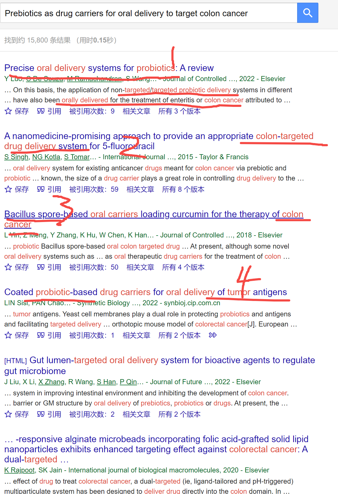
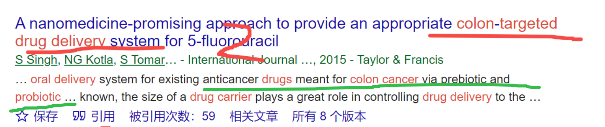

[来自： 科研论](https://wx.zsxq.com/group/15552141181242)

**【3237字答复-问题序号8】**

钟老师你好！

【课题如何检索】我目前想做的课题是用益生元作为药物载体用于口服给药去靶向治疗结肠癌。但是我构建检索式用“益生元”or“益生菌”（益生菌只是为了尽量扩大检索范围”and“结肠癌”，发现结果太少了，只有三百多篇，在这三百多篇里还有很多是机制研究，不是我想要的delivery。第一个问题，想向搜商超级高的钟老师提问一下，我应该如何构建检索式呢？

【课题意义】第二个问题，我的导师在和我聊课题的时候只是要求我去做有机合成方向，没有说到更细的方向。老板之前是做无机材料合成的，他和我表达现在自己偏向于转向合成类/更偏向实用性的课题。

目前合成有机材料方向的只有我和一个师姐，其他人偏向做外泌体和水凝胶。之前课题组没有人做过口服材料，我能想到说服老板的角度只有“挖新坑”，或者用益生元的形式和实验室的免疫方向相结合，再或者说，我认为益生元/益生菌是比较能和企业结合起来的（检索到的文献有与企业发表文章的实例）。想听听钟老师对于我这个课题意义的看法

期待钟老师回复！祝钟老师paper多多～科研顺利

**【答复】**

关于第1个问题，你想解决的是将益生元作为药物载体，口服给药去治疗结肠癌。如果相对精准搜索的话，这个检索式会覆盖：益生元+药物载体或口服给药+结肠癌。（+表示and，或表示or，看过我第2集检索视频的同学都知道）

但考虑药物载体或口服给药的同义词库可能会找漏，所以你搜益生元+结肠癌也可以，然后通过益生元+结肠癌所形成的文献库，在这个文献库中再去二次搜索药物载体或者口服给药方面相关的内容。

随后你说益生元加结肠癌是300多篇，300多篇已经不少了。但你没有给出你的检索式，所以我没法判断，比如关于益生元的同意词库或者结肠癌的同义词库有没有找全，比如结肠也有可能表达为结肠肿瘤之类的。但不管怎么样，300篇也不少了。

接着你就从“益生元+结肠癌”形成的 **文献库** 中，进行 **二次搜索** ，寻找关于给药方面的，这种情况下可以在题目中，也可以在摘要中进行搜索，大概率应该能找到同时和益生元+给药+治疗结肠癌相关的文献的。比如我随便用 **“钓鱼法”** 就能测试到如下极其相关的文献：

比如标记1的这篇是完全相关的，你提到的所有内容都覆盖了，益生元作为靶向或者非靶向药物治疗结肠癌。

标记2的这一篇也是100%相关度的，看我下面绿色划线的：

而且标记3的这篇，你看他标题其实没有用益生菌、益生元之类的表达，但是他用了芽孢杆菌，那其实是和你想调研的文献也是相关的，所以这个时候就可以启发你修正你的检索了，比如你可以把杆菌也囊括进去，顺便也启发一下你益生菌到底有哪些菌种，还有没有什么菌种可以作为载药的？

标记4这一篇同样也是100%相关度，而且它还提示了你的一些新的检索词，比如不一定肿瘤关键词只能是cancer，也可以是tumor。

而且你发现随便看一篇文献，都可以启发你后面的选题或者idea（也就是指导你要做什么东西），比如你上面就会看到有把它做成纳米级的，做成靶向的或者做成非靶向的，还有做完之后表面再弄一个涂层类的（想必是功能化的涂层）。

如果你步骤1~3的检索和导入正确，以上相关的这些文献必然应该出现在你的文献库中的，也就是说你找到的只会比我的多，不会比我的少。毕竟我这种还是极其粗糙的直译方式搜索，所以一旦用 **鲸吞法** 之后，应该会更全面的囊括这些文献。

那现在问题就来了，我不全面的随便看了4篇文献，就出来至少4个idea了。用了鲸吞法之后，你的idea数量可能是十几个甚至几十个之多了，那接下来怎么办，或者说应该怎么选，或者说idea应该怎么排序，先做哪个，后做哪个？

那就很简单，这个时候就结合真实世界的需求了，你们不是跟企业合作么，或者你们不是有病人的样本么，或者没人的话，患肠癌这个事情你总是听说过吧？就根据这些idea对于解决这些问题的靠谱度来排序就好了，比如有的idea一看就是为了发文章而发文章，纯粹基于排列组合的，和解决现实世界中的需求没什么关系，但有的呢似乎是有一定关系的（此类idea我们排序度靠前，优先要尝试），当然我后面还会展开，这个怎么判断。

这里继续展开联系真实世界需求的问题，当然不太可能说靠你这一个研究就能把肿瘤治好了，当然我很希望你能实现，大家也很期待，但至少目前全球那么多人在做，还没解决这个问题。

所以你把你要解决的问题分解掉，现在不是治不好这个病嘛，那治不好的原因到底是什么？卡在什么地方了？

一步步分解（是我 **第1本书中说的追根问底的极致分解** ，也是最近比较流行的第一性原理说法，我发现这两种思路其实是一样的，你看我后面的分解思路就发现了）：

是这个东西（益生菌+药物）的有效成分根本对结肠癌没任何作用（而且是所有类型的结肠癌都没有作用，意思哪怕只要一类结肠癌有作用那也行）？

还是说这个有效成分是有一定作用的，但是药物递送不到那里？

还是说有别的问题？

那你只要你的1篇小论文，即你的博士论文的一小章就解决整个问题环节中的一小个问题就行了，如果本来药的药效就不好，那我们就就把它换一个嘛，全球制药公司那么多，做了那么多药，难道一个稍微效果好的都没有？如果真没有，那其实载药就没有意义了，对吧。

但为什么我没有跟你说制药，因为我不知道你是硕士还是博士，你如果自己要做一个更好的药，然后跟你导师给你的益生元又没什么关系，我不知道你能不能做得到这一点。

那如果药是有点用的，但还不行，那继续追问，什么原因？是药物到不了肿瘤部位，还是到的了，但由于其他因素，没法发挥作用？如果到不了，继续追问，为什么他到不了那里，这其实就是一篇文章，就哪怕研究他为什么会失败（为什么到不了指定地方，中途发生什么情况了？），也可以是个文章。

这个其实蛮有趣的，你会发现肿瘤他特别聪明，就算药物能接近他，他也会想办法让这个药物失效，不要对他起作用。此外他还有一些办法，直接就让这个药物不要接近他。那所以针对这些问题，你就可以看怎么让益生菌这边有所提升，能把这个药物真的作用到肿瘤上。

等你明白为什么失败之后，第1篇文章有了，同时第2篇文章也有了：就是怎么针对这个失败的原因提升解决方案。

而且你这样子做的话，去企业或者以后去高校的话，也会特别欢迎这样的学生，就我目前在xxx过程中发现一个比较大的问题，就是很多人他可能影响因子很高，引用次数也很高，但他其实讲不出自己的研究有什么意义，就是并没有跟真实世界的需求去结合。当然他的论文引言部分肯定是会论述他为什么要做这个研究，这个研究如何如何有意义，但是你跟真实世界需求一对，就发现根本对不上。

比如我随便假设一个人A，他发现，唉，现在CRISPR很火，那我拿CRISPR去编辑一下我的益生菌，然后再去载药。然后选实验数据的时候又是选择性选好的结果，但其实真实情况可能是这个方案本身就不可行，那个药本身可能就对结肠癌没什么疗效，或者是没法发挥作用，或者是其他原因。如果有人问这样的文章为什么还能发表出来，那你就搜心脏干细胞就行了。

回到先前说的，如果你发现这个药物很好，就是细菌有点问题，那目前培养的益生菌又达不到这个效果，那其实也可以用基因编辑，自己长点细菌嘛，或者自己培养点更厉害的细菌嘛。当然要看你的时间，兼顾你的时间，选一个你博士期间或者硕士期间能完成的课题。

至于你过去是学有机的还是学无机的，这个其实完全不重要，熟悉我的粉丝知道，我都没学过化学，我以前是学编程，物理，微电子这些的。但是我们现在做的东西都离不开化学这个东西。所以你会什么东西，不会什么东西，这个不重要，根据你要解决的问题，问题需要你会什么，你就去学这个就行了。这样的学习速度也是最快的。

我现在看不到你的检索式和你的文献库，我不太相信益生元益生菌加结肠癌形成的这样一个文献库中找不太到给药方面的研究。

**另外其实我还可以给你第2个很快速的帮助你形成选题的思路** 。就是你还可以去搜益生菌加靶向药物或者加口服给药，但不要限制在结肠癌。这个时候你通过我前面钓鱼法搜索也能发现了，可能会发现这套治疗方案在其他癌症或者其他疾病当中的治疗。

那么其他疾病当中治疗的一些idea是不是可以起到他山之石可以攻玉的效果，帮助你把它领域迁移到你的结肠癌领域的治疗中？

**包括之前有个人在问关于马氏体不锈钢的问题，其实也可以适用于这种方法** 。

所以像我以上讨论的这种和你相关都很高的文献，其实不需要很多的，最少的情况下，几篇到十几篇也就够了，如果搜出来太多的话，反而也是个麻烦事，就说明你这个idea已经被人做过了，你还得想更多的idea才行。甚至有时高度相关的，搜出来一两篇是很正常的，就像我当时做锌空气电池的有个idea，其实只有非常少的几篇相关的，而且是锂电池领域的，所以你这个如果找到只有几篇相关的，其实已经可以了。而且从我上面的测试来看，显然不会只有几篇相关，而应该是非常多。

你目前说的“不是我想要的delivery”，我因为没有看到你的文献库，所以不好判断，但是我自己用钓鱼法搜了一下，你就发现了前面4篇。我在没有选择性的情况下就给出了检索结果的前4篇，结果4篇全部相关，100%的相关度，也就是说此类涉及药物递送的文献绝对不会少。

而且现在用了下图中AI驱动选题训练营中的方法和刘老师给你的每一步训练与指导，你能更快找到可以发表研究论文的选题（针对新人，估计可以提速10倍以上），只要做完第三期作业，你就能找到了多个选题了。做完第四期则会获得初步的研究方案，第五期则会获得一份开题报告或者硕士生/博士生研究计划。

这些选题是分三种不同的维度，照顾了不同需求的师生。维度一是针对发表顶刊级别的选题，维度二针对毕业时间太紧张，希望尽快获得研究结果、尽快发表论文的选题。维度三是针对有些思辨性的选题，比如常见于经管社科类的选题或项目申请有时也会涉及此类选题。每种选题一般都会提供6~9个可以发论文的题目，所以足够你往下推进了。

而且现在用了下图中AI驱动选题训练营中，刘老师给你分解出来的每一步训练与指导，你能更快找到可以发表研究论文的选题（针对新人，估计可以提速10倍以上），只要做完第三期作业，你就能找到了多个选题了。做完第四期则会获得初步的研究方案，第五期则会获得一份开题报告或者硕士生/博士生研究计划。

这些选题是分三种不同的维度，照顾了不同需求的师生。维度一是针对发表顶刊级别的选题，维度二针对毕业时间太紧张，希望尽快获得研究结果、尽快发表论文的选题。维度三是针对有些思辨性的选题，比如常见于经管社科类的选题或项目申请有时也会涉及此类选题。每种选题一般都会提供6~9个可以发论文的题目，所以足够你往下推进了。

另一个AI验证选题训练的功能是你找到了选题后，告诉你要验证这个选题是否靠谱，你所需要的最小化的实验方案是什么，当然如果靠谱的话，这个本身就可以作为核心的研究方案了。

扫码加入星球

查看更多优质内容

https://wx.zsxq.com/mweb/views/joingroup/join\_group.html?group\_id=15552141181242