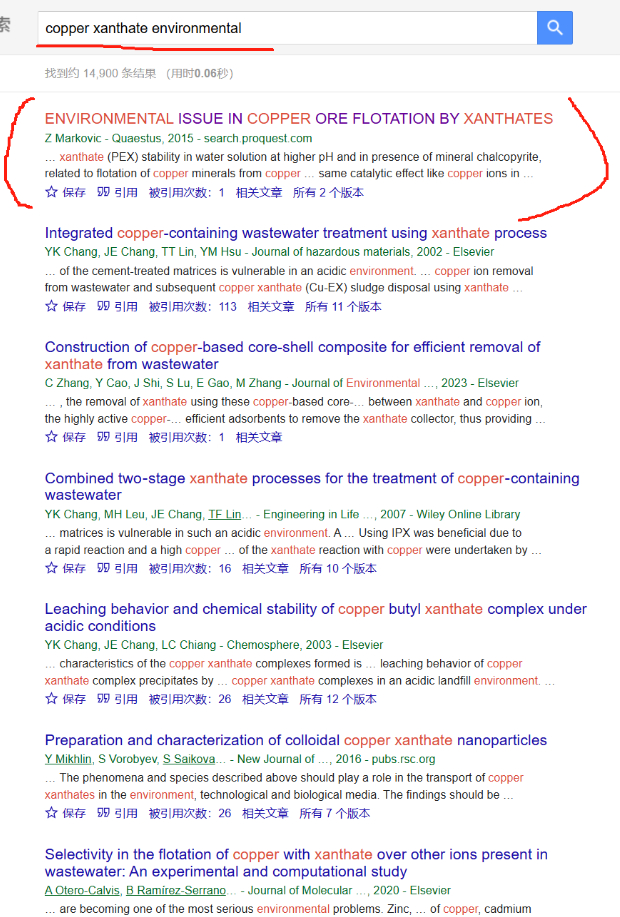
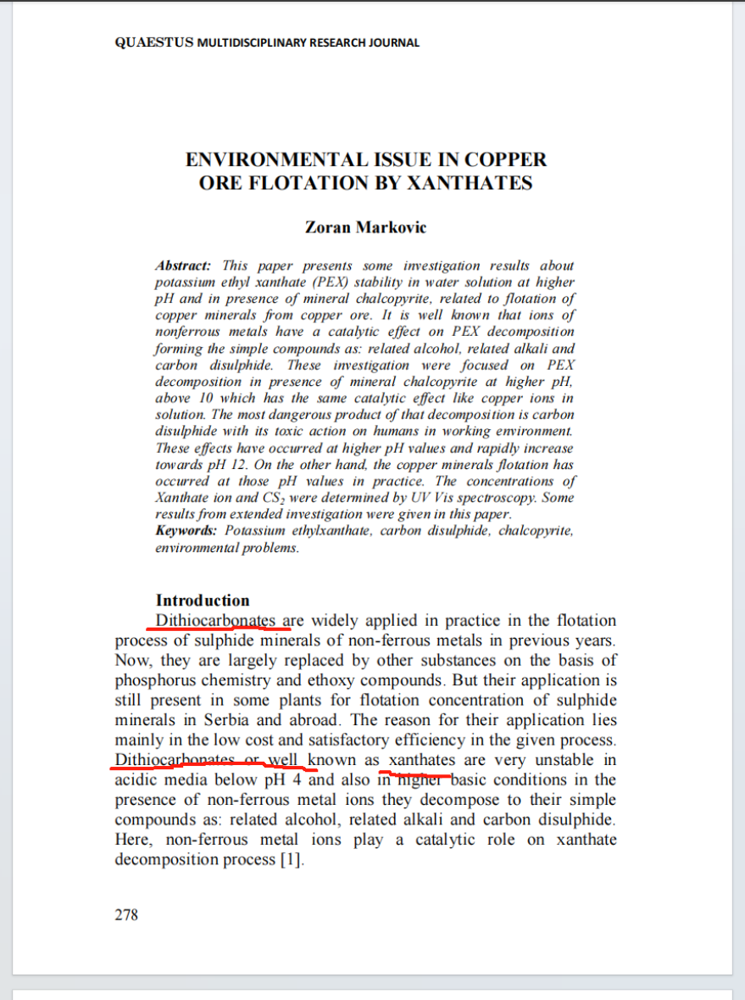
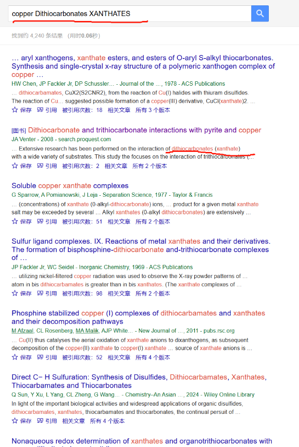
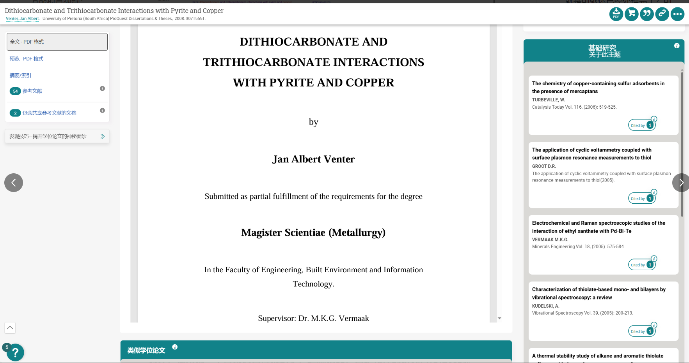
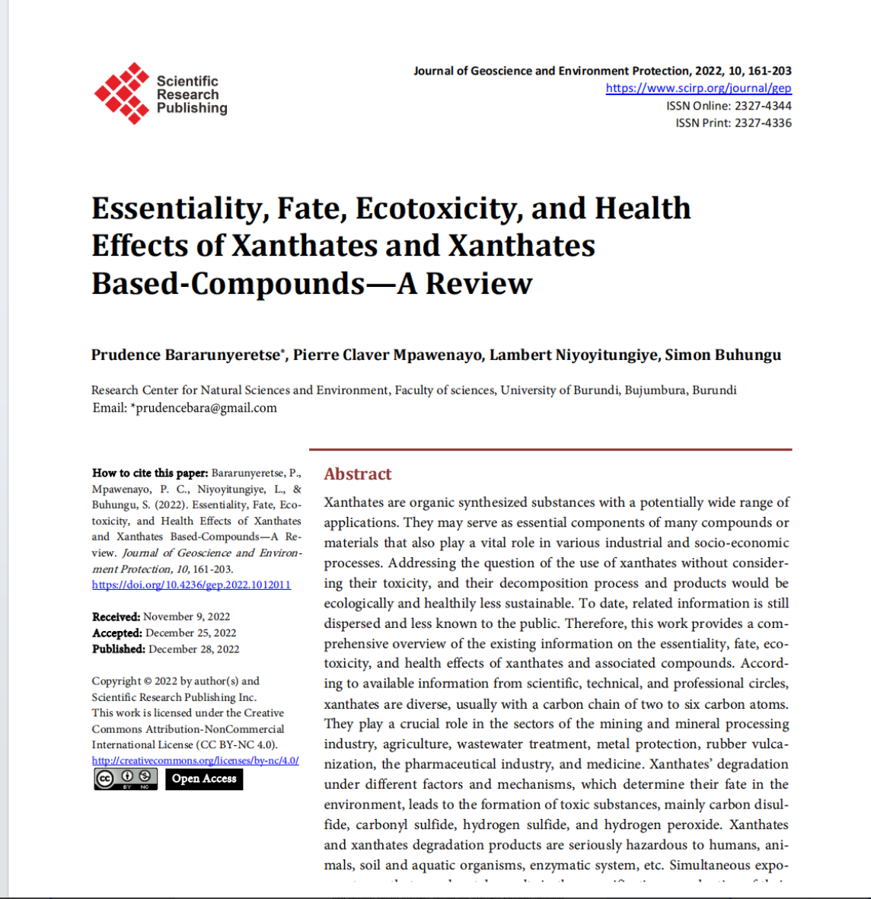
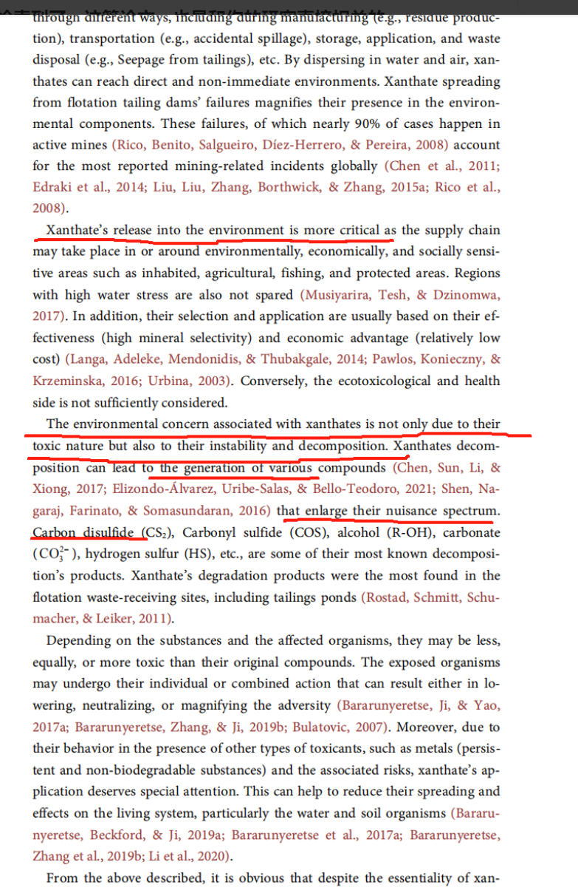
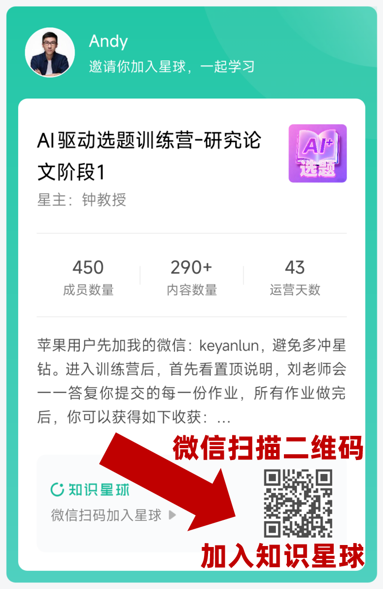

[来自： 科研论](https://wx.zsxq.com/group/15552141181242)

### 问题：

曲线柾国 提问：

钟老师你好，我目前是博三，但迟迟未能开题，是在是饱受折磨和困扰，特来向钟老师讨教。

我的研究方向是有色金属矿区污染场地残留有机浮选药剂和重金属在土壤和地下水中的复合污染风险评估与修复。

有机浮选药剂选择的是黄药，属于金属硫化矿的大量使用药剂。重金属选择的是铜；二者可以反应生成黄原酸亚铜（后称为CuBX）络合物（沉淀、颗粒或胶体）。

我遇到的问题是：

1.没有搜索到研究针对CuBX本身性质和环境行为。按照老师说的钓鱼法去搜索，以xanthate和copper or Cu or cuprous为A和B，检索到的文献内容一般包括（1）利用黄药或改性黄药去除水中重金属（2）制备Cu基吸附剂去除废水中残留黄药（3）利用CuBX的疏水性，附着在矿物表面进行浮选。但以上文献均未提及对CuBX这种物质本身的研究。

2.目前急需开题，老师的想法是让我按照风险识别，风险评估和风险管控三个方面来做。且不说是否做得完，关于风险评估这一块我很是苦恼。因为去查风险评估相关文献，想要学习一下别人有关污染物的风险评估是按照哪几个方面研究的，但查阅后个人认为和我想要的不是很相关。我的实验要围绕CuBX胶体的迁移行为来展开。然而查到的风险评估相关文献都是按照污染物识别-暴露评估-剂量-反应关系-健康评价/生态风险评价这一套流程走下来的。因此目前针对开题报告文献综述/国内外研究进展这里我没有想法，写不出大纲，天天被老师push，但我真的不清楚应该去查找何种文献，如何进行写作。

3.我不清楚如何从文献中提出尚未有人研究的领域空白去提出我的创新点和科学问题。由于找不到CuBX直接相关的研究，因此也曾尝试过用上游关键词去检索，如有机物+重金属;NOM+重金属；选矿药剂flotation agent\* or flotation reagent\* AND 重金属（Cu or copper or Pb or lead or Cd or。。。）

4.我按照老师说的看了选题相关、毕业论文相关、钓鱼法鲸吞法相关，一直的感觉都是有些模糊的思路启发，但仍不知从何处下手。因为太着急了所以先向老师发起提问，具体细节可以在回复老师过程中详细阐明。真的谢谢老师了！！！！！！

**答复：**

我发现你这次的问题和你第一次提的问题一模一样，就是完全看不到任何使用过钓鱼法检索方式的痕迹，因为我要截屏，所以发布主题在下方：

我这里手把手教你如何检索相关论文。首先说明，我对这个领域的背景知识都是从你这里得知的。所以我先直接以检索词copper xanthate environmental开启：

随后发现第一篇论文就非常相关啊。这篇论文已经把很多你想知道的问题回答了。随后又看到，他这里除了用xanthates这个词，还用Dithiocarbonates 这个词表示你说的黄药。

于是我用关键词：copper Dithiocarbonates XANTHATES去检索，发现你说的黄药也可以用Dithiocarbonates去表示。你就可以用这个词再去检索了嘛。

包括这本书也是和你的研究内容直接相关的。

另外，我用第一个检索词也检索到了，这篇论文，也是和你的研究直接相关的。

所以就是：

1\. XANTHATES这个词可能还有很多变体，你需要把这个变体确认完全，再去检索。这也是我科研论2里面一直说的找到检索词的同意表达的方法。

2\. 就算真的没有copper + XANTHATES环境影响的直接研究，可以分别研究XANTHATES和copper 的影响，这个肯定很多。然后看copper + XANTHATES是不是会先析出copper和XANTHATES，进而影响环境。

3\. 也可以看看别的金属浮选药剂，比如Dithiophosphates, Thionocarbamates的环境影响，看看他们是怎样研究的，进一步拓展到有机-金属复合物在环境中的行为研究。因为CuBX本身就是一种金属有机复合物，你就可以学习他们的研究方法了。

ps：

这是你上一次问的问题，也是同样能发现虽然很焦虑，但是没有像我这样做文献检索的工作。

[https://t.zsxq.com/lMy9Z](https://t.zsxq.com/lMy9Z)

不过这个也是我在科研论教材中讲过的，越是焦虑，会越是挤压人的处理带宽，导致别人手里塞给你一个工具，你也不晓得去用他，只是念叨我很焦虑。可以看完整科研论1专栏中的模块化工具2系列。

如果时间实在太紧张，太焦虑，那么也可以让刘老师来带着你做，就有点像你自己健身和让教练带你健身的区别。只要做完第三期作业，你就能找到了多个选题了。做完第四期则会获得初步的研究方案，第五期则会获得一份开题报告或者硕士生/博士生研究计划。

这些选题是分三种不同的维度，照顾了不同需求的师生。维度一是针对发表顶刊级别的选题，维度二针对毕业时间太紧张，希望尽快获得研究结果、尽快发表论文的选题。维度三是针对有些思辨性的选题，比如常见于经管社科类的选题或项目申请有时也会涉及此类选题。每种选题一般都会提供6~9个可以发论文的题目，所以足够你往下推进了：

扫码加入星球

查看更多优质内容

https://wx.zsxq.com/mweb/views/joingroup/join\_group.html?group\_id=15552141181242