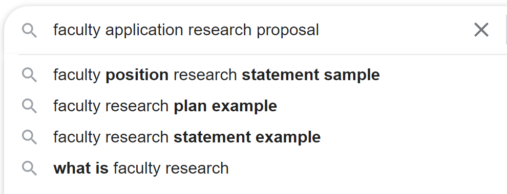
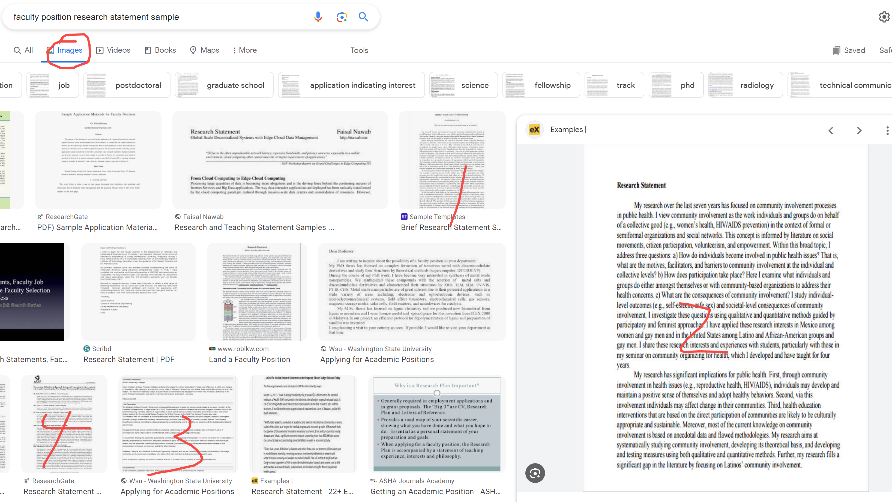

[来自： 科研论](https://wx.zsxq.com/group/15552141181242)

### 【852字答复子竺-问题序号199】

钟老师，您好，现在情况是博四结束，准备博五毕业，正在研究找工作的事情，发现有的工作申请除了CV外，还要求cover letter，关于教学理念的陈述，和research proposal。这里想咨询一下老师后三者怎么写呀，现在比较迷茫，cover letter不知道从何入手，教学理念的陈述并不确定应该写到什么程度，research proposal也不确定应该写到多么细致的程度。（属实也知道这个问题太general的，但属实迷茫，打扰老师了）在此十分感谢老师分享了这么多有用的资料。

### 【答复】

直接钓鱼法操作下就行了，输入和你要找的资料相关的关键词，比如faculty，research proposal，然后会发现输入法还能联想，你也可以选择联想的结果去看一下：

然后你可以点image：

其中有大量research statement的模板和别人的写作，你可以以此作为素材库，弄个10篇左右，将其进行大块的切割重组，然后也就知道自己的提纲应该是什么样的，再往里面填充就行了。

再重复一遍，刚开始先关注自己的提纲，也就是一级标题是什么，二级标题是什么，而且也明确了总页数大概控制在多少。

接着提纲有了，总页数也明确了，再往里面具体填充文字就好了，填充工作很简单的，就跟写introduction差不多的，但比introduction要容易许多。参考《科研论》中介绍的步骤，是如何生成一句句你需要的句子。无非就是一些背景介绍，以及自己为什么要干这个的重要性。你如果做好了文字素材库，会发现所有人都在干这个事情，给你介绍背景+引出自己工作的重要性。

而且这种情况下，你不用像我演示的那个案例这样整合进28篇文献那么多，大概有个5篇左右就足够了。

因为这种面试和应聘，更重要的还是你过往的成绩。

当然，因为你要的是英文的资料，所以我这里演示的是英文的搜索引擎，你如果要的中文的，那你就用中文的百度搜也足够了。

教学理念的陈述还是一样，钓鱼法随便就能搜出来大量写作范例，而且这些范例的可被迁移程度更高。

cover letter就更简单了，我当时搜research proposal的时候发现它联想为research statement（说明research statement用的频率比research proposal更多），然后打开关于研究计划的页面，里面还大量探索有关于 cover letter的sample，说明这是个经典的三件套，别人也经常在用，所以产生了大量的模板（别人分享的自己写作的案例），也就是语料库，用这些语料库训练自己的大脑神经网络，必然可以搞定自己的。

扫码加入星球

查看更多优质内容

https://wx.zsxq.com/mweb/views/joingroup/join\_group.html?group\_id=15552141181242