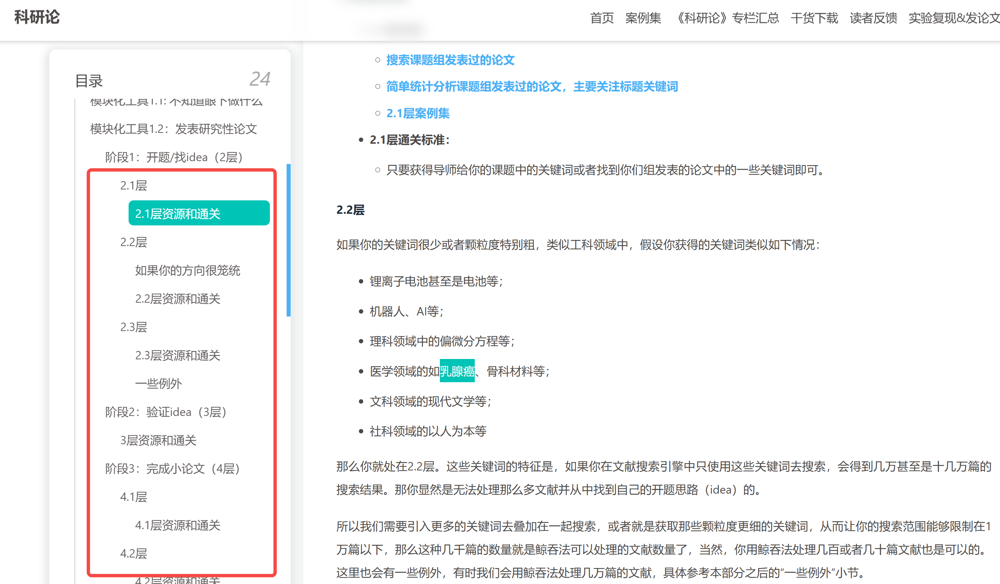
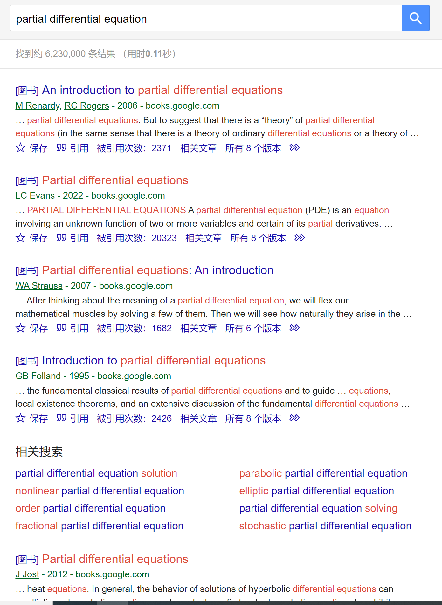
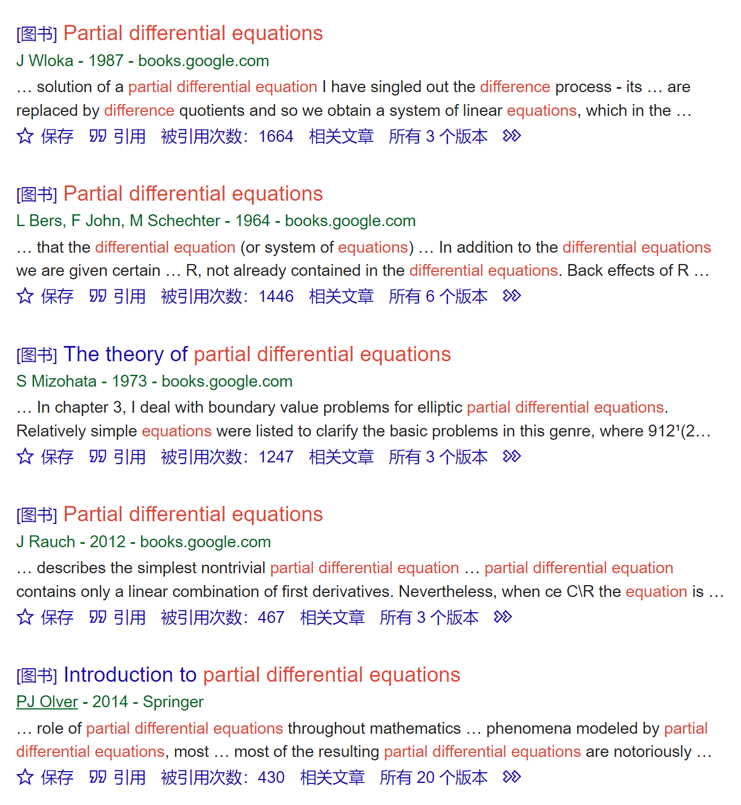
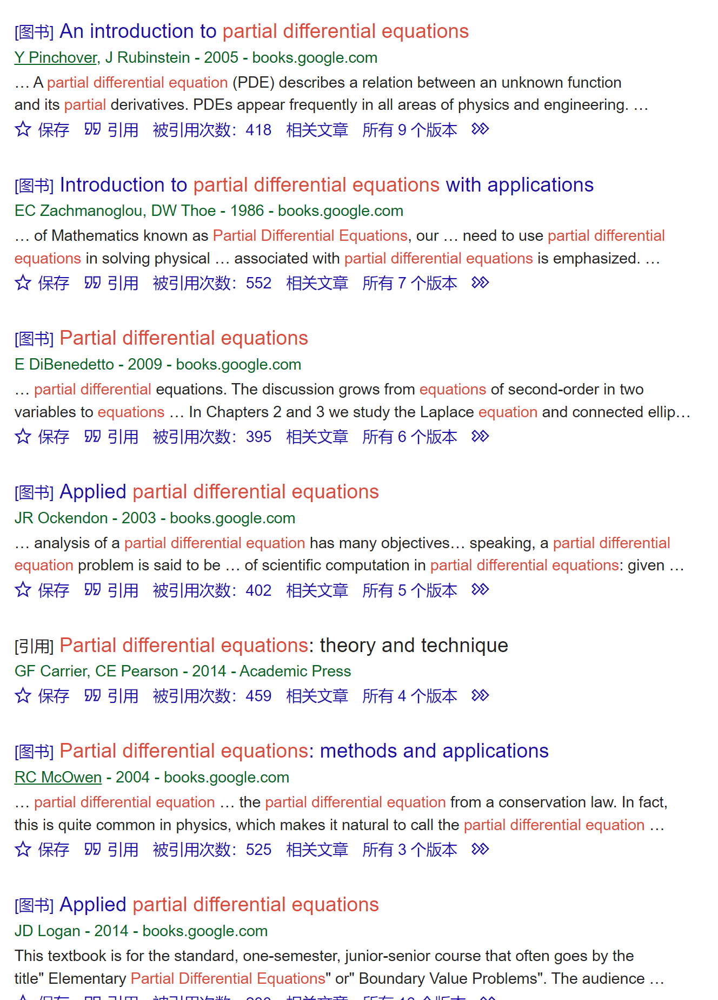
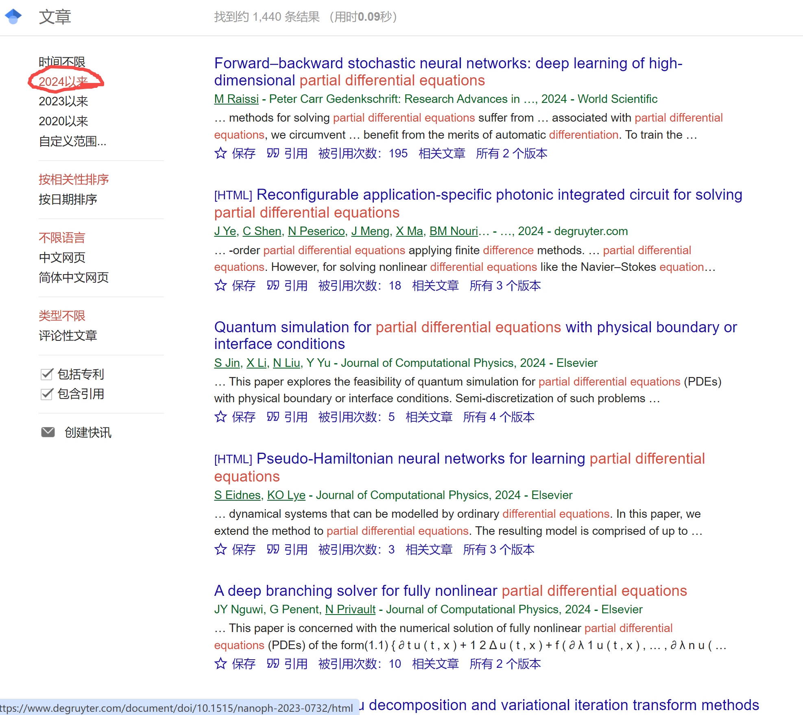
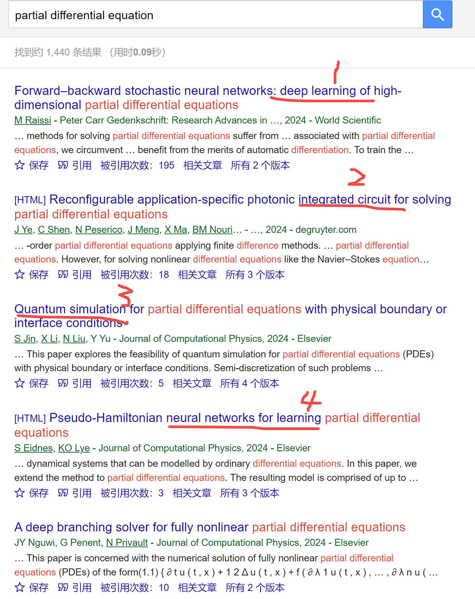
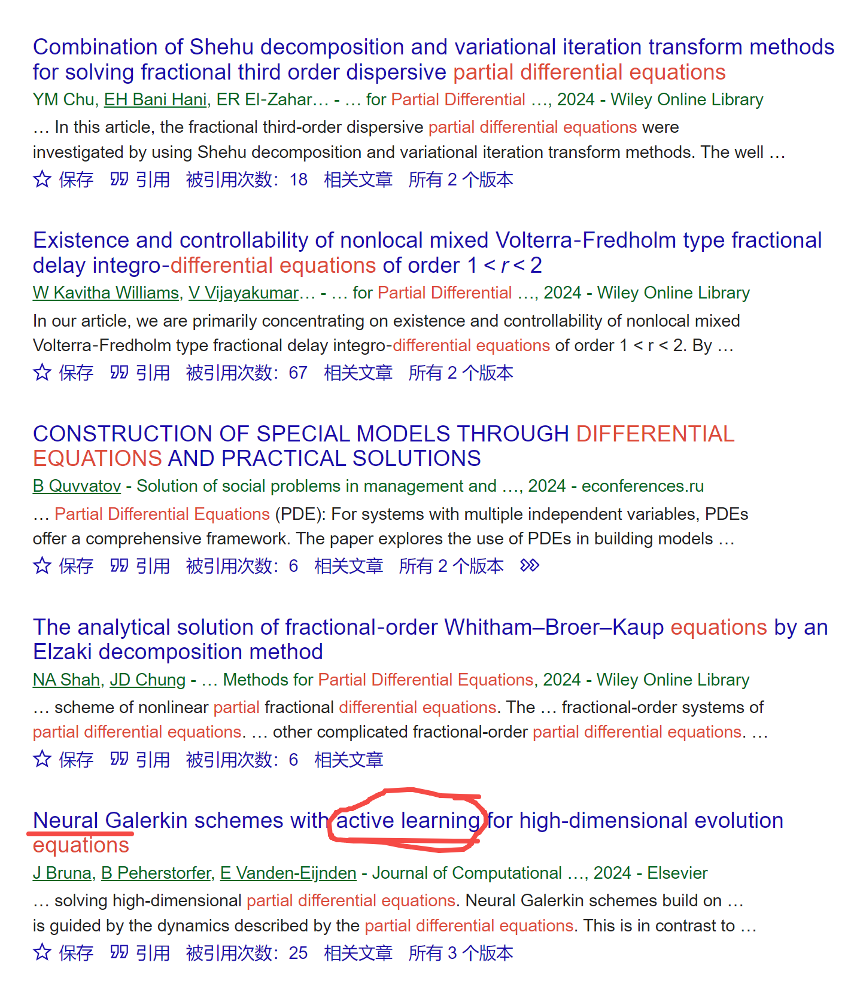

[来自： 科研论](https://wx.zsxq.com/group/15552141181242)

### 【10846字答复-问题序号45】

这是之前收到的我估计是一个硕士生的问题：

“放养，只知道自己要做偏微分方程，公式看不懂，不知道自己要干嘛”

### 【答复】

**提及要点：**

1. 一定要有人指导才能找到课题么？
2. 为什么研究越多有人做，越容易发表论文，而不是反过来？
3. 复现
4. 学术裁缝
5. 既然读本科的时候，在不需要搞研究（没那么多其他事情干扰）的情况下，都还没有弄懂公式，那到了研究生阶段，又得花大量时间搞研究，还要再按大学本科的方式来死磕公式么？
6. 快要毕业了，没有任何论文怎么办？
7. 关于综述
8. 深度利用AI来寻找选题的方法

**回复正文：**

这位提问人相当于是处于2.1层，然后要找到一个或多个二级词汇，从而可以让自己从2.1层来到2.2层。关于2.1层~2.2层是什么意思，详见下方帖子中的这个部位：

[http://www.keyanlun.com/#tools1-2](http://www.keyanlun.com/#tools1-2)

首先还是时刻目标导向，对于硕博士生而言，最重要的动作是完成一篇 **小论文** ，就算不要求小论文的硕士生，完成这样一篇也不亏，因为完成后的话，毕业论文的一个干货性章节也就有了。而且对于拓展以后自己的选择权也会多一些好处。

那为了完成小论文，总是要做点什么东西，而且这个东西不能是别人已经做过的，也不能是虽然没人做过，但完全没意义（别人只是因为没意义才不去做的）。

那具体做什么呢？偏微分方程是一个很大的领域，你不可能什么都做，所以在其中要找到一个细分的研究方向，你可以做的同时又能收获一篇小论文的。

最常见的 **方法1：**

比如看你们组里最近发的论文是关于偏微分方程的什么方面，提取除了偏微分方程以外的 **关键词** （因为既然你说放养，那我就不问导师会给你什么关键词了，大部分情况下的话导师会提供关键词）。

**方法2：**

如果组内没有学生，或者说完全新换了一个方向，过去发表的论文没有任何参考价值。那么你导师总发表过论文吧？从你导师发表的论文中，最好是最近发表的论文中提取关键词。

**方法3：**

如果你说导师也没发表过论文或者发表的论文也不能参考，而且组里又没有其他学生可以参考。那么也简单，启动星球中常说的【搜.钓鱼法】操作来获取关键词就行了。

而且【搜.钓鱼法】操作是不管你有没有通过方法1或者方法2提取出了一些关键词，都必须要用的动作，它的操作很快，也就几秒钟，但是给你带来的收获是巨大的。

总之我们的一切动作，为了让你达成这个目标：即除了偏微分方程以外，你还知道什么和偏微分方程有关的关键词，这样就可以启动下一步的【搜.鲸吞法】【聚】【分】操作，让多个idea自动浮现在你的脑海中。

并通过随后的【验】步骤选择靠谱的idea，并进入最后的【合】步骤完成投稿。

回到之前说的【搜.钓鱼法】操作：我们直接简单将偏微分方程的直译去搜索下：

翻了几页，发现好多都是图书，那么我们就点边上的2024年以来，一方面看看最新的工作大家都在做些什么，一方面用这样的方式应该会不至于显示那么多图书的结果：

果然发现这样子页面中不少就是文献了：

然后你马上就能提取一些关键词了，比如会发现和神经网络学习、深度学习相关的工作（即将机器学习用于偏微分方程领域）：比如从文献1和4中可以提取Learning、deep learning、neural networks等。

还会发现一些工作似乎和硬件，如集成电路有关（从文献2中可以提取integrated circuit）。

类似的，还有将量子模拟用于偏微分领域的，如文献3。

如果像文献2、3的工作，你觉得和你偏差过大，比如你完全不懂，或者也没有这样的硬件条件，不想做或者不能做，那么就不要从中提取关键词，继续往下看就ok了。

这样看了几篇或者十几篇后，你肯定会获得偏微分领域中的一些关键词，也就是 **可以获得多个二级词汇，从而来到二层了** 。

而且这些关键词是你至少初步感觉下来，不是完全不能做的那种。

比如像机器学习、深度学习这些的，我相信你也是可以试一试的。现在那么多开放的源码，就算你不懂底层的原理，你拿来应用总是可以的。

而且既然才看了5篇，就发现有两篇文献将深度学习或神经网络模型应用于偏微分方程领域，就说明还会有更多此类的文献，我们后续是可以通过【搜.鲸吞法】操作和之后的【聚】【分】操作将此类文献全部囊括，并在操作过程中就会逐步获得自己的idea。

比如我们再往下翻，还会发现一些类似的内容（比如下面有文献提到了主动学习）：

那么我们会这样考虑，既然那么多人都围绕神经网络模型学习、机器学习等发表了论文，那你肯定也可以。 **我们后面会分析到：越多人发表，并不是像一些人认为的你越难发表，而是你越容易发表。**

这就相当于市面上充斥了各种风格、各种造型、各种式样、各种面料的衣服，那么你很容易博采众长，形成自己的一套服装设计。但如果只给你看一件衣服，其实你是不太有概念或者有信心的，不知道把这件衣服换一个造型或者换一种面料设计行不行？会不会给人感觉很奇怪。

当然这种操作走到误区就会变成我一直说的排列组合式的文献驱动型的研究了。以上面那个例子打比方，就是通过从不同的服装设计中汲取部分元素排列组合成一种市面上没有的，但可能很奇葩的设计，比如使用服装A中的面料材质，用服装B的部分袖管设计，再用服装C的部分领口设计，其余部分的造型再参考服装D的。

这样的衣服确实市面上没有，也能上市，也能放货架上，就像论文写出来之后也能发表，但这个工作整体的产生并不是兴趣、好奇心驱动，或者是真实世界的需求驱动的（上货架不代表能卖掉，就像论文发表出来之后不代表会有人看，有人用。市面上毕竟还有大量引用次数为0的论文，当然有的没有引用的论文，是因为他的思想太超前了、或者他是接近真理的少数人，同一时代的人看不懂，或者不支持，那也就引用不了了，但他可能之后会产生巨大的影响，不要一概而论）。

甚至这种操作还能再升级一些，如果发现各个服装中提取的面料做排列组合已经被人用过了，那还可以再跨界一些，比如从日常化工原料中提取材料。当然有的服装面料设计看上去是用这样的手法获得的，但它实际上是 **有真实世界需求** 的，比如莱卡面料（开始也没想到这个材料可以用于衣服），确实轻、有弹性，穿着可能有时尚感。

所以抽取不同文献的部分要素，进行排列组合式的研究，能快速发表或者更确切的说是批量制造无穷无尽的论文，那些号称自己两三年发几十篇论文的硕士生甚至本科生，你也可以留意一下，是不是有这种痕迹。

**注意我为什么要说上面这句话，不是无缘无故说的，是有原因的。其实是说给那些非常焦虑毕业的人听的，比如经常听到说自己还1年毕业了，没文章，很焦虑怎么办之类的。**

你反过来理解一下，既然人家能这样发几十篇，你只是要收获其中的1篇文章而已，是不是不会太难？当然你最好能结合上我之前说的与真实世界需求联系起来，因为这个时候我也不会去提好奇心驱动这个事情了，如果是好奇心驱动也不会来到这个position问我。

好奇心驱动的人非常少，这样的人，光是搞明白某个问题他就觉得很有意思，只要能去搞就行了，他并不在乎说什么时候能毕业甚至人家给不给工资（想想发现DNA螺旋结构的那位），也就是说能让他研究这个问题本身就是给他最大的激励了，当然我们不能强求大家都这样，我自己目前也还做不到。

继续回到这个问题的答复，所以通过以上说明，你就会明白了一个大领域（也就是你这里说的偏分微分领域）中，如果你找到了一个小的细分领域（比如我这里通过钓鱼法很快找到了神经网络学习），其中这个小的细分领域，你如果发现不少人发表了论文，那其实意味着你更容易在这个细分领域中产生你自己的论文。

至于联系真实世界需求其实也不难，比如为什么他们要将机器学习方法用到偏微分方程里面，又为什么这种机器学习算法还不行，又要用到另一种有所不同的或者略有微调的机器学习算法呢？他们肯定在前言会有交代的，当然有一些也会出现如上学术裁缝般的操作，讲的似乎有道理，但实际上并不是这样。这种你通过 **【复现】** 的操作就能识别出了，学会复现是特别重要的，特别对于一些理论代码建模算法之类的工作以及假如你看不懂太多基础公式的话。

关于如何找到复现的论文也是通过【搜.钓鱼法】的操作，因为这种方式支持 **全文搜索** 。星球中也分享过这么一个案例，这位提问人当时在提问的时候说，有一个工作一直复现不了，因为别人的代码都跑不了或者找不到源码。但他后来在等待提问的期间，就通过浏览我星球中钓鱼法专栏的案例自行解决了这个问题，即通过钓鱼法找到了能够复现代码的论文。

那一旦你能复现第1篇你觉得你借鉴价值最大的论文，你就有办法复现第2篇你觉得借鉴价值也挺大的论文，而第2篇论文也不是随便找的，而是存在能改进第1篇论文的点（至于怎么快速找到这些论文，就执行之后的【聚】【分】操作，并穿插定点精准寻找模式的【搜.钓鱼法】操作），你组合下就 **形成自己的论文** 了。

**所以，要** **注意这点！** 虽然你这个课题到目前为止，你可能关注了机器学习+偏微分方程。但如果搜索过程中，你发现有机器学习+其他类型的方程，不要觉得这是不相关的结果，而将他们迅速排除。 **这反而是对你非常有价值的文献。**

因为如果其他类型的方程采用了机器学习的解法，而这种机器学习算法还没有被应用到偏微分方程领域中，那么你其实可以直接将这种机器学习的方法迁移到你的偏微分方程领域中，快速完成和发表你的工作。当然这种方法可能会被很多人抨击，但是对于一些非常焦虑毕业的同学而言，还是一种比较高效的方法，而且也不能说是完全没有意义。

又比如在电池里你可能会看到这样的工作，比如有人发了锂空气电池。那接着就有人看到受启发，去看看元素周期表中还有没有什么没做过的、又可以做成金属空气电池的元素，比如去发表钠空气电池，接着又会出现钾空气电池、钙空气电池等，某个体系第1个发的人很有可能论文会发在大家认为不错的期刊上，那从提问人的情况来看，他并不是说一定要发表在特定期刊上，属于只要有SCI论文发就行，那肯定是更加可以发出来了。

当然更好的情况是他确实要跟需求有关联，比如他觉得锂的资源稀缺或者锂空气电池有什么问题，他才想去做钠空气电池，而不是排列组合模式，或者说采矿心态，这个东西没人做过（这块区域还没人开采过），我赶紧去做下。

当然，这种心态支配下的工作也会在完成之后，再来反向思考这个introduction应该如何包装，也会呈现是有需求驱动的。毕竟按有的人的话来说：“上下两半嘴左右都是理，只要你东西做出来，总归是能包装出应用的”，就算地球上不能用，还有火星上可以用（比如什么氮气电池），水星上可以用，外太空可以用。

上面这个模式就属于作者将锂+空气电池中的锂替换为其他元素。和之前提到的机器学习+其他类型的方程中的方程替换为偏微分方程类似。即他山之石可以攻玉：用另一个和你相似领域中的工具和方法来解决你这个领域中的问题。

以上完全是我们简单执行【搜.钓鱼法】操作就能获得的认知，那接着就可以通过【搜.鲸吞法】一方面获得偏微分方程+机器学习的文献。机器学习会出现大量同义表达（ **获得同义表达很重要** ），怎么找到这些同义表达参考《科研论》第3章节，注意其中每一个案例都要看，而且为什么和你不相关领域中的案例也要看的原因已经多次强调了，你看的过程中我还会穿插解释这个原因。

另一方面，通过【搜.鲸吞法】获得机器学习+其他方程的文献，其实你观察下这两次检索，你将检索式设置为机器学习+方程，应该就可以通过一次搜索达到以上两个目的。

通过【搜.鲸吞法】获得机器学习+方程（这里的+表示搜索中的AND，记得执行搜索前，看星球中的 **万能检索式** 模板）的文献后，通过【聚】步骤批量导入文献库（导入时记得带上摘要、关键词、doi号）。

接着就可以通过《科研论3》和星球中【分】专栏提及的【分.粗分.总览】、【分.细分.总览】、【分.搜分】等操作方式，你就会在你的文献库中获得一系列 **层级分明的分组** 了。光是看这些分组名称，你就应该了解到偏微分方程领域中已经分别用了哪些类型的机器学习算法，以及非偏微分方程领域中又用了哪些机器学习算法。

看《科研论》包括星球中其他案例的时候也注意使用方式，不要单纯只是去看，具体参考这个帖子：

[https://t.zsxq.com/17IOY5w3F](https://t.zsxq.com/17IOY5w3F)

**我脑补下来，文献库中应该要出现这样的分组（标签），或者说你执行【分】字诀的时候，重点要关注如下分组：**

**机器学习算法1 + 偏微分方程类型A**

**机器学习算法1 + 偏微分方程类型B**

**机器学习算法1 + 偏微分方程类型C**

**机器学习算法2 + 偏微分方程类型B**

**机器学习算法3 + 偏微分方程类型A**

**机器学习算法2 + 其他类型方程D**

**机器学习算法5 + 其他类型方程E**

**....................**

然后你就会知道重点应该复现哪些论文了，那么最终通过复现A类型的论文，再通过复现B类型的论文，然后从A和B中各自选出对你有参考价值的元素，组合出你要的论文。这也有些像 **【搜集拼图碎片】** 的过程，从A论文中搜集一部分拼图，再从B论文中搜集一部分拼图，必要的话也可以从C、D类型的论文中搜集剩余的拼图， **最终组合成完整的拼图也就是你自己的论文** 。

比如你先复现了A论文，然后发现B论文中的某一个点，是可以拿到A论文中进一步改善效果的，那就形成你自己的论文了。

如果你对选题有进一步的追求，不想做这种被大家鄙视的“学术裁缝”类的研究，那么仔细看《科研论》的第5章节，我专门用实例给你分析了如何从真实世界出发，以第一性原理思考方式去寻找选题，而不是自己绞尽脑汁地、且痛苦地去凭空想象，但结果弄出个闭门造车的东西。

但是要注意这种搜集拼图碎片的思维方式本身是没有错的，我们即使是在真实世界需求驱动下或者好奇心驱动下解决一个问题，也一定会涉及使用这样的方法，比如保暖衣物的发明会借鉴动物身体结构的保暖原理，没人可以在不借鉴任何前人工作的基础上就独自完成一个问题的（ **所谓站在前人/巨人肩膀上，不借鉴前人工作，起码的生存都无法实现，智人包括已知大量生物都有模仿的本能，我们只是不要让它走到一个极端，为模仿而模仿，即将模仿当做终极目标，而忘记我们当初模仿想实现的目标是什么了** ）。

1. **关于公式、代码看不懂**

所以明白以上之后，又可以回答一个星球收到的很高频的、但我觉得也是存在误区的一个问题。一些同学看到一篇论文后，就迫不及待的去下载全文，然后 **发现里面一堆公式看不懂，就很沮丧，然后提问说公式看不懂，怎么办？**

碰到这样的同学，我会问他这么几个问题：

（1）你大学本科4年都在学数学（比如线性代数，可能就要学个一学年），然后也没看懂这个公式，那现在你的时间更少了，再重新系统的学一本数学的书，可能就得花一年了，那你还有时间弄自己的研究，弄毕业的事情吗？

（2）你怎么确保文献里面写的公式是对的，万一是错的呢？而且就算这个公式有出处，引用了别人文献，也不能证明这个公式就是对的。

我有一次审稿，看到一长串公式，因为作者前后的推导工作也都是略掉的，我也没有办法判断这对不对，但从里面的符号来看，我感觉作者那个加减号写反了。

这个公式引了一个文献，那我就打开这个文献一看，发现文献的公式形式是和作者一样的。那一般人可能看到这里就结束了，但是我用【搜.钓鱼法】直接去搜了这个公式，发现这个公式是出自一本书的。然后我就去看这个书里的公式，发现作者的符号果然搞反了。

而且有的时候书也会写错，因为有的书可能也是抄的别人的文献，然后别人文献有错误也被抄进去了。

（3）就算每个公式看着好像是正确的，你怎么知道公式和公式之间的推导过程也完全是正确的呢？要完全不出错其实非常难的，爱因斯坦也有在投稿中出现错误的公式推导（被期刊编辑发现），有些人号称证明了极其难证明的数学猜想，但其中有些后来是发现他的推导过程有错误。100个、1000个步骤操作下来后，即使是重复步骤，人脑都可能出错（高考数学满分150，我们大部分人都做不到150），何况还涉及推导这种的。

（4）就算有不少人号称自己的公式很正确，以此优化出来的算法很牛逼。但他只给了关键公式，没有给出详细的推导过程，也没有给出详细的代码，你怎么知道基于他的公式优化出来的代码真的能跑出更好的输出效果么？你看到的只是他作图做出来的结果，一手数据真的是这样么？

也可能是他公式确实都是对的，推导也确实都是对的，但可能是通过特定样本拟合，或者借助了“调参”等手法，其实是跑不到那么好的效果的。

如果继续想的话，我可能还会想出一些问题。

所以就算看懂公式，离最终发表论文还差了十万八千里。

那代码看不懂也是一样的道理，我这里就不重复说了。

所以看到这里你就会明白了。你想搞明白公式的这篇论文是不是靠谱都还不一定呢？如果你一头扎进去，很可能浪费了很多时间，但得不到什么输出，所以很简单的方法就是，是骡子是马拿出来遛一遛，即直接去复现，先别管他公式什么意思，代码什么意思。

你只要搞明白他想干嘛，他的目的即可，只要他的目的中有一部分和你目标相关，哪怕只有10%的相关度也行，目的或者说人家想干嘛你总是知道的，这个看一下标题，看看摘要或者看看前言中的in the present work，你肯定就懂了。如果连这都看不懂，那大概率这篇文章也不是你能借鉴的，换一篇继续看其他的就好了。

那如果你说这篇论文不给你代码和完整的公式验算过程，那么你就pass换一篇，找那些有代码、能复现的论文去做，复现不出来就继续更换，直到换到可以复现的，那如果你说找不到，那么就用【搜.钓鱼法】，星球成员中已经有人反馈用这种方式找到可以复现的文献了。他在没有看钓鱼法专栏之前，也觉得找不到此类文献。

哪怕你复现出来的这个论文，跟你的相关度或者你觉得可以借鉴的程度只有10%也没有关系，能有10%已经算很大的相关性了，比如来个10篇这样的论文，每篇借鉴个10%就可以形成你的论文了，记得我们先前说的，通过搜集拼图碎片形成完整拼图也就是你的论文的操作。

而且大部分情况，你想到的很多idea，其实别人都已经想到了，这也意味着应该已经大量存在对你借鉴度有90%+的文献，只要你钓鱼法用的好，就能找到此类文献。一旦你能复现出这样的论文，只要再复现另一篇或者复现其中的部分，从中知道怎么把先前这篇论文中的一小部分的元素进行更换或者进行升级，就可以完成你自己的论文了，这主要是针对毕业时间特别紧张的学生，可以采用的一种方法。

这就有点像先模仿别人做出个电动车，然后再模仿别人油车中的发动机单元，把它放到电动车里面去，然后做成那种油电混动的车或者增程式的电动车。

我再举个我读书时候的例子，以帮助你举一反三，我当时有个课程作业是涉及神经网络算法和遗传算法，而且还涉及两个结合在一起。而且期末了，肯定还有其他许多课程作业需要提交，那我如果从线性代数、矩阵一个个底层公式搞起，肯定也没那么多时间。

所以那时的话，我记得还是用Matlab的，他自己就有一个神经网络算法和遗传算法包，你只要知道怎么运行这个代码包，然后把输入给到这个代码包就好了，最后在出错 -> 调整输入 -> 再运行 -> 直至能成功跑通的过程中，其实你自然而然的就会对这个算法有更深的了解，然后也会更理解别人说的当前算法目前存在的一些问题以及怎么修正。

关于这段说明，具体也可看这个帖子：

[https://t.zsxq.com/17Y5Wt7j5](https://t.zsxq.com/17Y5Wt7j5)

我并没有从底层的这个代码包去一行行看它代码、一行行看它公式，因为毕竟就那么一两周就要做作业了。

而如果从什么线性代数学起的话，光这东西就得学一学期，何况你两周后就要交作业了。

而且现在或者未来也不一定是过去这种100%只能依赖自己手工纯推导的时代了，比如机器学习也能理解公式推导，Matlab包括其他工具本身也可以帮助你理解公式、推导公式，我觉得更重要的是你擅长使用这些工具，然后能看懂它的推导过程，比如很复杂的运算，你是相信计算机算出来的，还是你在草稿纸上比划出来的呢？（当然别以偏概全，我不是说你彻底放弃自己的推理计算能力）。

此外，再次提醒不要以偏概全，我这里长文叙述，针对的是已经到了研究生阶段，看了一两个公式就说看不懂的这些同学，所可以采用的方法。并不针对大学本科已经受到系统训练，能看懂公式、代码的那些同学，因为我的科研论更多的面向的是最为基础的、缺少指导的这部分人群。甚至还有一些是尚未接触过大量公式、代码的本科生，那用了这种方法就可以最快的速度直接以应用为导向进行输出。

继续围绕这个话题，进一步延伸下。

工科领域有时候也会出现类似的这么一个情况，就是我们不理解某个事物，是因为这个东西还没被造出来，如果这个东西造出来了，我们就能更好地理解这个事物。当然很多纸上谈兵的或者只看教科书、没有结合实践的会很难理解这个现象，他们会觉得你连原理都不知道，你怎么能造得出来这个东西？

这就是被应试模式给训练太久，忘记了这个真实世界到底是什么样的了。你想想飞机是怎么出现的？蒸汽机是怎么出现的？

经常是一个偶然的现象被发现之后，工程师就想着把这样的现象做出某种机械结构，以实现某种功能。是这个功能实现了，比如飞机飞起来之后，才有很多人去研究它为什么能飞起来，才出现空气动力学这个学科，而不是说莱特先上了一学期的空气动力学课程才设计出来了这个飞机。

蒸汽机也是同样的道理，不是说我们先有了热力学方程，上了一年热力学方程，推导了一系列公式，才有了蒸汽机。是有了蒸汽机之后，不断捣鼓这个东西后，大家才发现了一些规律，才知道了一些热力学原理。要知道在还没上热力学定律课程前，已经大量劳动者发明和改造纺织机了，工业革命就是在这些实践者的实践中发生的，而不是坐而论道这批人指导他们创造的。

玩好一个游戏，最好的方法就是直接扔给他这个游戏去玩，一边玩一边再来说游戏规则游戏攻略，而不是先看一通游戏攻略再去玩游戏（等看完攻略再去打游戏，攻略也早忘了）。

所以公式理论看不懂，其实刚开始，也不需要我们看懂公式，我们先去把这个论文或者把这一串涉及公式的代码包（算法包）给运行一套出来，或者说 **复现出来，等东西能跑通了，这个是骡子是马知道了，我们随后再【切块化】地搞懂每个模块的代码或者公式就行了。**

**其实我们为什么会普遍觉得公式和代码很难，就是因为我们学习这些东西的过程中完全脱离了真实环境，我们没有去用它，没有用的东西其实是很难理解、自然也学不会的。**

**我现在教你的方法就是你可以先囫囵吞枣，不求甚解，但是你要先去用它，在用的过程中自然就会搞明白它的功能是什么（类似读书百遍，其义自现）。**

**而且更重要的是，最好能试图想想，为什么有人会想出来这样的公式，这才是更精髓的！不只是说你能不能看懂公式，能不能推导，而是想出这个公式的第1人，他是怎么想的？从来没人教过他，他是怎么想出来这个公式的？**

所以针对提问人询问公式看不懂，我觉得同样是这个提问的方式本身导致了它是一个问题，就是他把目标仅仅定位在看懂公式，而不是说发表自己的论文这个动作上。

基于这样的认知，他会认为如果公式看不懂，就卡着无法推进了。

所以再次注意我前面说的步骤，我通过【搜.钓鱼法】打开了思路，之后通过【搜.鲸吞法】囊括了这个思路所涉及的主流文献，又通过【聚】【分】快速获得了一些目标文献，也就是有复现价值的文献，那么之后下一步“阅读”文献的目标是为了【复现】，这个阅读是有双引号的，并不是让你逐字逐句的读明白它里面每一个单词、每一句话、每一个公式。

也就是说假如你已经到了目前这个阶段，但无法完全看懂公式、代码是什么意思，其实没关系，你根本不需要去看懂，按我说的操作下来之后你就可能懂了，而且论文也发了。

能通过复现的论文，也就是通过了【验】步骤，来到了最后一步的【合】步骤，首先是准备好你论文中非文字的部分，这些其实是论文你中最干货的部分，比如是一些公式图表等，参考【合.图】步骤（目前主要在B站中，《科研论》中还没更新到）。

接着干货有了，就是怎么把论文中的字给码出来，最头大的大家普遍反映是前言部分，那么就参考《科研论》的第1、2章节，整个完成速度是非常快的，也可以看一下评论区大家的交流。

至此，第一篇小论文也就完成了，硕士论文的第一个干货章节也就完成了，在做的过程中你肯定也会产生一些新的idea，那么就按照这样的方式完成硕士论文的第2个干活章节就行了，无非就是不用写英文论文了，如果有问题，再发起提问，我再回答。

两个干货性章节完成了，你每个你之前都有前言吧，那你硕士论文的绪论自然也可以完成了，那这些论文当中总要用到方法吧，那第2章关于方法类的章节也有了，整个硕士论文也就完成了。

其实不只是公式/代码/理论计算类的研究可以通过复现加速你的研究进程。实验研究类的，也是一样的，当然也不是说随便找到一篇就能复现的，毕竟也有大量实验无法复现，但我们只要通过【验】字诀，结合【搜.钓鱼法】找到哪怕一两篇可以部分复现的就已经足够了。

**其他方法：**

当然也可以用中文引擎，如百度，cnki做如上操作，这里不再重复了。

此外，我为什么没提到新人们广泛推荐的综述。主要还是觉得耗时有些久，如果确实有必要，会来看。

按照我之前所说的大概模式就是基本上根据标题或者通过钓鱼法进行全文搜索，就可以判断出来这篇文章有没有能复现的代码。如果有的话就直接开始操作复现了，几篇复现成功之后，自己的论文雏形也就有了。所以暂时没有发现，需要看综述的必要性。

而且一旦看了综述之后，反而会出现很强的思想钢印的效果或者说信息茧房，密密麻麻看了一堆信息就会觉得，哎，大家说的都蛮有道理的，好像领域中每一个问题都被人研究了，那自己还能干些什么呢？好像做的都不会比别人好。而且最重要的，这些综述没有办法提供最为核心的领域中这些文献到底哪篇是可以真实复现出来的，说的效果再好，如果不能复现的论文，对于完全看不懂公式的人来说，其实也不是那么友好（有用）。

而且现在的一些综述质量，基本上是AI以后快要能做的事情了，AI现在也能鲸吞个几万篇文献，然后帮你输出个10万字的综述，那你觉得看了这样的综述，你就能写出自己的论文了吗？

此外，综述不也是基于已发表文献来写的吗？而已发表文献本身就被已经吞进来并处理过了。

ps：

关于先前钓鱼法的搜索，我提到出现图书结果过多，你也可以在页面边点击评论性文章，应该也可以让图书类的结果少显示：

或者你可以将钓鱼法搜索出的结果按时间排序结果，也可以达到类似的效果。

1. **深度利用AI来寻找选题的方法**

而且现在用了下图中知识星球-AI驱动选题训练营中的方法和刘老师给你的每一步训练与指导，你能更快找到可以发表研究论文的选题，只要做完第三期作业，你就能找到了多个选题了。做完第四期则会获得初步的研究方案，第五期则会获得一份开题报告或者硕士生/博士生研究计划。

这些选题是分三种不同的维度，照顾了不同需求的师生。维度一是针对发表顶刊级别的选题，维度二针对毕业时间太紧张，希望尽快获得研究结果、尽快发表论文的选题。维度三是针对有些思辨性的选题，比如常见于经管社科类的选题或项目申请有时也会涉及此类选题。每种选题一般都会提供6~9个可以发论文的题目，所以足够你往下推进了。

扫码加入星球

查看更多优质内容

https://wx.zsxq.com/mweb/views/joingroup/join\_group.html?group\_id=15552141181242