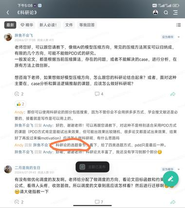

详情返回 科研论

来自：科研论进入星球

3喵 提问：

钟老师，您好，我想问一下比使用鲸吞法更前面更初始的问题，即如何从现实需求中提取研究方向（或者说如何学术化现实问题）？比如如何快速寻找到小说里面的某个情节（如怎样快速在《水浒传》中找到武松打虎所在的章节和页数）？如果学生只知道这样初始的想法，但完全不知道该如何转化为学术研究时，该如何操作？

展开全部

【如果学生只有某个初始想法，但完全不知道该如何转化为学术研究时，该如何操作？钓鱼法和鲸吞法的关系（694字）】 这个第三个问题就是我在科研论2-搜商教材中重点在阐述的。你看那8个检索案例，每一个都是本人对一些专有名词都完全没有任何概念的时候，怎么一步步通过我设计的动作找到研究思路和实验方案。 比如我当时根本就没听说过一些什么物理化学耦合反应和生态，动物性格的关系，那你看我是怎么一步步找到大量可供研究的idea的？ 然后你的第二个问题，同样是在这个《科研论2-搜商》中重点阐述的，你看每次我们进入一个陌生的领域都是跑上来先执行钓鱼法。你这个问题也是执行下钓鱼法，哪怕用百度简单搜搜，就能很快找到结果，再不行的话，用一些AI的东西，比如文心一言，kimi，cloude，gpt都能找到结果。 只是说这种钓鱼法找到的结果，他是必然可以给你找到结果，而且这个结果一定也可以自圆其说，逻辑上是跑得通的，但问题是可能以偏概全(包括AI给的结果)，因为逻辑上能跑通的解释可有无穷多种，但符合真相的只会有一种。 所以这个时候就还要再借助鲸吞法，防止以偏概全，但是如果不先执行钓鱼法，你根本就不知道自己要去鲸吞什么东西，因为你连基本名词都一无所知。 就比如你连水浒传是啥都不知道，或者武松是什么都不知道，以为是种吃的肉松还是个人都不知道的情况下（想象是个刚出生的新人），肯定是没有办法直接执行鲸吞法的。所以很多人的错误也在这里，他执行鲸吞法执行错了，就是因为他没有通过钓鱼法先获得一些基本的认知。 然后关于第一个问题，就下面这位同学也在问的，见截图，这个就是科研论中选题章节讲的内容，你可以去看一下。

展开全部

最后编辑：2025-10-30 11:08

等22人觉得很赞