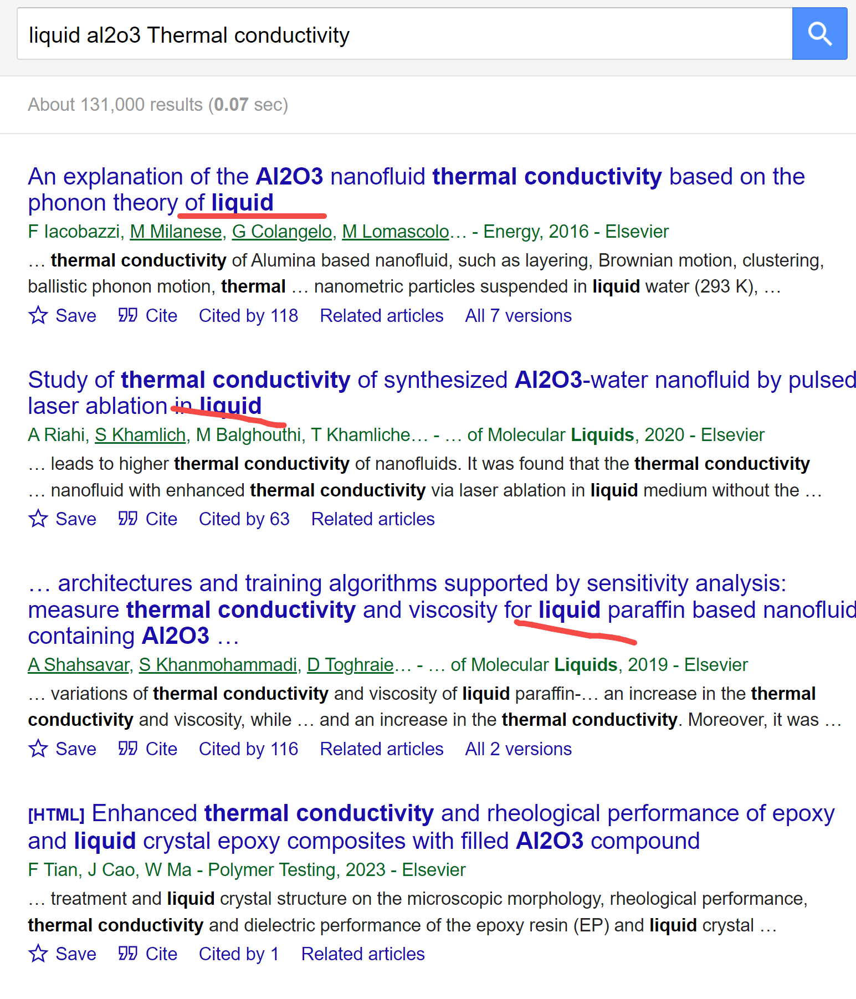
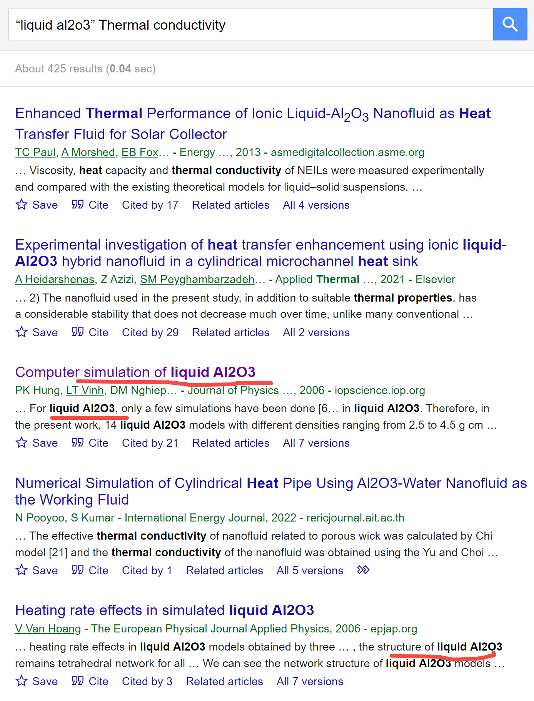
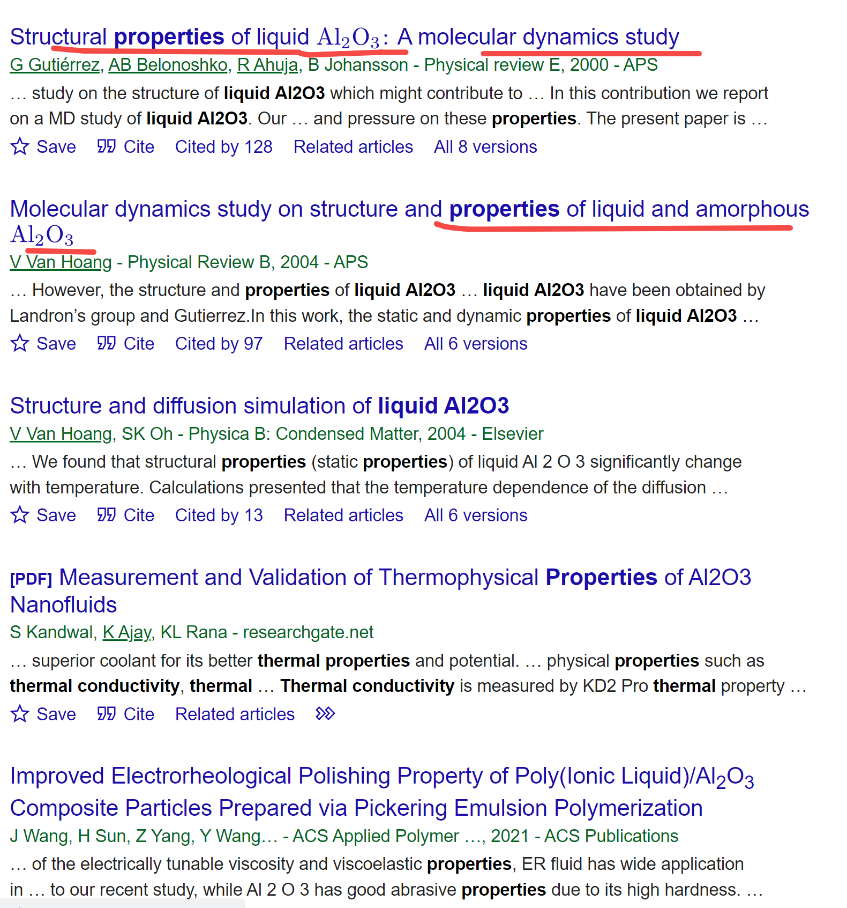

[来自： 科研论](https://wx.zsxq.com/group/15552141181242)

### 【626字答复-问题序号205】

请问老师怎么找材料的某些参数？

我主要做的是材料热力学模拟，当输入的热源较大时材料会发生相变，发生固-液，甚至还会发生蒸发。一般来说材料固态下的参数很容易找，但对于液态下的参数很不好找。具体来说，我主要做陶瓷材料，比如Al2O3，AlN，高熵陶瓷，需要的参数包括不同状态下的热导率，密度，比热容，以及熔沸点和相应的潜热。

谢谢老师。

### 【答复】

这种还是可以采用我在科研方法专栏中提到的 **“钓鱼法”** 的解决问题方法。你看完我下面讲解后，把“问题解决技能、科研方法”专栏中的其他案例也一个个都看下，应该还会提升你能力的，以后遇到类似问题也知道如何解决。

**“钓鱼法”就是在支持全文搜索的引擎中（相当于一片水域中），使用特定鱼饵（构筑特定检索词、检索式），来找到你想要的资料（钓到你想要钓到的鱼）。**

在“钓鱼法”解决问题过程中，我们根据钓鱼的情况，比如没有鱼上钩，或者上钩的鱼的种类不对，去不断重新调整我们检索式。比如这个学生提到“液态下的参数很不好找，比如Al2O3，”，那我们就直接搜索液态下的参数，比如我先搜了这个：

从检索结果看，是出现了liquid，但不是我们需要的液态Al2O3，所以我重新调整检索方式，将liquid Al2O3两边加上双引号：

这次就能发现几篇极其相关的文献了，人家专门模拟了液态下Al2O3的结构参数等。然后你结合这些文献，包括这些文献引用的，和引用他们的，就能搜索到更多你要的信息了。

其他几个材料也是一样的，你可以用这种方法测试下。如果最后某个材料真的彻底没有，比如Al2O3有，AlN没有，那么其实这里反而可以产生一篇论文了，比如是否有必要将Al2O3的研究方法移植到AlN上，从而获得AlN的材料参数，本质上两者的研究范式是一样的（当然，目前这个案例似乎不存在这种情况，看上去这些软件应该各种材料参数都会有）。

扫码加入星球

查看更多优质内容

https://wx.zsxq.com/mweb/views/joingroup/join\_group.html?group\_id=15552141181242