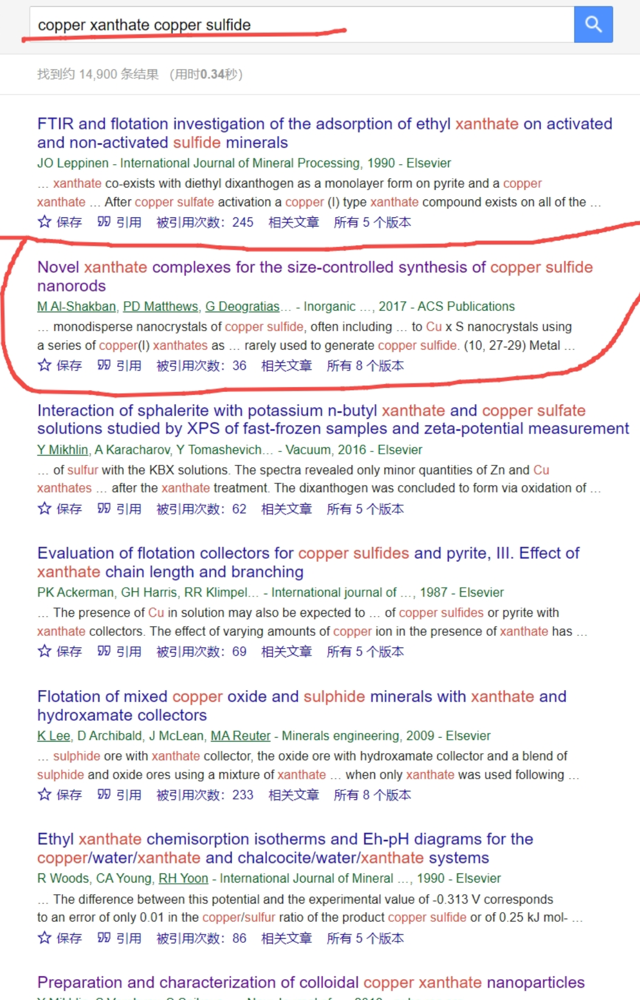
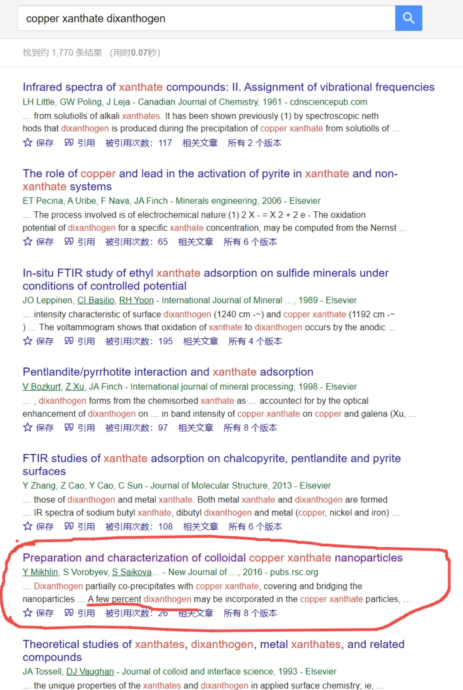
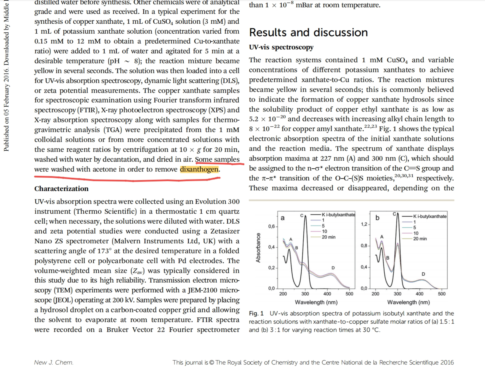
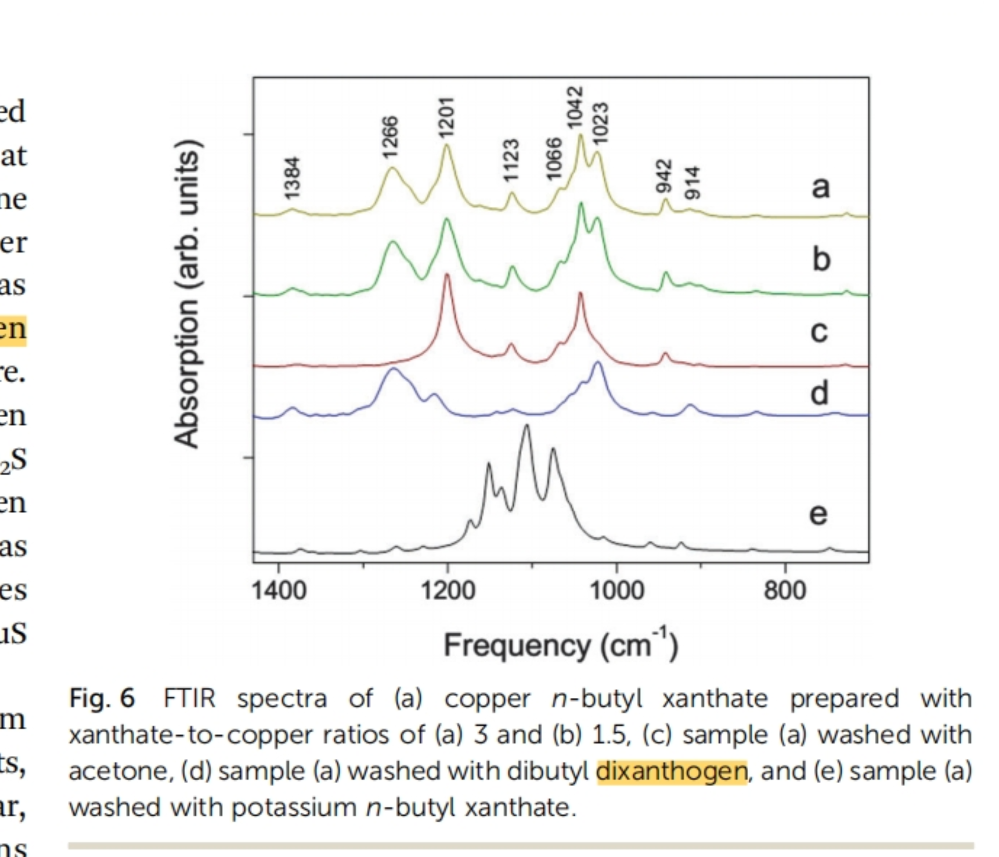
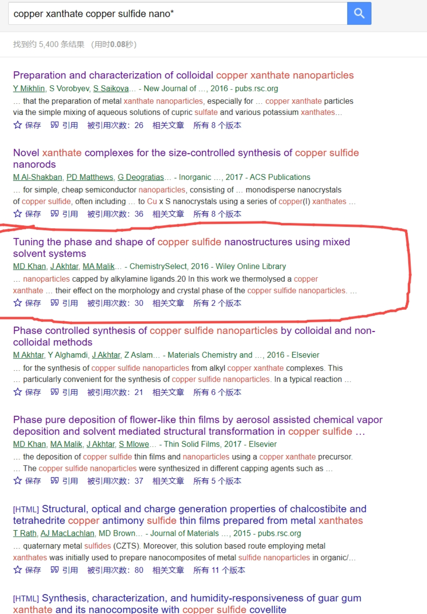
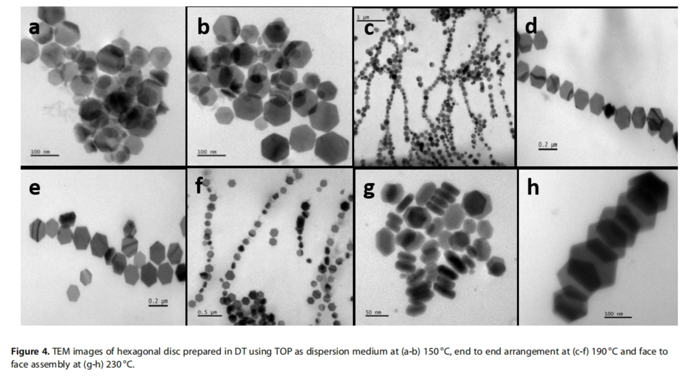
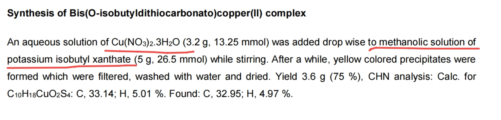
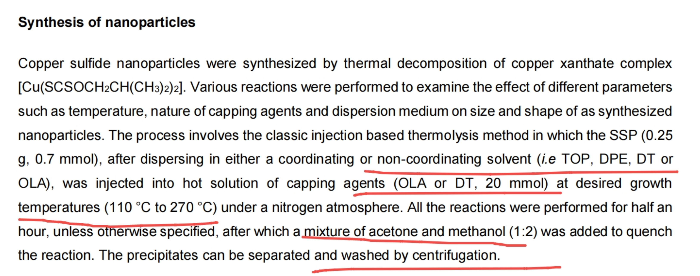

[来自： 科研论](https://wx.zsxq.com/group/15552141181242)

### 【1158字答复-问题序号32】

钟老师您好，我是从b站一直跟您到这里的学生。目前本人在查找材料制备这一块的文献。我主要是想制备出稳定的黄原酸铜或亚铜的胶体溶液。

首先我按照钟老师所教的不遗漏和鲸吞法去搜集了文献，在此过程中，我发现文献中写到的方法大部分都是直接将两种溶液混合反应生成黄原酸铜或亚铜沉淀，但在该反应式中，也会生成一种双黄药的不溶性物质，现在的问题是我没有找到如何将这两种物质分离，或者单独制备出黄原酸铜这种物质，包括胶体溶液也好，纳米颗粒也好。其次，在搜索文献过程中，我发现材料学领域中，金属黄原酸经常被用作制备纳米硫化物。因此，我想向钟老师请教一下，金属黄原酸的稳定胶体溶液或者纳米颗粒有没有一种传统的制备流程呢？亦或者是在材料领域中属于默认的方法，在文献中不会提及的方法？

钟老师指导说，如果确实理解了搜查的原理，那么具体的实验问题应该不会得不到解决。秉着授之以鱼不如授之以渔的思想，钟老师想借着我遇到的实验问题向我们讲解如何去搜查文献，解决具体实验中遇到的困难，那么其他领域的同学们也是可以学习和借鉴的。在此非常感谢钟老师及其团队给予的帮助和指导！！！

### 【答复】

学生问题的产生过程主要可以概括为：

1. 想要合成硫化铜
2. 黄原酸铜是常用的前驱体
3. 黄原酸和Cu2+反应容易出现双黄原酸，但是文献中没有提及如何分离双黄原酸与黄原酸铜
4. 怀疑是否有学术界的未披露的分离双黄原酸的常识

那么对于这个问题产生的过程，主要是在第2和第3步。

首先如果批量检索了，应该会注意到双黄原酸是黄原酸配体被氧化后生成的产物。在学生的问题中，应该特指Cu2+将黄原酸离子氧化的这个过程（如果是空气引起的，可以通过惰性气体保护解决）。

那么第2个问题显然是不准确的。因为文献中有大量是使用Cu+作为前驱体，也就不存在黄原酸离子被氧化从而形成双黄原酸的过程。这个问题也就不存在了。

（相关内容很容易检索出来：关键词copper xanthate copper sulfide）

那如果特指可能存在的“Cu2+将黄原酸离子氧化形成双黄原酸，随后双黄原酸难以分离，影响产物纯度”这一问题。可以从以下几个角度思考：

1. Cu2+对双黄原酸的氧化大多出现在什么场景？
2. 双黄原酸能否被选择性去除？
3. 双黄原酸的分解产物是什么？是否可溶？

由此继续检索：（关键词 copper xanthate dixanthogen ）

这篇论文提到了，如果在水溶液中使用Cu2+与黄原酸进行反应，的确会生成双黄原酸（回答问题1），同时双黄原酸能够被丙酮（！）大部分去除（部分回答问题2）：

然后继续思考，合成硫化物的论文中是怎么解决的？检索式：copper xanthate copper sulfide nano\*（为了避免铜矿浮选对检索结果的干扰，这里其实可以学生从自己的数据库中总结出更好的检索词）

首先看到，这篇论文的合成效果是很好的：

同时颗粒表面也没有被有机物包裹的感觉。继续看他的实验条件：

1. 他是在醇水混合液中进行的反应，和纯水溶液中Cu2+与黄原酸的反应不完全相同。是否这样可以避免Cu2+对于黄原酸的氧化？

2\. 有机溶剂热注射法。是否双黄原酸能够溶解在这些有机溶剂里面？此外，温度在110~270度之间反应。这个温度是否已经超过了双黄原酸的分解温度？是否直接分解成为 [乙醇](https://baike.baidu.com/item/%E4%B9%99%E9%86%87/135334?fromModule=lemma_inlink) 和 [二硫化碳](https://baike.baidu.com/item/%E4%BA%8C%E7%A1%AB%E5%8C%96%E7%A2%B3/6032457?fromModule=lemma_inlink) ，从而不影响CuxS的纯度？

后面还可以根据上面这些问题再继续检索下去，但建议开始开始尝试进行实验了。因为实验过程本身是有可能解决双黄原酸带来的这些问题的。可以试验后再根据实验情况检索。一边实践，一边解决问题，比单纯去查资料效果更好。

小结：从以上可以看出，学生的提问其实是不太准确的，由于不准确的提问导致了这个问题解决上的困难了。要更多通过第一性原理思考，去不断追问源头上的问题，这样就会发现原先认为的问题可能不对，其实是另外个问题，然后反而通过问问题的过程中，已经找到去实验/实践的思路了。

扫码加入星球

查看更多优质内容

https://wx.zsxq.com/mweb/views/joingroup/join\_group.html?group\_id=15552141181242