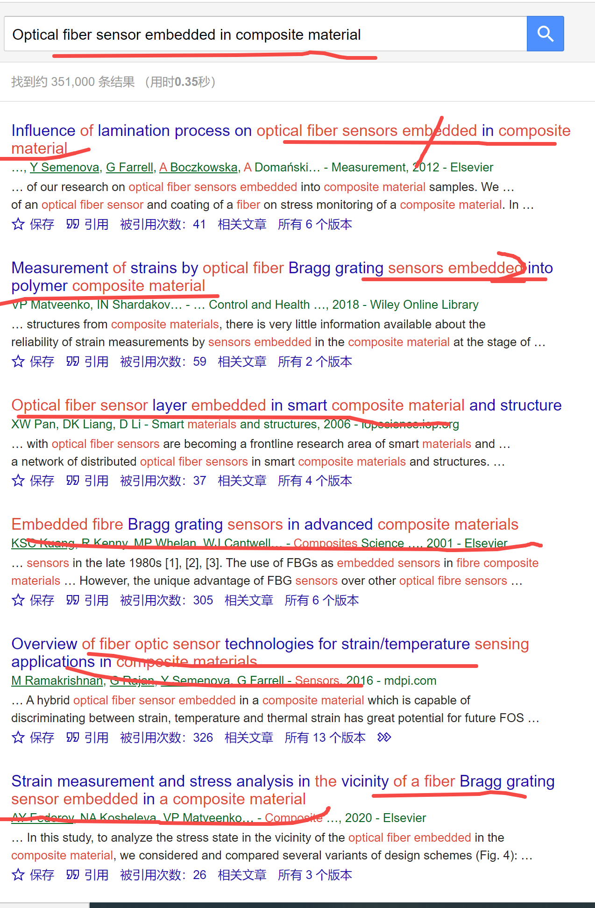

[来自： 科研论](https://wx.zsxq.com/group/15552141181242)

### 【1362字答复爱sun的德古拉😜🤣\* 的提问-序号176】

钟老师，您好，我是上海某211材料硕士，我本科学的是金属材料，硕士导师让我去做碳纤维复合材料，还跟我说要我做智能复合材料（其实也就是将光纤传感器埋进复合材料里面），但是我们组没有这个设备，也没有这个技术储备，他让我去做，但是设备什么的也没有买，让我自己先去调研。我现在已经研二了，我不知道我还能不能做出来这个东西，我感到很迷茫，不知道该怎么办才好。

### 【答复】

关于没设备、没硬件的问题，这个里面有答复：

[https://articles.zsxq.com/id\_3qhbu6mw0svb.html](https://articles.zsxq.com/id_3qhbu6mw0svb.html)

接着，其他的问题，就是给你个笼统的方向，让你自己去调研，这个属于选题，你要找到自己的一个选题，然后经过【验】步骤（如果有的话），就可以进入【合】步骤的投稿了。

这个也讲了好多了，包括昨天也提到了这个案例，也是完整看完：

[https://articles.zsxq.com/id\_70xvfhd79mk7.html](https://articles.zsxq.com/id_70xvfhd79mk7.html)

还有星球中更多的关于开题选题的案例，也要一篇篇，都完整看完。

看的过程，也就是说训练你大脑神经网络的过程，看完后一般自己的开题思路也就知道了，如果那个时候还不知道，可以再来提问：

选题的话，就用【搜】【聚】【分】三步骤循环操作，也就明白了。

比如先随便用【搜】步骤中的钓鱼法测试下：

注意，如果是新人对这个领域一无所知的，可以用非常直译的方式去搜索，就接近自然语言对话的形式。你可以看到我的搜索方式，就是非常直译的那种，然后发现获得的结果都是极其相关的，而且列出来的一屏都是100%的相关度。

那接下来就好办了，就说明你这个idea是有大量文献可以参考，可以帮助你找到开题的，你从中找一个对设备需求度最少，毕业速度最快的，然后又有一定的意义的方向就行了。

具体操作上，设置检索词，用【搜】步骤中的鲸吞法，然后导入文献库（【聚】），对文献进行分组操作就好了，记得带着目的分组，专栏中都有多个案例提到，我书本和视频中也有演示。

这样操作完之后，就能找到自己的选题了。怎么做实验，实验遇到问题如何有章法的去解决，也都专栏中提到过。

从上面钓鱼法当中，我们都能发现有一些能做的点。比如这个光纤埋进复合材料后，他可以去分析应力或者分析温度或者分析些什么东西。

随后从我最近《科研论》中所讲的要素法操作来看，你这个课题可以分解为：

A（材料体系）+B（结构）+C（应用）

A就是选个什么材料，比如什么光纤埋到什么复合材料中。而且复合材料的种类也好多，一定可以找到那些又能启发你的体系，然后你又和他们有所不同。

B就是做成什么样子。

C就是用到什么用途。

只要A+B+C组合起来，和别人有差异，你就能发文章了，你比如可以从一批文章中（也就是文献库的分组A）中，吸取一些关于材料体系的认知，另一批文献（文献库的分组B）中，了解关于做成什么样子的认知，比如会有哪些不同的结构。

比如上面检索结果中的第3篇还提到了结构（structure），那就说明可能不同的结构设计也会有一些不一样，比如三维多孔的或者一维的或者怎么样。

然后你说没设备，那就找个对测试设备要求低的应用场景（C要素），同时材料体系（A要素）和结构（B要素）也选那些对设备要求低的。

你这个其实是那些不被老师放羊的很多人超级羡慕的课题，文章肯定能发，idea无穷尽，时间也可以自己控制。

没技术储备更无所谓了，什么叫研究生呢？本来就是要研究。研究嘛，前面从来没人做过都是很正常的。否则就是做题家了，现成的题目，现成的答案，把它复制出来。

如果不理解以上术语或者检索式方面遇到问题，那仔细看新人必读中的帖子，包括五字决和那个汇总了检索问题的合集文章。

扫码加入星球

查看更多优质内容

https://wx.zsxq.com/mweb/views/joingroup/join\_group.html?group\_id=15552141181242