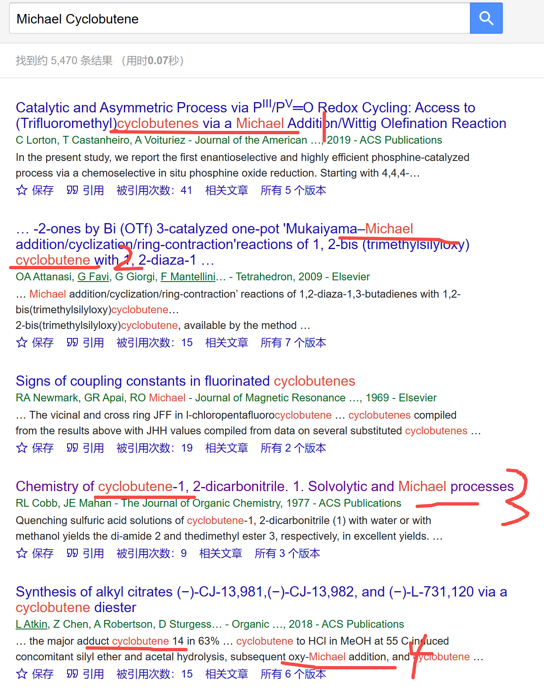
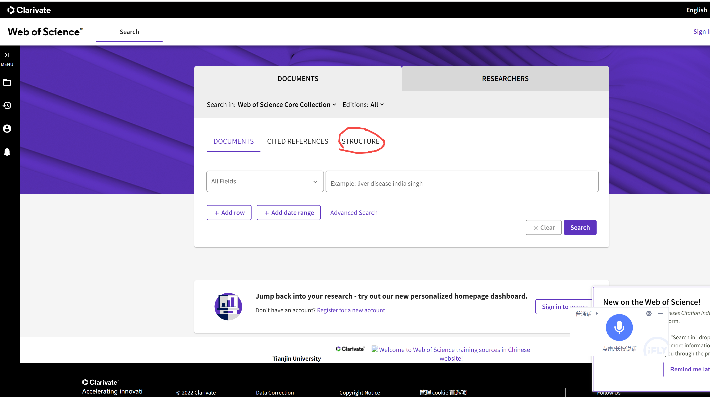
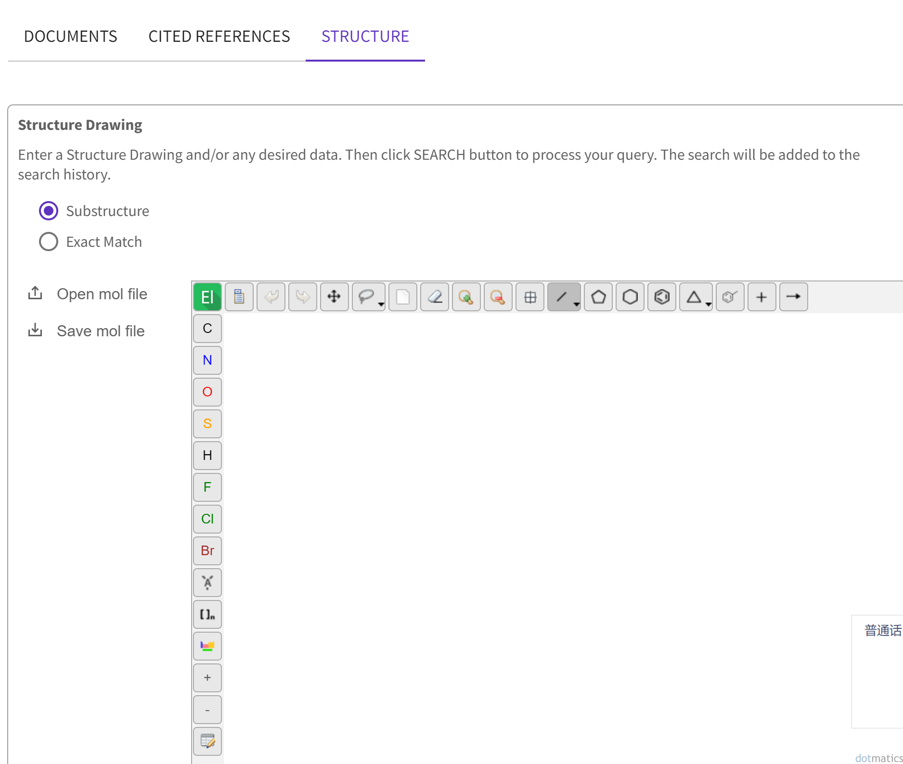

[来自： 科研论](https://wx.zsxq.com/group/15552141181242)

### 【1655字答复石墨烯 提问-序号155】

钟老师您好，我是学习有机化学的。目前在做一些很小众的反应底物，环丁烯和环丙烯相关的Michael加成等等的反应。现在在检索时就发现，如果带上环丁烯这些，检索出来的结果相对少，而且不一定有参考价值。可能是其他类型的毫不相关的反应，加上michael加成之后结果过多又很难筛选。在写introduction的时候就会比较头疼。因为感觉论文的核心卖点在于这种底物的特殊性。请问老师该如何设定关键词检索文献并分类，以写出一个很好的introduction。谢谢老师！

### 【答复】

“如果带上环丁烯这些，检索出来的结果相对少，而且不一定有参考价值。可能是其他类型的毫不相关的反应，加上michael加成之后结果过多又很难筛选。”====还是一样，针对这种情况，先上 **【钓鱼法】** ：

在接近直译的情况下，我们还是能找到一些相关结果的，有的直接从标题上就能看到相关性，比如1~3。

有的从全文中，会发现有一定的相关性。

而且我们还没有进一步延伸搜索，有的他可能不一定会直接在标题中体现环丁类的表达，它可能直接是一个化学式，但也许也是环丁类的东西。这种的话你肯定更有经验了，因为我不知道你具体做的是个什么物质，你可以把这个物质的结构式再放进去用钓鱼法搜索。

Web of science也有一个功能，就可以直接根据结构式进行搜索。 Web of science刚登录进去的界面是这个样子的：

注意最右边有一个structure，点开后：

在这个页面中你就可以自己画或者提供结构式，以此搜索，然后再加上Michael加成。

有了以上结果后，就不会有你说的如下问题了：“在写introduction的时候就会比较头疼”。这里面还要用到我经常提到的 **【领域迁移能力】** ，或者也可以简单理解为他山之石可以攻玉，虽然道理大家都知道，但经常是不知道怎么操作，所以我也给出了一个具体的操作公式或者说操作步骤。这个在其他帖子中也有多次说明。包括我在其他帖子当中提到的收集拼图碎片的思想，或者游戏道具中经常见到的，用碎片合成装备或者升级装备，也是类似的思维方式：

你想参考A去参考你前言的写作。你显然不可能找到一个和A匹配度100%的文献，那一旦找到的话，就说明你这个方向已经有人写了，而且写的是和你一样的，你还得换一个方向。所以你会找一些和A有一定相似度的，我们称之为A\*的方向。比如这个案例中，除了环丁烯，还可以比如搜其他环丁类的物质，如环丁烷（我只是打比方，不要咬文嚼字），比如我上面钓鱼法的搜索就涵盖了其他环丁类物质。

另外有时候写作过程中，即使找到了和A有一定相似度的A\*，也可能存在找不到我们写作前言所用素材的问题；或者就是找不到A\*。那么我们就需要把A拆解为比如B+C+D。然后去寻找B、C、D，或者B\*、C\*、D\*。

比如有一个学生，他做出来了一个贵金属催化剂，长得有点像珊瑚。然后他想描述这种类似珊瑚形貌的优点。然后他直接搜催化剂方面，确实能找到一些也是珊瑚状的催化剂或者材料（相当于找A\*）。但是其中找不到太适合的描述珊瑚形貌优点的文字素材。而且看了科研论之后，你就会明白，我们要找的文字素材还不能只是来自于一篇文献。

那么我就通过第一性原理的思考方式去问他了，自然界的珊瑚为什么会长成这样的形貌而不是其他形貌呢？它长成这样的形貌肯定是有原因的，对不对？那是不是研究自然界珊瑚的一些文献就会提到这种形貌的优点（可以先用钓鱼法搜下，因为我们只要有个3，5篇相关的也就够了：搜索关于讨论珊瑚为什么会长成这种形貌的文献）。

所以他如果写作前言时发现一部分写作素材缺失的话，那完全就不要局限在只是搜索珊瑚形貌的催化剂，而是可以直接去搜自然界真正的珊瑚，看人家是怎么描述珊瑚长成这种样子的优点的，比如随便脑补下，这种一维+三维的组合是不是和一些微生物的接触面积更大，更容易提高捕食率什么的，或者这样的传质动力学更好之类的。

以上工作就相当于将本来前言写作所需的A（珊瑚状Pt催化剂）拆解为B（珊瑚的优势）+C（Pt催化剂的选择原因）了。C是很容易找到的。那一旦和B组合起来，你前言写作所需的文字素材就完整了。

当然你可能写前用的过程中不一定会遇到这样的问题，但我也提前预告一下，说不定其他学生会问遇到类似的问题，如果遇到的话就把它分解，然后去其他领域搜。

至于你说“核心卖点在于这种底物的特殊性”====那别人的有机化学合成工作必然也要用到底物的，而且他们也必然会说自己底物是怎么个特殊，怎么个具有创新性，怎么个难找，找到了才能够让反应好。这种表述也是可以拿来参考到你的领域的。

扫码加入星球

查看更多优质内容

https://wx.zsxq.com/mweb/views/joingroup/join\_group.html?group\_id=15552141181242