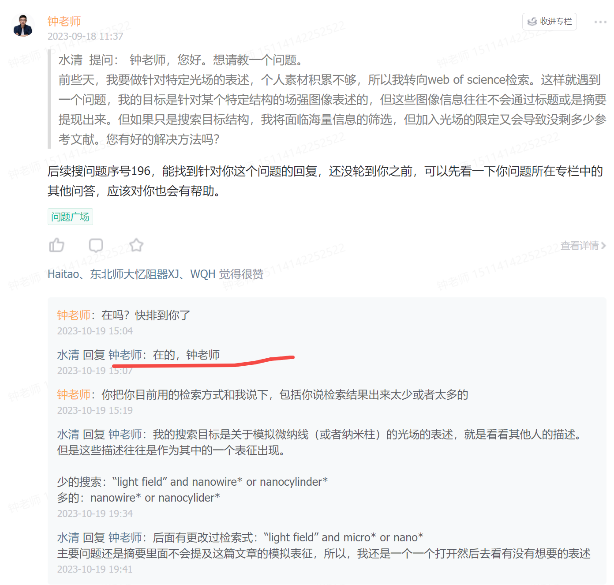
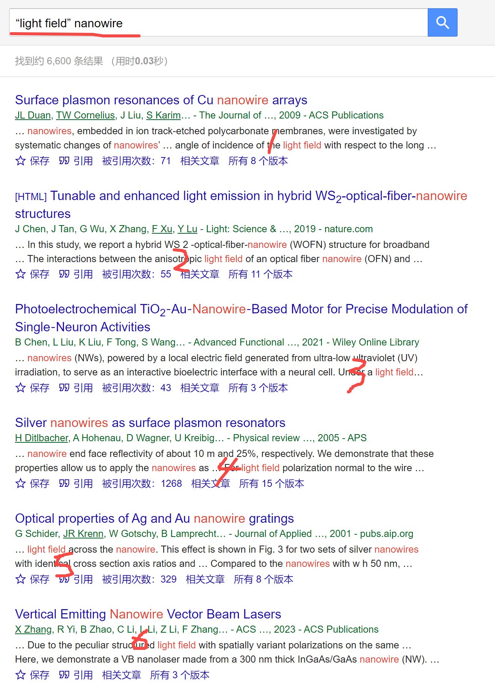
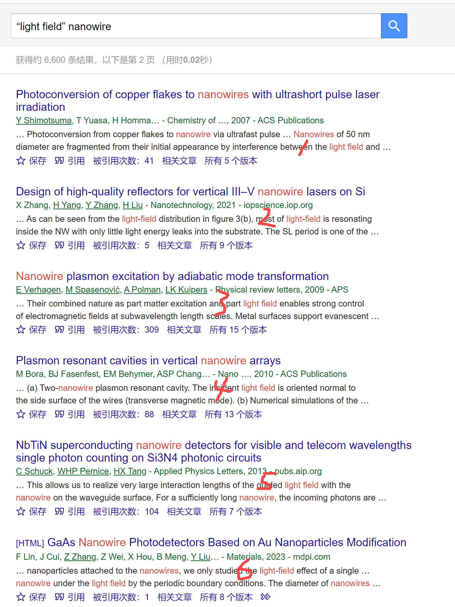
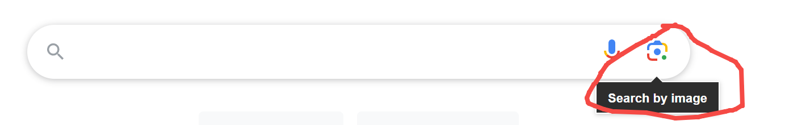
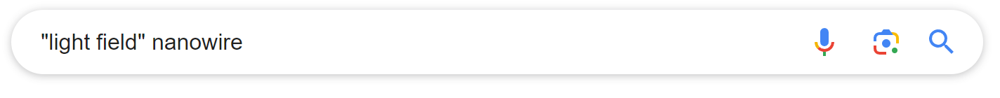
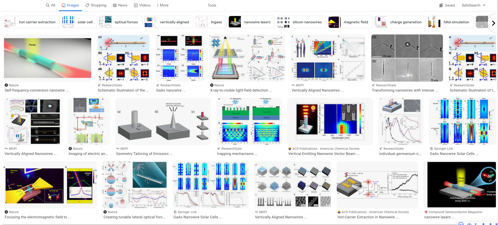
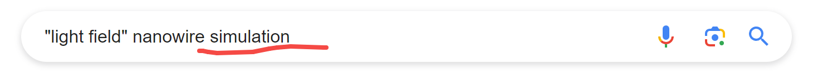
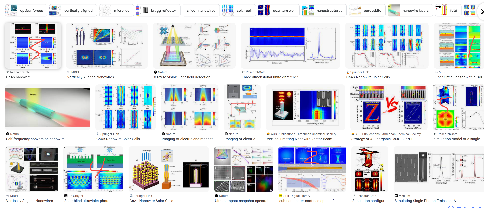

[来自： 科研论](https://wx.zsxq.com/group/15552141181242)

### 【1483字答复水清-问题序号188】

钟老师，您好。想请教一个问题。

前些天，我要做针对特定光场的表述，个人素材积累不够，所以我转向web of science检索。这样就遇到一个问题，我的目标是针对某个特定结构的场强图像表述的，但这些图像信息往往不会通过标题或是摘要提现出来。但如果只是搜索目标结构，我将面临海量信息的筛选，但加入光场的限定又会导致没剩多少参考文献。您有好的解决方法吗？

这位叫号有响应，而之前几位都没响应，因此先答复这个问题了：

### 【答复】

一种情况，在wos或scopus中用A and B的方式搜索。

A为"light field" or "optical field"，限定在主题（意思就是title、abstract、keywords都会去搜索）

B为你这里列出的micro\* or nano\*，同样限定在主题。

以上方法你说你已经用过了，那我就重点讲下面这个方法，也就是钓鱼法，可以支持全文搜索：

比如1~6中的每一个，都带有light field，且带有nanowire，而且5号部位，你可以看到边上就提到了Fig. 3，说明图3应该就会提到这个光场了。

这种搜索方式的好处是可以搜索正文light field的地方，而且light field前后的表述也可以看到，可以帮助你判断这个结果是否相关。

而且继续往下看：

以上新的一组1~6，还是同时涵盖了你要的nanowire和light field，而且3号部位你还看到了图3b，说明图3b是给出了纳米线的光场图。

此时，我才翻了2页，所以可以预期，这2组关键词同时结合的文献不会少，可以解决你的问题，即：“但加入光场的限定又会导致没剩多少参考文献”。

而且我只使用了nanowire这个词，另外一个纳米结构，我还没用，包括light field我不知道会不会有人用optical field这个同义表达，你可以都去组合搜索下，这样一来，你的结果还会进一步丰富。

关于以上操作，只能耐心一页页翻进去，看到ok的，可以先点保存，这样先存在你账号中，全部看完后，可以再导入到endnote中。

我有时候会连续翻十几页，甚至50到100页，直到发现没有相关的了，才会结束，我感觉这个工作量还可以的，毕竟做一次就一劳永逸了。

而且他本身也是按照结果相关性来排序的，所以越翻到后面，应该也会发现相关的结果少，那看到连续几个页面都没相关的，就可以stop了。

另外，有些咬文嚼字的同学，向我反映我用“他”不严谨，还给我提供了关于“他她它”区分的链接，我当然是明白这点的。但是从我个人习惯而言，以前帖子也写过，我不太忍心用没生命的它来做这种表述，毕竟他帮助我们好多，而且他的使用也充满人性化，很多人都以为自己会搜索，但其实并不会，所以类似场合，我喜欢用他或者ta。

如果对我所讨论的未来生命话题感兴趣的话，可以b站搜未来生命，钟澄。

继续回到这个问题，还有你可以用钓鱼法中的图片搜索，比如你确认某个光场+纳米线的图片，和你要的效果很接近，那么你可以截屏保存这个图片，然后点击下面这个部位：

再把你刚保存的图片上传即可，随后会出现大量图片，你可以直接一目了然的去看这些图片，看哪些图片是你要的效果，然后再把文献保存下来即可。

当然，也可以直接在这个栏目中搜"light field" nanowire，然后以图片形式浏览检索结果：

你还可以按照你的诉求，加上其他东西，比如加上simulation（模拟）或者什么的：

比如以上的1~5，都是和模拟相关的结果。

当然，之前钓鱼法的文字搜索版本，你也可以其中继续追加你要的关键词，或者调整。

最后，做这种操作也不要有穷尽的想法，只要素材库足够你启动下一步工作也就可以了。

然后唯一担心的就是说，你要做的这个idea，你要做的体系，是不是别人已经报道过了，那这个很简单，如果出现这样的工作，那么钓鱼法肯定是能搜出来的，所以就在你要做之前，钓鱼法搜一下，确保你这个idea没有被人一模一样的报道过就行了。

扫码加入星球

查看更多优质内容

https://wx.zsxq.com/mweb/views/joingroup/join\_group.html?group\_id=15552141181242