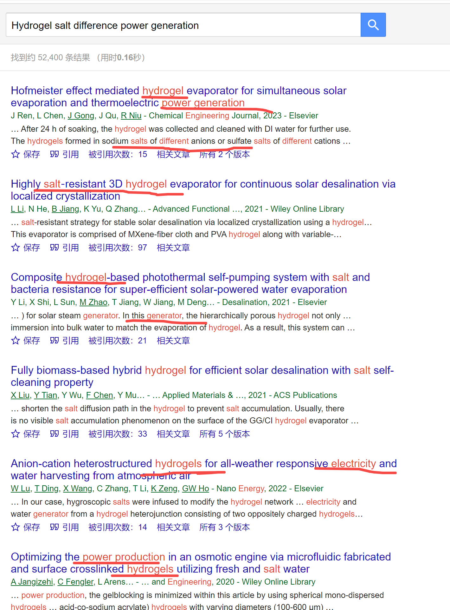

[来自： 科研论](https://wx.zsxq.com/group/15552141181242)

### 【3778字答复风的提问-序号166】

钟老师您好，最近在检索水凝胶相关的文献，在Scopus上检索后大约有五万多篇文献【标题 hydrogel\*；文献类型article和review；语言 English】，但是Scopus一次只能导出前两万篇，后续的就算分批也不能导出了，我打算用Web of Science，但是在Web of Science上检索不出来最近一月发表的文章，而用X—MOL的话，虽然能查出最近的文献，但是只能显示前300结果，请问如何能全面的导出检索结果呢。（我目前做的课题是用水凝胶做盐差发电，这两者结合的文献非常少，所以想把水凝胶的关键词设置的少一点）

### 【答复】

直接先给解决方案，你可能会对我为什么这样操作有疑问，比如觉得你也考虑过这样做，这样操作是不对的等等，但你的考虑我也全部都考虑过了，关于更多的背景交代和原因阐述，在之前的检索案例中已经讲过很多次了，如果有疑问，一定每个看下，看完你应该疑问就能消除许多。

如果直接能理解我的操作，没有疑问的话，那么也可以不看过往案例。

**还是A and B形式的检索式。**

**也就是我常说的，我归纳出来的万能检索式。**

既然是做“水凝胶做盐差发电”（即水凝胶+盐差发电），那检索式中必须要包含盐差发电内容，这才是重点，即A必须包含盐差发电的相关同意表述，如果觉得一个A讲不清楚的话，那么可以将A拆开为A1 and A2，总之体现盐差发电。

而目前的提问中，反而看不到关于盐差发电的检索，只是在检索水凝胶，这是有严重bug的。

即 **第1步** 只检索和“盐差发电”相关的内容，此时先测试下，结果是否相关，如果结果大比例是和盐差发电相关的话，那么开始追加B的内容，即检索式中的“and B”。B对应你的课题就是水凝胶。

而第一步的检索测试下来，如果发现检索结果大比例和盐差发电无关，那么就从检索结果中分析原因，调整检索词即可。

如果第一步都发现出现问题的话，那再来问我，但应该不至于，盐差发电的结果相当之多，只要随便能找到几篇关于盐差发电的论文，就知道关键词是什么了。

还有重要的一点，如果平时随意浏览的时候，比如公众号报道或者别人推送或者从相关文献引用中的文献中，发现一些研究也是和盐差发电相关的，但没有被你检索进去，那么你就进一步优化，扩展检索词，将这些文献也囊括进来。

**第2步** ，第1步通过后，我们就会有大量关于盐差发电的文献了，其实这里可以有两个分支方法去处理：

分支1：如果结果小于5000的话，那么也不要去追加水凝胶的关键字了（即不要and B这步了），直接将它们全部导入endnote中。

通过二次搜索就可以非常轻松的找到和水凝胶相关的体系。

而且你还能找到别的体系，比如有的人也是做的盐差发电，但他用的一个水溶液体系A，你觉得非常不错，另外一个人用的水溶液体系B，你觉得也很不错。那么结合起来，就会启发你找到自己的idea，然后将这个溶液做成水凝胶，你就找到自己的论文了。

毕竟任何溶液（包括有机体系、包括离子液体等）都是可以转化为凝胶体系的，这样你能找到无穷无尽的idea，而且质量也都不会太差。

比如endnote一次分组的时候，也许你还会发现有机体系，离子液体等（我举例假设的，此时也许没有，但很可能未来就有了，很多我当时给学生说的一些想法，当时确实没有，但几年后、快的几个月后就有了），都可以启发你是不是可以借鉴到你要做的凝胶体系中。

当然，如果你选idea的时候能结合我说的真实世界需需求驱动就更好了，什么叫真实世界需求驱动去看选题专栏中的文章就知道了。但这点也不用苛求，确实有不少工作是文献驱动的。这些工作我们就权当是锻炼了一下学生的一些基本操作吧。虽然我严禁学生做文献驱动类型的工作，但我不能要求大家都这样做，毕竟有些学生也有来自各方面的压力等。总之，我们不要二极管思维，对于世界中的万象都要理解。

另外，注意我上面这个词，我用的是“选idea”，而不是找idea，因为一旦按照我的【搜聚分】方式操作下来（看新人必读），无穷无尽的idea就自动会给你冒出来，你只要从中选一下就行了，你都不需要绞尽脑汁的去想。

就类似星球中的《科研论》专栏中详细介绍的写作也是的，也不需要你绞尽脑汁的对着一片空白的文档去想这句话怎么写，而是有大量的文字素材呈现在你面前，你只要按照一定的章法去做选择题就行了，选择题做完后，句子就自动出来了。

分支2：明白以上分支1的讨论之后你就知道了，如果结果大于5000的话，那么我们这里加上个B（水凝胶），它结果就能大幅减少了。这个时候才会并列水凝胶的同义表达。

你说水凝胶+盐差发电组合起来结果就会少，我认为结果不会少，结果一定会不少。我们用【钓鱼法】来看一下就行了，如果钓鱼法都能搜出大于5篇的话，那么这结果已经不算少了：

才半屏，就大比例相关的结果了，而且后面还有很多相关的结果。看到这些结果，其实也可以极大打开你的开题思路的，这里就不再展开了，在星球的选题专栏中已经多次演示过了。

而且我上面用的词还是不专业的，是用一种最粗糙的直译的方法，实际搜索会更加优化，所以得到的结果会更好。我想表达的就是用这么粗糙的直译的方法都能找到相关的文献，那优化完之后相关的文献只会更多。

**另外，我们要正确认知结果多和少，我发现有一些学生会说检索结果很少，但其实已经不少，反而还太多了。**

因为如果和你课题体系高度相似（>90%）的文章，结果如果太多的话，哪怕只有1条，就说明你这个选题已经被人做过了，你还得更换选题，所以结果少甚至搜不到其实是正常的。

比如我当时给学生布置的课题是锌空气电池和可见光结合起来，利用可见光降低锌空气电池的充电电压，学生说搜索不到，那搜索不到才是正常的，搜索的到，那就坏事了。

他只要采用我说的【搜集拼图碎片】的操作，去搜可见光响应的OER催化剂，然后直接把这个东西拿到锌空气电池里来试一下就行了。

他显然不能直接搜锌空气电池+光响应，当时的话，那样就会搜不到文献。

而如果相似度比如>70%的话，其实有个三五篇，就已经足够了，那如果你觉得三五篇不够你参考，那你就要调整水凝胶，不要限制在水凝胶，就像我刚在分支1中演示的，为什么一定要限制在水凝胶呢？其他非水凝胶体系中能盐差发电的文献不照样是给你可以参考的么？

如果你不知道某个体系怎么做成水凝胶，那就专门去搜这个体系的水凝胶就好了，看是怎么做出来的，注意此时的搜索不要叠加盐差发电，而是类似水凝胶+A的方式，A就是限定水凝胶的体系。

而且一定要用凝胶吗？固体就不行么？比如某些固体电解质之类的（当然这个也是我随便假设的，我也没深入调研过），然后这样思考，会逐步得到非常大脑大开的idea，我给学生构思的当时发nature子刊系列的论文都是这么来的。

**以上2个分支，我倾向尽量选择分支1。甚至可以放宽到就比如2万，** 即假如盐差发电的检索结果小于2万的话，就全部一次性导入到endnote中，进行二次搜索，从中找出各种体系，包括水凝胶体系。

这样一来，你endnote分组中，会有大量不同体系用于盐差发电的分组，你光看看这些分组，就知道你的小论文可以做什么了。

但如果像你提问中的那样，只是去搜水凝胶，那水凝胶几乎能做各种各样的事情，说白了溶液干的事情，他都能干，本质不就是个溶液+聚合物么？光水凝胶做电池的而不是发电的就会有上万篇。而且生物/医学材料中的应用又起码有个上万篇。

针对你这个选题的思路，你先要知道盐差发电可能有哪些体系能做出来，包括那些我此前提到的脑洞大开的体系，然后再去看这些体系当中，哪一个是没被人报道做成水凝胶的，那么你再去把它做成水凝胶，这个时候再去单独的针对性的找这个水凝胶怎么做出来就行了，而不是说把十几万篇的水凝胶（虽然问题中说的是5万，但我认为远不止5万）文献都囊括进来。

就算我们要用我常说的他山之石可以攻玉的方法扩展边界去找idea，那也可以先在你的研究领域附近扩展边界，扩展后发现找不到idea，那么就继续扩展圈子，而不要一下子扩大太大。除非这个时候我们处理信息的吞吐能力跟上了，比如我有些博士生，已经可以处理5~10万篇量级的文献库了。

对于大部分博士生而言，我建议总体数量不要超过2万（即导入endnote的文献数量不要超过2万），然后endote中进行一次搜索后，相关可参考分组中的累计文献别超过5000篇。就假设你真的导入了2万篇文献，那么你最后实质参与分组的文献也不要超过5000篇，比如剩余的1.5万+的文献是不参与分组的。

有人会问，既然不参与分组，干嘛要导入进来，他导入进来的目的就是给我们在endnote中进行搜索用的。

因为我们随时有可能发现水凝胶的其他表述，比如他不一定要叫hydrogel，它可以直接说pva，paa，pmma之类的。那我们如果不把这些文献先导入进来，以后每次在scopus上检索太麻烦了。

所以我们就可以全部导入进来，然后发现，噢，原来paa也属于水凝胶，那么我们就可以在这个2万篇中，当然也包括那个1.5+的文献中直接搜paa。

要知道，就算你只是达到这个程度，也已经超过大部分学生甚至老师的文献吞吐量了。

**最后关于真的要导出2万篇的工作，这也是可以操作的** ，就用scopus，肯定不能用web of science，因为web of science，如果我没记错的话，它最多只有几千篇，而scopus可以一次2万。

假设你有5万+的结果，那么你搜索时候，再叠加个日期就行了。比如你限定在某些年份搜索，然后这样就可以让搜索记录小于2万，那么用3个检索式分别覆盖3个不同的年份断，而且这3个年份断加起来又是覆盖所有年份就好了。

那之后将这3次检索结果，分3次导入，就可以实现5万+的导入了。

比如第一次只检索2017~2023年，然后导入；

第二次，从2012~2016，然后导入；

第三次，从最早年份到2011，然后导入，就好了。

扫码加入星球

查看更多优质内容

https://wx.zsxq.com/mweb/views/joingroup/join\_group.html?group\_id=15552141181242