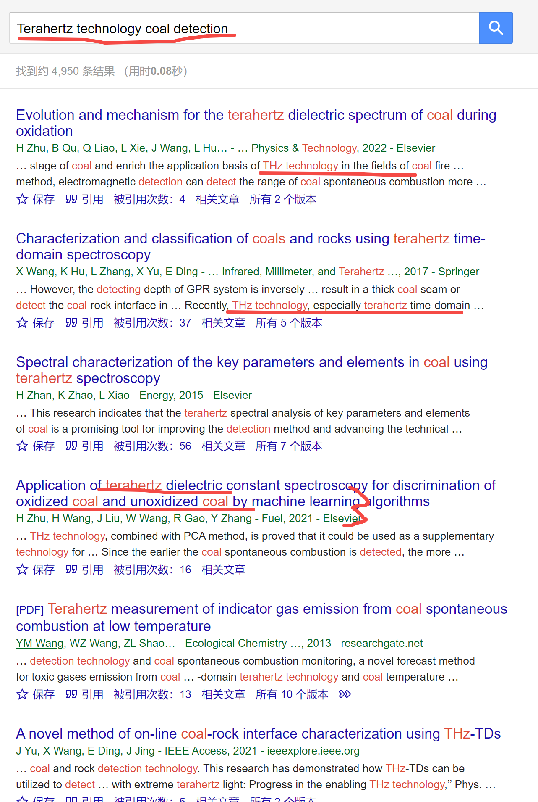
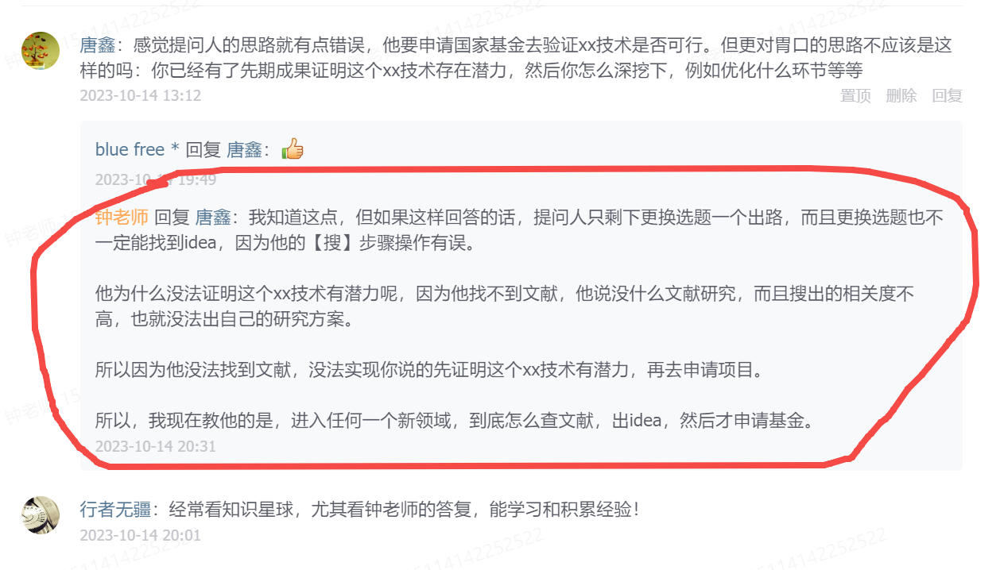

[来自： 科研论](https://wx.zsxq.com/group/15552141181242)

### 【500字答复 问题序号254】

钟老师，我是一个入职一年的青椒，去年申请国自然-青基被否了，我做的课题是利用太赫兹技术进行煤炭检测，但是传统的光谱学技术（如傅里叶红外光谱、核磁共振谱、激光诱导穿透）已经被应用在煤炭检测中了。我想寻找太赫兹技术的独特性，现在只有在煤炭的水分检测中有其独特优势，相关的文献只有十几篇，而且相关度也不是很高。

另外，太赫兹光谱在煤炭质量检测方面我难以提取科学问题，我现在不知道是该换一个方向申报国自然，还是该继续深入研究？

### 【答复】

先插一句，看到这种序号一下子突然大的，就说明是插队进来的问题，所以它的序号是不连续的。

“想寻找太赫兹技术的独特性，现在只有在煤炭的水分检测中有其独特优势，相关的文献只有十几篇，而且相关度也不是很高。”

\=====

首先这句话，我自己测试下来，发现并不是这样。这种操作我们已经很熟悉了，用钓鱼法迅速测试下：

可以看到有大量相关的关于太赫兹技术在煤炭领域当中的应用，比如还有的人提到机器学习，而且看上去也并不是只局限在检测水这一块：

比如有文献多次提到可以区分不同氧化态、表征不同氧化阶段的煤炭、煤炭分选、在线界面表征、还有包括用太赫兹技术表征煤炭的关键参数等等。

而且以上关于太赫兹技术在煤炭领域中的应用，我只是看了4篇文章，就能得到了挺丰富的信息。后面还有更多的几十乃至上百篇我都还没翻，所以这就意味着我们是可以通过后续鲸吞法来操作的。

另外至于你说的，如果你找不到科学问题，能不能换方向，这当然是可以的，自然基金本来就是要有科学问题才能申请的。

但到底是他真的没有科学问题，还是只是搜索技能不过关，导致没有办法提炼出及科学问题，这个是要分清楚的。

看了留言后的补充回答：

扫码加入星球

查看更多优质内容

https://wx.zsxq.com/mweb/views/joingroup/join\_group.html?group\_id=15552141181242