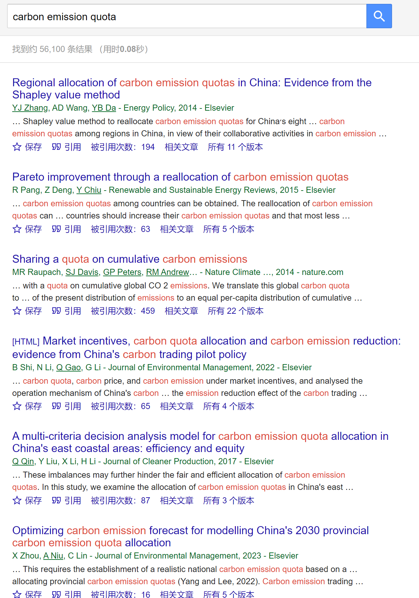
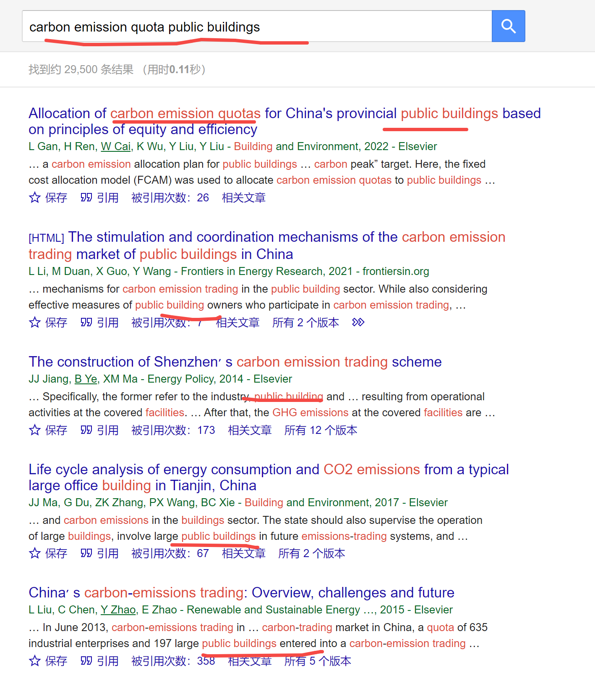
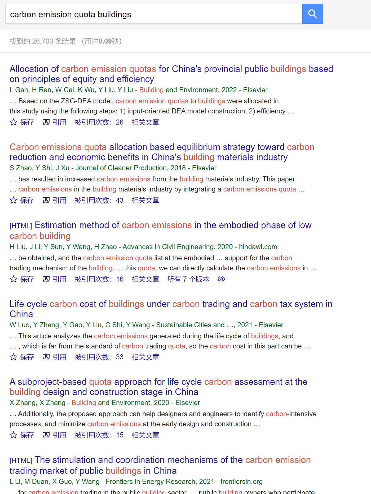

[来自： 科研论](https://wx.zsxq.com/group/15552141181242)

### 【3697字答复提问-序号162】

钟老师，您好。我现在是博士在读。按照您的方法已经发表了1篇小论文了。我的问题是：想让您帮我构建一个博士毕业论文框架。

我是经管的，论文研究主题是碳达峰背景下公共建筑碳排放权配额机制的研究。

我是确定选题之后才看到了钟老师构建知识库的方法。我尝试了很多检索式，搜索结果好像都不能覆盖我的选题。（我也不知道是不是我的检索式出了问题，如果老师看到这个题目，会如何去检索呢？）所以检索式是分开构建的（以下编号是有顺序的），包括：

2 TS=(carbon emission OR co2 emission) AND TS=(quota OR allowance OR allocation OR allocate or allocating OR allocative OR permit) 该检索式对应分配研究。

3 (intertemporal OR bank OR borrow OR EU ETS) AND (quota OR allowance OR permit OR trade) 该检索式对应储存与预借研究。

现在，我觉得要写的，有两个主要研究性章节。

2 配额分配研究

3 配额储存与预借研究

但是我不知道以下两个内容放在论文中合不合适。

1 配额总量研究

4配额运行保障研究

其实我也不知道这么写对不对。或者换一种思路，老师只看我的研究主题，觉得应该写哪些核心章节？

还请老师帮忙指导一下，谢谢老师！

钟老师，在您回答之前我补充一些内容。

我阅读了相关搜索的回答。按照我的检索式搜索，确定的范围太小了。按照回答中的例子（熔融纤维+发光），应该有两个检索式，1熔融纤维，2纤维+发光。应用在我这里，应该扩大检索范围。直接搜索碳交易。然后进行分类，会有1建筑碳交易，2电力碳交易，3工业行业碳交易等等。继续往下分，也会出现1.1建筑碳交易价格，1.2建筑碳交易分配方式，1.3建筑碳交易的总量情况等等。2.1电力碳交易价格，2.2电力碳交易分配方式，2.3电力碳交易总量情况等。以上的这种分类方式也是我脑补的情况。

实际情况是，在web of science 按照主题搜索 carbon AND trading or trade，得到的结果有21000多篇文献。这个文献量太大了，而且有的分配的文献没有被搜索进来。所以我想着按照拼接的方式，建立3-4个检索式，每个检索式对应一个核心章节，然后把大论文拼出来。但是又不能确定大论文的核心章节写些什么，现在就卡在这里啦。我这段时间再思考一下，看看能不能有所进展。

### 【答复】

"我尝试了很多检索式，搜索结果好像都不能覆盖我的选题"=== **我看最近的提问中也有多个星球成员提到了类似的问题，包括分组时发现很多不相关的文献，都是属于此类问题。所以其他在等待我回答问题的星球成员一定不要只是单独等待，要把起码你这个专栏中的问题答复都看一下，一定可以触类旁通解决你自己问题的！**

遇到此类问题，可以采用 **【先精确后扩大】** 的方式：

就是先确保你设置的这个检索式能够 **大比例的** 覆盖你的选题，就是说检索出来的检索结果，一眼看上去得跟你的主题比较相关，否则的话你不要盲目扩展这个检索式。

如果你仔细看了我【搜】步骤中的视频，也能发现这个规律的，我先会限制在标题中进行搜索，发现检索结果匹配度比较高的情况下，我才会开始用or的方式叠加其他同义表达以进一步扩大搜索范围。

而且这个时候我还会继续观察搜索结果，如果发现哪一次叠加了or之后，搜索结果引入了过多不相关的，我还会调整，直到最终测试下来这个检索式是可以的情况下，我才会将检索的区域从标题扩展到主题。

那按照这种方式操作的话，一旦扩展到主题之后，如果检索结果不是太多的话（建议新手＜5000），即使初步看上去这个时候似乎不相关结果有些多，我也不会再进一步筛选了，因为我们先前通过标题搜索识别出的相关文献肯定都包含在里面了，之后通过文献库去二次搜索，肯定是能很轻松的找到这些相关文献的。

这本质也是一种【试错】中会用到的方法，就是确保你上一个步骤是没有问题的， **确定能找到和你选题相关的文献后，再以此为基点去逐步扩大范围** ，这样你就能识别出在哪一个步骤引入之后，会出现大量不相关的文献，那么你就知道这一步是有问题的，你就可以做相应的调整。

所谓的 **【试错】，在后续具体开展实验和具体开展研究过程中也经常会用到的** ，因为我们大概率会遇到研究不出来或者实验不成功的情况，这时候也经常要用到【试错】的思维方式。

想想修电脑的过程，如果电脑坏了的话，我们不可能一股脑的把所有部件都放在一起（类似某一个检索项叠加许多or），然后去看哪个坏的，我们这个时候就会把一些不必要的部件尽量全拆走，然后先拆到最小单位，看这个部件好不好。比如我们经常做的是拆卸到只剩主板，看看主板能不能点亮，如果主板都不能点亮，你显然不会再往上面去加内存条，加显卡，对不对？

只有主板能点亮，那么你才会加内存条，这样你就能知道是哪个部件坏了，导致的问题。

包括有一些星球成员涉及编程，也问到了类似的问题，说代码排查bug很困难，其实排查bug也是类似的解决思路。比如我们先把代码切成一段一段的，或者简单点，先每次一分为二，二分法查他这个代码出问题的区域在什么地方，以此类推的逐步缩小排查范围。而绝对不是一行行的去看代码，那效率太低了，而且也根本看不出问题。

就这个案例中，既然已经发现“尝试了很多检索式，搜索结果好像都不能覆盖我的选题”，那么就不应该继续像下面这样的检索式那样，叠加过多的or了：

TS=(carbon emission OR co2 emission) AND TS=(quota OR allowance OR allocation OR allocate or allocating OR allocative OR permit)

其中尤其是第2个检索项，并列了大量的or，而且都是在主题中的（TS），这样我们就没法判断，哪个or引入后，导致检索结果大量不相关了？或者是不是or其中的任何一个词，其实都是有问题的，并无法获得对的检索结果？

所以解决方法应该是，第一步or连接的词尽可能少，确保能检索出相关结果后，再追加第二个or进来。

明白后，就可以理解具体的解决方案了：

还是可以采用A and B的检索式形式。但是A和B中一开始不要并列大量的同义表达，想办法做减法，在其中放最少的关键词，但是和你要检索的主题高度匹配的关键词。

比如针对你说的"碳达峰背景下公共建筑碳排放权配额机制的研究"，A就是碳排放，B就是配额。然后只限定在标题中搜索，这样你可以一目了然的看到搜索结果和你的主题是否相关。

如果这个时候都不相关，那就说明配额这个词你用错了。因为碳排放这个词，我相信大概率应该不会用错的。除非是真的没有碳排放配额方面的研究，但我相信这个完全不可能，所以我们用【钓鱼法】测试一下就行了：

这里中文就能看到不少相关的研究，而且我们这个时候还没考虑同意表达的问题，所以英文肯定也能搜到，而且结果应该还不少，继续搜英文的：

从上面的搜索结果来看，都是高度相关的。这就说明按碳排放配额的方式去搜，肯定是能搜出来许多高度相关的文献的。

这个时候你就可以考虑比如在scopus中，使用A and B的检索式，A中用or连接一些碳排放的同意表达，B中用or连接一些配额的同意表达， **记得每次只增加一个词** ，确保增加的这个词新增出来的检索结果还是相关的，才继续追加下一个同义词，如果增加出大量不相关结果，那么也没必要放入这个检索词了。

我这里给出一个 **适合大部分新手的模式，建议采用新手模式来操作【搜】【聚】【分】模式** ，这样可以省掉80%的bug：即如果这种情况下检索出来的结果相关结果（即和你研究主题相关的文献）过多，比如大于5000了，那么可以做如下考虑：

1、检索词不要再扩展到主题了，我觉得限定在标题就可以了（如果标题也大于5000，那继续看）。

因为此时就意味着你已经有足够的素材进行参考了，所以不需要再通过扩展到主题以囊括更多的文献素材给你参考了，因为5000篇足够你完成包括实验/研究、写作、毕业论文在内的各项输出了。

至于文献遗漏问题。你想，你都>5000和你相关的了，假设你要做一个碳排放配额方面的研究，那么你发论文的时候，你会将碳排放配额体现在什么地方？是标题中完全不体现，只放摘要中，还是会体现在标题中的？你基本是后者，那别人也基本是这种情况。

所以新手模式，检索结果>5000+，且检索结果大多相关，那不用在扩展到主题了。

至于我们之前说想扩展到主题，更多的考虑的是他山之石可以攻玉，想更多搜集”他山之石“帮助你启发，但现在你都已经这么本地石头可以攻玉了（相关的文献都5000+杯了），就没有必要再去穷尽他山之石了。

2、检索式目前是A+B，那么继续增加+C，比如你案例中的+建筑。我可以先用钓鱼法看一看，加上建筑的情况下会不会有相关的。测试前，可以先测试更为相关的公共建筑，如果发现公共建筑包含相关文献的话，那么就把公共去掉，这样就可以看更多建筑方面的碳排放配额方面的研究，那么可以借鉴到你所研究的公共建筑领域中。

如搜碳排放+配额+公共建筑，仅仅是很粗陋的直译，都能找都大量相关结果（如果你考虑一些同意表达的话，搜索会更理想）：

在我没有刻意筛选的情况下，前面的那些结果就是100%相关的，而且大量提到了中国，包括某一个城市的情况。

所以这就说明去掉公共两个字（public），即：

从以上结果中，确实会发现从建筑的其他角度考虑碳排放配额方面的问题，那么导入文献库，进行快速的二次分组，就可以帮助你启发你后续的研究，并完善你毕业论文的研究性章节。

另外关于穷尽同意表达，以及到底是在标题还是在主题搜索的时候，也不要钻牛角尖，完整的看完我下面这个帖子，这个帖子也提到过相关内容：

[https://articles.zsxq.com/id\_js2pelwhkm8s.html](https://articles.zsxq.com/id_js2pelwhkm8s.html)

**所以小结下，你之所以在开题，还有规划毕业论文章节的思路不是太清晰，就是因为【搜聚分】三个步骤没有给你提供有效的信息，而没有提供有效信息的原因就是在于出发点的【搜】步骤就有问题，所以即使形成了文献库，对你也没有太大帮助。**

那明白了以上并且按照我说的重新操作之后，我相信你毕业论文框架会重新有思路，而且会更有逻辑性。如果那个时候你【搜聚分】步骤做完了，还没思路可以再来问我，另外还纠正你下面这一段误区：

“我阅读了相关搜索的回答。按照我的检索式搜索，确定的范围太小了。按照回答中的例子（熔融纤维+发光），应该有两个检索式，1熔融纤维，2纤维+发光。应用在我这里，应该扩大检索范围。直接搜索碳交易。然后进行分类，会有1建筑碳交易，2电力碳交易，3工业行业碳交易等等。继续往下分，也会出现1.1建筑碳交易价格，1.2建筑碳交易分配方式，1.3建筑碳交易的总量情况等等。2.1电力碳交易价格，2.2电力碳交易分配方式，2.3电力碳交易总量情况等。以上的这种分类方式也是我脑补的情况。”

你里面说：“应用在我这里，应该扩大检索范围。直接搜索碳交易。”===这个理解是有问题的。

你注意我给的2个，“1熔融纤维，2纤维+发光。“==其中第一个我说的是熔融纤维而不是纤维，你现在只搜碳交易，那就相当于只搜纤维了。显然范围太大了，而应该再加上像熔融那样的词，即A and B ，甚至发现+B还是太多了后，继续and C。所以我针对你这个案例，先加配额，后又加建筑或公共建筑。

扫码加入星球

查看更多优质内容

https://wx.zsxq.com/mweb/views/joingroup/join\_group.html?group\_id=15552141181242