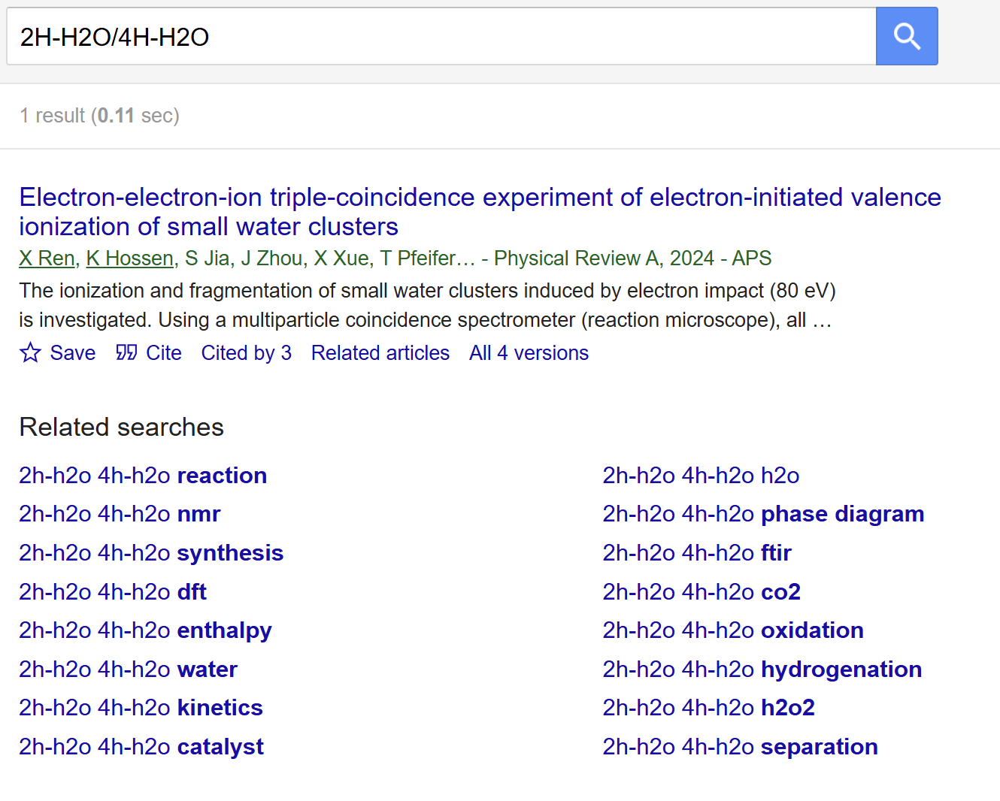
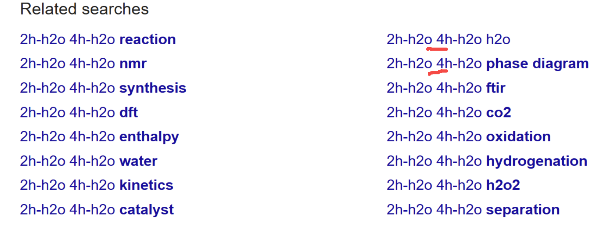
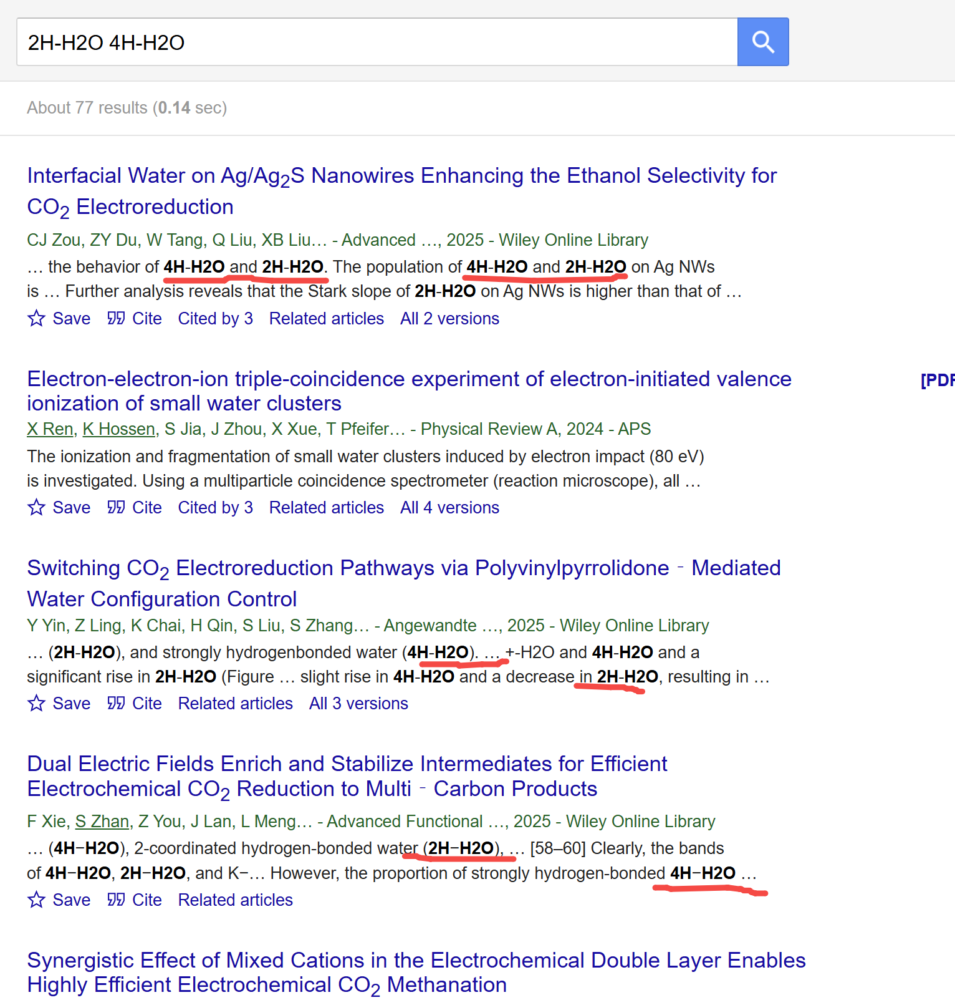
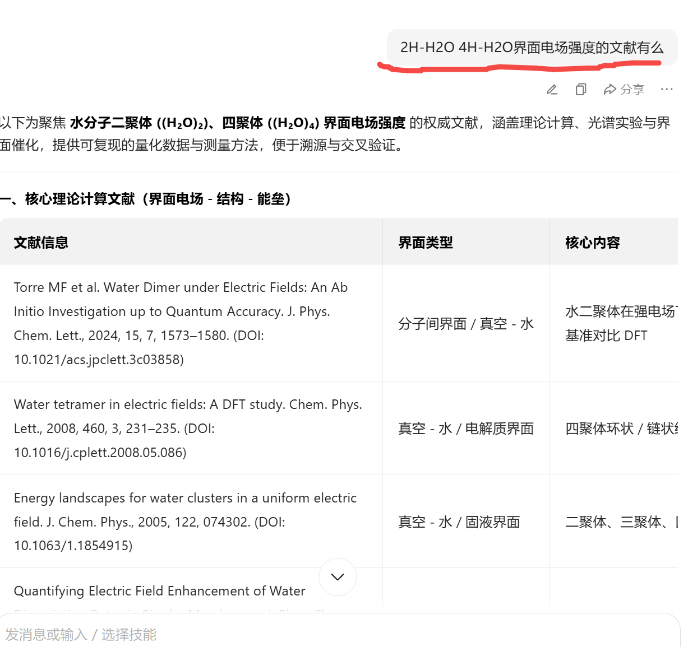
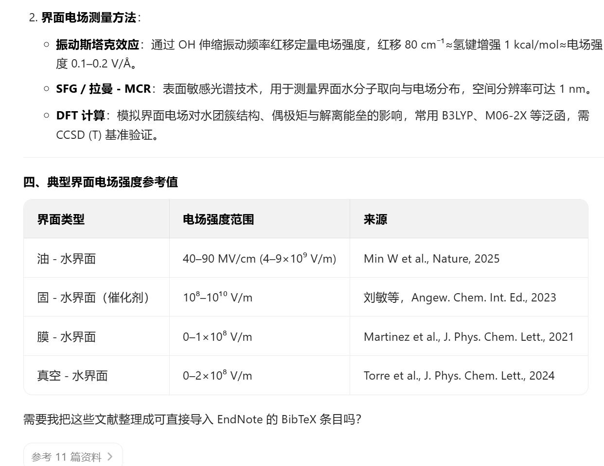

[来自： 科研论](https://wx.zsxq.com/group/15552141181242)

这个学生说用了钓鱼法搜不到东西，然后我问他怎么搜的。他说他就输入了“2H-H2O/4H-H2O”，然后我也直接先无脑复制他说的东西，看看是否如此？

结果还真是搜不到，虽然有一个结果，但结果中没有标记出搜索词，也不知道是否真的命中了这个检索内容。

但是呢，这学生就没继续去想了。搜索这个动作只是起步，你看了我科研论2中的内容了吗？我所有的第一步操作都是当时想的好好的，或者当时也没更好的思路，但只知道一个关键词，所以先那么搜搜，然后结果一操作完之后发现，哦，原来想的还有一些偏颇，或者有一些遗漏，实际搜下来并不是这个情况，或者有新的发现了。那根据这些情报，我就又可以调整下一次的搜索动作了。

像这里也是，学生给的那串东西搜不到，但问题是人家下方都提示你一堆东西了，你会发现把那个斜杠去掉，换成空格就有可能能搜到大量的东西：

所以我们接着就继续尝试，果然能搜到大量内容了，而且你看黑体字就一目了然，其中有很多完全命中搜索内容的。

所以下次如果出现问题，不要只迈出一步，发现没获得结果，就说我找不到。你要想一想，你能不能再尝试根据你迈出的那一步得到的信息，再继续迈出第二步、第三步、第四步，直到你觉得实在前进不了呢？

何况钓鱼法我们当时说过，除了我现在演示的操作，还包括直接去跟AI的对话。像这种学术类型的东西，你显然是适合跟G对话的，毕竟他能索引到很多学术资源。那现在这个学生，我说的这些操作一个都看不到，他就只是输入了这一串2H-H2O/4H-H2O，然后就说找不到。也没看到他针对这个搜索内容做一些修改，也没有看到他去跟AI对话等等的。

我在课上还讲过这么一个例子，有一个学生说，他说做的东西是非常脑洞大开的，从来没有人研究过，用钓鱼法也找不到，是关于外星人的社会关系学研究。然后我当场给他实操了一下，别说钓鱼法了，就是鲸吞法都能找到大量这方面的研究。那钓鱼法就更加多了。当然搜到那么多结果的时候，虽然在我预计之内，但我还是有点怎么说呢，毕竟连有没有外星人都还不晓得，却已经有那么多关于外星人社会关系学研究的论文发表了.......

全球几十亿人在输出信息。研究学者又是上千万计的。文献更加是海量，所以不要随随便便说某个东西你搜不到。大概率还是你太钻牛角尖、太咬文嚼字了，没有变通去搜索。 **比如这个学生为什么就不能试试把斜杠给去了呢？你说你不知道可以去斜杠，那你往下瞄一瞄呢，钓鱼法都提示你了，可以把斜杠换成空格；如果你还说你没注意，那科研论2中一直提到过删除测试的，你这个斜杠有实体意义么？能不能删呢？** 整个科研论2真的强烈建议好好读一下，里面会看到我大量调整、大量变通的思维。其实我构建检索式也就花了5分钟到10分钟。 **但为什么我要花几十万字、花3年的时间去写这本书让你们看到，去跟你们讲** 我刚开始也是几乎一无所知的，然后我究竟是怎么通过不断试错逐步对这个陌生领域知道地越来越多的呢？这背后我的思路才是最为关键的。你掌握了这样的思路，就能去开发和探索任何一个新领域。

别人可能会怕教会徒弟，饿死师傅，而我真的不只是像素级告诉你们操作，还像素级的告诉你们我是怎么想的，而且关于我怎么想，也都是高中初中生就有的常识，你们也一定可以想到的。否则为什么文科、医学、经管这种和我专业跨度那么大的学科，每当他们说搞不懂一个问题，不知道做啥，搜不到东西的时候，我反而能搜到东西、找到思路呢？我是真的希望你们能学会，但是手和脑子在你身上，你看完后，真的要多走两步才行，别才走了一步，就喊有困难了。我都身体力行的，一次碰壁、调整；二次碰壁，再调整，你看我有的检索式也是调了十几次甚至20多次才出来的，你们也应该可以的，对不？

当然，我这个帖子的标题是起了夸张点的，世界上绝对的东西几乎是不存在的。所以，应该也是存在钓鱼法搜不到的东西，但是我用这种夸张的标题是想时刻让你自己可以提醒自己，当你搜不到东西的时候，反问下自己“还能有搜不到的东西么？”，是不是你钻牛角尖了？是不是你没有大胆去删你要搜的内容？

不过遗憾的是，就算我说了这么多，我估计有的学生还会继续沿着固有思路又应激式的反驳。哦，虽然你搜出来了这个，但是我要搜的不只是这个，我要搜的是这个加X，比如我要搜的是2H-H2O/4H-H2O的界面电场强度，那个没有。

但真的没有吗？而且你真的搜了吗？其实就继续在我那个搜索里面加电场强度的表述就行了。包括我随便问了问AI都发现有大量反馈。而且我问的还是豆包，如果问G效果应该会更好。

结果AI不仅给出了界面电场强度的测试方法，还给了强度的具体参考值，如果用G效果应该还会更好。

当然，针对这种条件反射式的学生（我把这些学生称之为“ **say no”先生** ）。他可能还会说，哎，AI这些东西是不是幻觉？就算查下来不是幻觉，他也会说，那我不知道他全文里有没有写？全文万一下载下来，真没有，他就又不知道咋办了。那照这么说，所有新文献都不应该有了，因为前人文献没说，他就不知道咋干。

就是只要思维不转变，他有无穷无尽的问题。但其实他每一个问题往下自己去迈几步就知道了。是不是幻觉，你就搜出来嘛，毕竟人家AI把文献标题和DOI都告诉你了。你不知道全文里有没有写，你就下全文嘛。

如果下了所有相关的全文都没有。那么你还可以看和你相似的体系，别人有没有做过。然后你把这套方法移植过来，去算这个对象的界面电场强度就好了。这样一来，不就成为这个领域里面第一篇发这个论文的人了吗？此后别人做了类似工作，还都要引你的文章了。毕竟界面电场强度这个东西又不是你发明的，肯定已经有很多A和B的组合计算过了。这背后的方法都是相通的。

其实我过去投资也总碰到这种人，就是只说问题，但自己就只晓得坐那喝茶，别人的每个动作，都张口就来这不对，那不行，但自己也没行动过，但凡行动后会发现根本不是那么回事。最后别人一次又一次成功了，他就还只能在那喝茶坐而论道。“悲观者就是这个案例中的提问者永远正确，因为他只要不行动，一直疑问句提下去，总归会碰到一次对的答案，但是乐观者也是实践派才能enjoy世界啊，虽然他们失败了10次，但这10次失败就孕育了第11次的成功！”

巧的是，等我打完这些字，再看了下群消息，发现这个学生果然说了类似的话\[捂脸\]，所以你们接着应该知道怎么做了？如果不知道的话，看看我上面的截屏是在干什么？

过去带了那么多学生，我发现成功的模式完全无法重复，但失败的模式是高度重复的。比如这种习惯性say no的学生就挺常见的，导师一提什么，就张口就来这不行，但自己就是没去动作下。看到很长的东西，就说这个太长了，信息量太大了，我没看完整，然后我这里不懂.......但要信息少吧，又说看不懂。

扫码加入星球

查看更多优质内容

https://wx.zsxq.com/mweb/views/joingroup/join\_group.html?group\_id=15552141181242