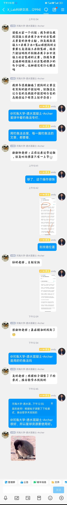

详情返回 科研论

来自：科研论进入星球

【钓鱼法不只是帮助你找到文献，打开思路，还有一些很具体的问题，不知道怎么解释的，也适合用这个方法。比如下面这个问题，只要把钓鱼法专栏中的每一篇都看一下就可以解决了】 但看的时候一定要用正确的看法，是一边看，一边就要时刻想，能不能用到你的案例中，即对照操作你的案例。 “请教大家一个问题：我导师让我找混凝土在去离子水中析出氮磷元素量的参考文献，但是我用混凝土+去离子水+氮or磷搜到的文章要么是混凝土去除氮磷，现在只能证明找不到做去离子水中混凝土析出氮磷的文章，但我导要直接表明混凝土析出氮磷很少的句子证明，这种情况有什么解法吗 我跟导说我翻遍了搜到的文章没有写到的能不能证明，就像没见过白色的乌鸦能不能说明白色的乌鸦在这个世界上就不存在？”

...

展开全部

最后编辑：2025-11-13 15:16

等45人觉得很赞